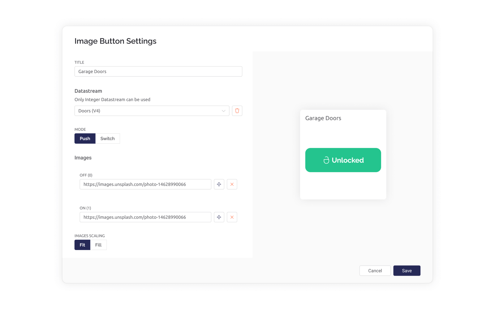

# Image Button


_**Note:**_ please remember that web and mobile app widgets are set up separately in the Web Dashboard and Mobile App Dashboard sections correspondingly. They can still use the same datastreams to access the same data (Map widget is an exception – a different codebase is used for Map on mobile and web).


The Image Button widget simulates a latching or momentary pushbutton, with the two states (e.g. on/off) represented by a custom image.&#x20;

A latching pushbutton persists the state change after manual activation. A momentary pushbutton temporarily changes the state while being manually activated (pushed).

For the button image, you need to provide http/s URL. The URL should be a valid endpoint to the binary data of the image. URL shortener will not work.


The main use case for this widget is same as for on/off Switch widget but enriched with images.

### Settings



**Title** - This is the label shown at the top of the widget. The default is the name assigned to the datastream.

**Datastream** - only datastreams of data type integer may be assigned.

**MODE** - defines the type of control, simulating either a momentary pushbutton, or a latching pushbutton.

\- **Push** - Clicking the button and holding changes the widget state from ‘OFF’ to ‘ON’. Releasing the button will return the widget to its original state.

\- **Switch** - Clicking the button will change the state between the options of ‘OFF’ and ‘ON’.

**Images** - Assign a URL that links to an image accessible online to each of the two states of ‘OFF’ and ‘ON’. A shortened URL will not work.

**IMAGES SCALING** - adjusts how the image will be scaled to fit the widget.

* **Fit:** The image will be scaled to fit the height or width of the widget size
* **Fill:** The image will be scaled to fill the widget area. Cropping may occur

### How to send data from the device

By default, the widget uses 0/1 (LOW/HIGH) values. It sends 1 (HIGH) on press and sends 0 (LOW) on release in PUSH mode.\
You can also change the button state from the hardware side. For example, turn on the button assigned to virtual pin V1 by sending value 1, for example:

```
Blynk.virtualWrite(V1, 0); // show off image
Blynk.virtualWrite(V1, 1); // show on image
```

Don't put `Blynk.virtualWrite()` into the `void loop()` as it can cause a flood of messages and your hardware will be disconnected from the server for spam. Send such updates only when necessary.

### Get data using Blynk library

You can also get the button state from the server in case your hardware was disconnected with the Blynk Sync feature :

```
BLYNK_CONNECTED() {
  Blynk.syncVirtual(V1);
}

BLYNK_WRITE(V1) {
  int buttonState = param.asInt();
}
```

### Set image URLs via setProperty function **of** Blynk.Edgent Firmware API

A connected IoT device can programmatically change the two image URLs by accessing the [properties for the widget](../../blynk.edgent-firmware-api/widget-properties.md).  Examples:

```
Blynk.setProperty(V1, "onImageUrl", "https://host/static/icon.png");
```

```
Blynk.setProperty(V1, "offImageUrl", "https://host/static/icon.png");
```

### Send data using HTTP API

Please check this article [https://docs.blynk.io/en/blynk.cloud/update-datastream-value](https://docs.blynk.io/en/blynk.cloud/update-datastream-value)
