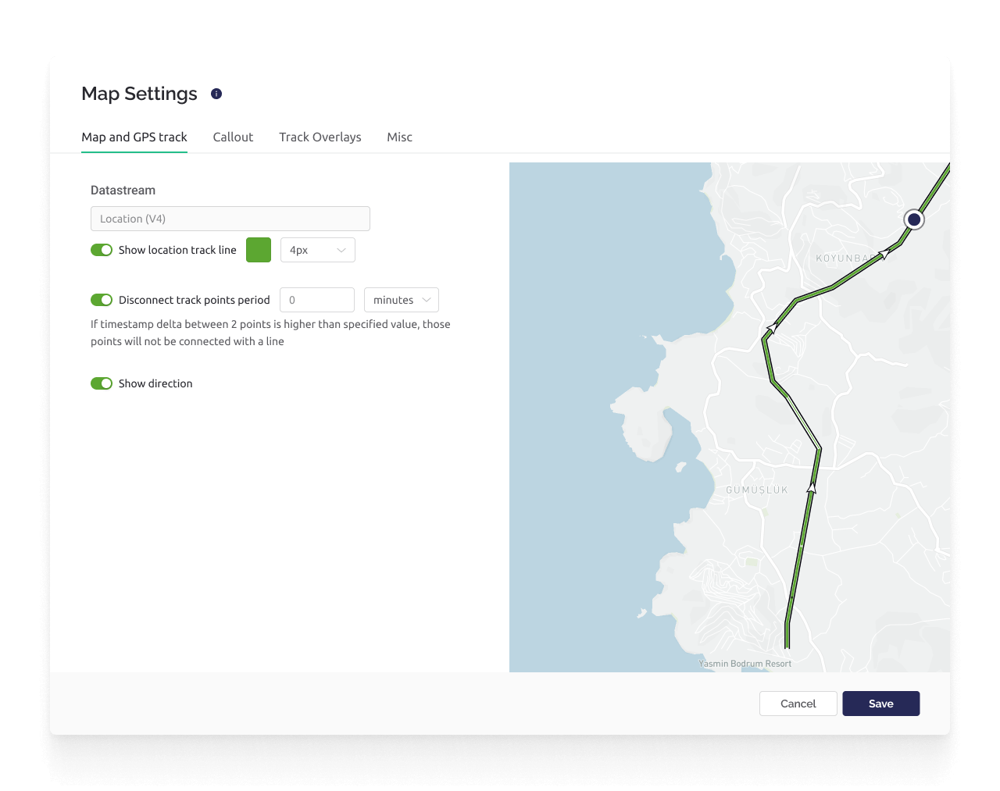
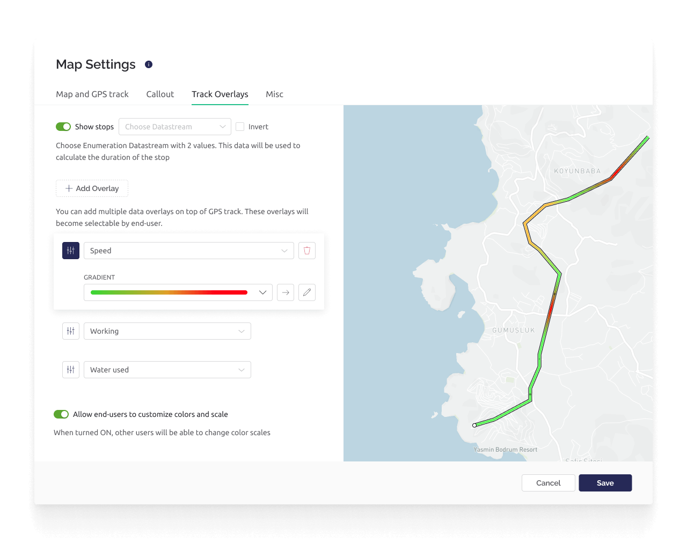

# Map


Available to PRO and Enterprise plans subscribers.



_**Note:**_ please remember that web and mobile app widgets are set up separately in the Web Dashboard and Mobile App Dashboard sections correspondingly. They can still use the same datastreams to access the same data (Map widget is an exception – a different codebase is used for Map on mobile and web).


This widget displays GPS position data, and optionally additional synchronized datastream data on a map as a callout or/and a track overlay.&#x20;

The displayed time period, zoom, map style, and track overlay (when enabled) can be configured by the user. Only one map widget can be added per device template.

<figure><figcaption></figcaption></figure>

**Callouts** can be configured to display additional datastream values posted at the same time as the GPS data.

**Track overlays** allow datastream values that approximately correspond to the location datastream timestamp to be visualized on the GPS track. E.g. speed of the device along the track.


Note that the GPS track points are assigned to a datastream by an IoT device or HTTPS API.  The current position of the IoT device derived from the IP address is also available, but is generally treated separately from the map widget.


Before creating a map widget, you need to create a Location Datastream, and in order to visualize the data you will need to write location values to the datastream.

#### Create Location Datastream

The map widget requires the use of a Location Datastream. Create a location datastream by editing a template, select ‘Datastreams’ tab, click on ‘+ New Datastream’, and select the option ‘Location’. Max one location datastream per template.

Assign a virtual pin to the location datastream, and a default longitude and latitude positions in [decimal degrees](https://en.wikipedia.org/wiki/Decimal\_degrees) under ‘DEFAULT COORDINATES (LON/LAT)’. The advanced setting ‘Show in Service Charts’ will make this DS available in the list of datastreams in Custom chart (which is often used as a service chart).

#### Write Values To Location Datastream


Currently the code behind the Blynk.App (mobile) map widget supports both an old and new API format. It is recommended you do not use the old format of Blynk.virtualWrite (pin, index, lat, lon, label).&#x20;

Use the new format of Blynk.virtualWrite (pin, lon, lat) and/or the HTTPS API to ensure your system is compatible with both the Blynk.App and Blynk.Console map widgets, and conforms to the unification of the code in the future.


After the location datastream is created, a pair of GPS longitude/latitude values need to be written to the location datastream from either an IoT device, or via HTTPS API.

```
Blynk.virtualWrite(V5, longitude, latitude);

https://{server_address}/external/api/batch/update?token={token}&V5=longtitude&V5=latitude
```

In order to include datastream value for Callout and/or Track Overlays, you should use the HTTPS API request. This will fulfill the callout and track overlay requirement that all datastream values have the same timestamp.

```
https://{server_address}/external/api/batch/update?token={token}&V5=longtitude&V5=latitude&V14=100.0&V3=23.1
```


Please pay attention to the order of the coordinates. Longitude should always go first.



Location real time update is not implemented yet. Refresh the page to see the latest location.


### Map Settings

The map widget settings has four tabs labeled ‘Map and GPS track’, ‘Callout’, ‘Track Overlays’, and ‘Misc’. Begin by selecting the ‘Map and GPS track’ tab and assigning / creating a location datastream.

#### Map and GPS track

<figure><figcaption></figcaption></figure>

**Show location track** - Turns on/off the display of the track.  When enabled, you may choose a color and thickness for the track.&#x20;

**Disconnect track points period** - when enabled, two sequential points with a delta higher than the specified threshold will not be connected.&#x20;

**Show direction** - when enabled it will add a directional arrow to the track.

#### Callout

The Callout tab allows you to optionally configure additional datastream values to be displayed when a particular set of GPS coordinates are viewed. The datastream must have the advanced settings option ‘Save raw data’ enabled, and the same timestamp as the location datastream.

<figure><figcaption></figcaption></figure>

* **Add Value** – click this button to search and select for any Datastream you want to show in Callout window.
* **Move** – hover on the previosly added Datastream panel for action buttons to appear. Hold Move button and change the position of Callout Value, release mouse button, repeat with other panels once you find it fine.
* **Delete** – hover on the previosly added Datastream panel for action buttons to appear. Click Delete button (no confirmation is applied here)

#### Track Overlays

The Track Overlays tab optionally configures additional datastreams to be visualized on the GPS track. Click the ‘+ Add Value’ button to add a datastream.

The datastream must have the advanced settings option ‘Save raw data’ enabled, and the same timestamp as the location datastream.

<figure><figcaption></figcaption></figure>

#### Misc

The Misc tab allows you to configure the track termination point style, and optionally the track course direction.

 (4) (1) (1) (5).gif>)

**STYLE: POINT** - choose the track termination style from the options of: Point, Course, Truck, and Device name.

**Choose Datastream** - select a datastream that contains course information in degrees (e.g. device compass data) in order to show the course direction with the Course and Truck track point styles.

**Use global time range selector** - when enabled, the global time range setting will constrain the range of data displayed.


### Changing the datastream value(s)

You can update the assigned datastream value using the hardware or HTTP API.&#x20;

**Hardware:**

```cpp
double lat = 40.8414;
double lon = -73.8731
Blynk.virtualWrite(V1, lon, lat);
```

**HTTP API:**

```
https://{server_address}/external/api/update?token={your 32 char token}&V1=-73.8731&V1=40.8414
```


Don't put **`Blynk.virtualWrite()`**into the **`void loop()`** as it can cause a flood of messages and your hardware will be disconnected. Send such updates only when necessary, use flags, or [timers](../../blynk.edgent-firmware-api/blynk-timer.md).

