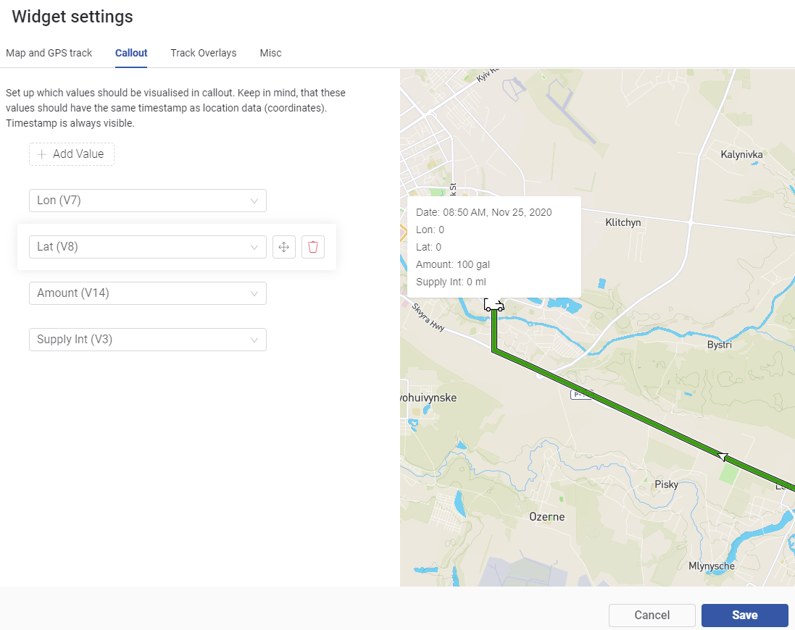

# Map

Available only for PLUS and PRO users


_**Note:**_ please remember that web and mobile app widgets are set up separately in the Web Dashboard and Mobile App Dashboard sections correspondingly. They can still use the same datastreams to access the same data (Map widget is an exception – a different codebase is used for Map on mobile and web).


This widget displays device locations/route and data sets (predefined by Template owner) that are assigned to GPS data:

* Current or latest known location of the device&#x20;
* GPS track (historical position of the device)
* Overlays: various data related to the time and location of the device. E.g. speed of the device at a particular point of the track.


1. Specify the time period if it's needed (top center of the widget):
   1. select the day: click arrows to switch to previous/next day or click on the day to open date picker, search and click on the date you want;
   2. set day time period: click the field containing time data to open time picker, set hh:mm for both start and end of the period;&#x20;
2. Change track overlay by selecting available in top right dropdown menu. It's used for values/statuses differences visualization that can be checked in track overlays legend (bottom right)
3. Navigate to the point you want to check:
   1. use scale management buttons at top left of the widget;
   2. move the map by moving the mouse with left mouse button hold;
   3. click the point or area (nearest point data will be displayed);


Now you can see all the data that was actual while the device was on the selected location.\
It always starts with Date and Time in the first line, Location Longitude and Latitude in second line and all other data in further lines.


Location real time update is not implemented yet. Refresh the page to see the latest location.


### Map Settings


* **Show location track** – enable it to view the whole route. Otherwise only track points and direction will be displayed. **Color** and **line thickness pickers** are available for the Track.
* **Disconnect track points period** – enable it in case you need to split the track if timestamp delta between 2 points is higher than specified value.
* **Show direction** – enabling this option will show the arrows on the Track to ease the understanding of it's direction.
* Map Style – select the one you find the best for your purposes. 7 styles are available now:
  * Streets
  * Outdoors
  * Light
  * Dark
  * Satellite
  * Satellite+Streets
  * Blynk Light

### Callout



Callout is used to view specified Datastreams' value that was actual at the place and time selected by user in Map Widget.

* **Add Value** – click this button to search and select for any Datastream you want to show in Callout window.
* **Move** – hover on the previosly added Datastream panel for action buttons to appear. Hold Move button and change the position of Callout Value, release mouse button, repeat with other panels once you find it fine.
* **Delete** – hover on the previosly added Datastream panel for action buttons to appear. Click Delete button (no confirmation is applied here)

### Track Overlays

### Misc

Here you can set up Device's **actual track point design**.

Select one of 4 track point styles:

* Point
* Course
* Truck
* Device name

Select Datastream that contains course information in degrees (e.g. it gets it from Device's compass) so the track point can **show course direction** (this feature is supported by Course and Truck point styles)

 (4) (1) (1) (1) (1) (1).gif>)

## Insert the data


Web and apps Map widgets use different codebases now that will be unified in the future.


Let's say we have the Location Datastream assigned to the Virtual Pin 5. For the map you can update the data from the hardware:

```
Blynk.virtualWrite(V5, longtitude, latitude);
```

Also, you can insert the data via HTTPS API:

```
https://{server_address}/external/api/update?token={token}&V5=longtitude&V5=latitude
```

You can also send multiple datastreams within the same request. In that case these datastreams would be displayed in the callout with the same timestamp:

```
https://{server_address}/external/api/batch/update?token={token}&V5=longtitude&V5=latitude&V6={somevalue}
```


Please pay attention to the order of the coordinates. Longitude should always go first.

