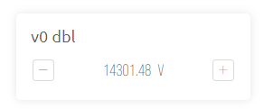

# Number Input


Available to MAKER, PRO and Enterprise plans subscribers.



_**Note:**_ please remember that web and mobile app widgets are set up separately in the Web Dashboard and Mobile App Dashboard sections correspondingly. They can still use the same datastreams to access the same data (Map widget is an exception – a different codebase is used for Map on mobile and web).


The Number Input widget displays a numeric value and lets you increment or decrement the value using - and + buttons. The initial value is the datastream default value, and the range of values are defined by the datastream [min value](../templates/datastreams/datastreams-common-settings/min-value.md) and [max value](../templates/datastreams/datastreams-common-settings/max-value.md), and so is the unit.

<figure><figcaption></figcaption></figure>

#### Settings

<figure><figcaption></figcaption></figure>

**Title** - This is the label shown at the top of the widget. The default is the name assigned to the datastream.

**Datastream** - [data type](../templates/datastreams/datastreams-common-settings/data-type.md) integer or double may be assigned.

**HANDLE STEP** - defines the minimum increment/decrement of the values as the user clicks the -/+ buttons. The step value is a whole integer when the datastream data type is integer, and a decimal value when the datastream data type is double.

**Loop Values** - when disabled will cause the number displayed/generated by the control to stop increment / decrement of the values at the datastream [min value](../templates/datastreams/datastreams-common-settings/min-value.md) and [max value](../templates/datastreams/datastreams-common-settings/max-value.md). When enabled, incrementing past the max value will continue (loop) starting at the min value, and similarly decrementing past the min value will continue (loop) beginning at the datastream max value.

**Show Units** - will turn on/off the display of the units (derived from the [datastream settings](../templates/datastreams/datastreams-common-settings/)).
