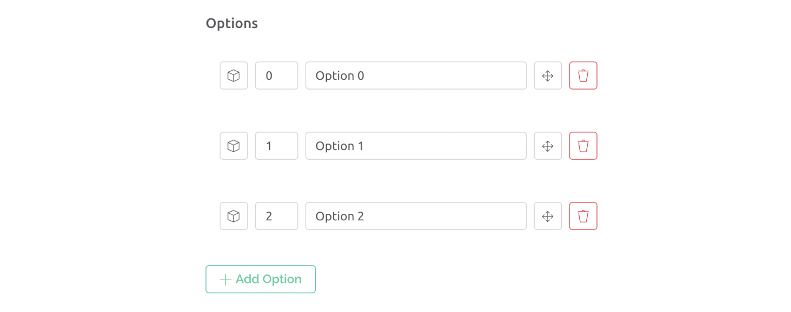

# Segmented Switch


_**Note:**_ please remember that web and mobile app widgets are set up separately in the Web Dashboard and Mobile App Dashboard sections correspondingly. They can still use the same datastreams to access the same data (Map widget is an exception – a different codebase is used for Map on mobile and web).


Unlike the basic switch widget that can only have two statuses, with Segmented Switch you can  switch between up to 10 statuses or options. This widget works with **Enum** and **Int** Datastreams.

### Settings

* Name the Segmented Switch widget by filling out the TITLE field or leave it blank if you want to hide the widget name&#x20;
* **Datastream** – access the list of available Datastreams by clicking on **Choose Source** (a dropdown list will be shown). If you use Enum Datastream, all options will be automatically loaded.
* **Color** – pick the color for the active Switch status background from the palette or define it by color number input
* Choose whether you want to use **Icons** next to each label for options or just labels
* Set **Options** in the corresponding fields. Add up to 10 options to switch between

