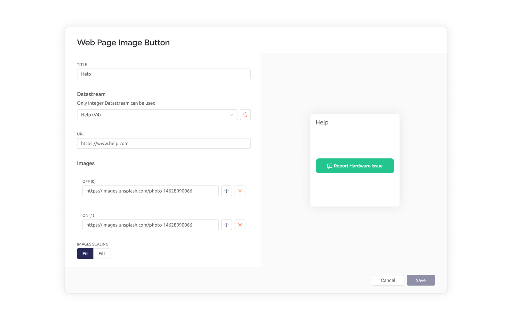

# Web Page Image Button

Available only for PRO users


_**Note:**_ please remember that web and mobile app widgets are set up separately in the Web Dashboard and Mobile App Dashboard sections correspondingly. They can still use the same datastreams to access the same data (Map widget is an exception – a different codebase is used for Map on mobile and web).


This widget allows you to display any image and open any external or even Blynk Console internal page in the new tab on click.&#x20;

You need to provide a http/s URL for the image. The URL should be a valid endpoint to the binary data of the image. URL shortener will not work.

You can set up two images representing the pressed/unpressed state of the button and an URL field for the external page address.


### Datastream

When you click on the image, the widget doesn't send any values to the server but datastream is still required as it is used for **setProperty** actions. Only Integer datastream can be used here.&#x20;

### Mode

The button operates in push mode: on finger released — the button will switch to the default state.

### Widget Settings



#### **URL**

URL to the web page that is opened on click

#### **Images**

**Off Image** - for default button state\
**On Image** - for pressed button state

#### Display options

As of now, the image button widget supports 2 display options:

* **Fit:** The image will be scaled to fit the height or width of the widget size
* **Fill:** The image will be scaled to fill the widget area. Cropping may occur

### Settings via setProperty function

For example, just use V1 datastream.

You can set **url** via setProperty function (in these examples V1 pin is used as an illustration. You should use your own configuration):

```
Blynk.setProperty(V1, "url", "https://blynk.cloud");
```

You can set **onImageUrl** via setProperty function:

```
Blynk.setProperty(V1, "onImageUrl", "https://blynk.cloud/static/icon.png");
```

You can set **offImageUrl** via setProperty function:

```
Blynk.setProperty(V1, "offImageUrl", "https://blynk.cloud/static/icon.png");
```

\
