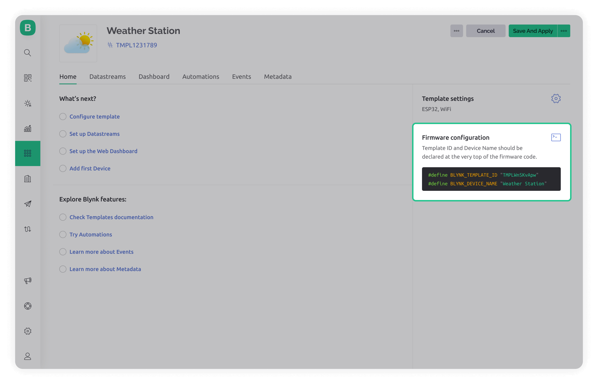

# Blynk.Edgent overview

## What is Blynk.Edgent

Blynk.Edgent is a packaged solution that allows developers to easily connect their devices to the platform and take advantage of all its advanced features without the need for extensive coding. It includes:

* Blynk library API (Secure connection and data exchange)
* **Blynk.Inject** (dynamic device credentials provisioning over WiFi Access Point or BLE,)
* **Blynk.Air** (OTA firmware updates)
* A simple UX/interaction example:
  * Device state indication using an RGB LED
  * Device configuration reset using a button

This level of integration and ease of use can save significant time and effort spent on developing IOT essentials and help focus on the embedded firmware application building your connected product more quickly.&#x20;

Although Blynk Library can be used without Blynk.Edgent features, it is recommended to use Blynk.Edgent whenever possible.

### Hardware supported by `Blynk.Edgent`

| ESP32                 |
| --------------------- |
| ESP8266               |
| Arduino MKR WiFi 1010 |
| Arduino Nano 33 IoT   |
| Seeed Wio Terminal    |
| TI CC3220             |

### Dual-MCU Boards supported by `Blynk.Edgent` through [`Blynk.NCP`](../blynk.ncp/overview.md)

| Board                                                                                                                      | OTA for MCU | OTA for NCP   | Connectivity | Provisioning | NCP File System |
| -------------------------------------------------------------------------------------------------------------------------- | ----------- | ------------- | ------------ | ------------ | --------------- |
| [UNO R4 WiFi](https://store-usa.arduino.cc/products/uno-r4-wifi)                                                           | `⏳ RA4M1`   | `✅ ESP32s3`   | WiFi 2.4     | ✅ BLE        | 4.25 MB         |
| [Portenta C33](https://store-usa.arduino.cc/products/portenta-c33)                                                         | `⏳ RA6M5`   | `✅ ESP32c3`   | WiFi 2.4     | ✅ BLE        | 512 KB          |
| [Nano RP2040 Connect](https://store-usa.arduino.cc/products/arduino-nano-rp2040-connect)                                   | `✅ RP2040`  | `❌ NINA_W102` | WiFi 2.4     | ✅ BLE        | 384 KB          |
| [Nano 33 IoT](https://store-usa.arduino.cc/products/arduino-nano-33-iot)                                                   | `✅ SAMD21`  | `❌ NINA_W102` | WiFi 2.4     | ✅ BLE        | 384 KB          |
| [MKR WiFi 1010](https://store-usa.arduino.cc/products/arduino-mkr-wifi-1010)                                               | `✅ SAMD21`  | `❌ NINA_W102` | WiFi 2.4     | ✅ BLE        | 384 KB          |
| [T-PicoC3](https://www.lilygo.cc/products/lilygo%C2%AE-t-picoc3-esp32-c3-rp2040-1-14-inch-lcd-st7789v)                     | `✅ RP2040`  | `✅ ESP32c3`   | WiFi 2.4     | ✅ BLE        | 512 KB          |
| [RPi Pico](https://www.raspberrypi.com/products/raspberry-pi-pico) + [ESP8266](https://www.waveshare.com/pico-esp8266.htm) | `✅ RP2040`  | `✅ ESP8266`   | WiFi 2.4     | ✅ WiFiAP     | 1000 KB         |

### How to connect a device with Blynk.Edgent

1. **Create a blank Template** in [Blynk.Console](https://blynk.cloud/). To do it, open the _Templates_ section in the left menu and click + _New Template_ button. Assign a name and select hardware and connectivity, you can further customize the template and build the dashboards later.
2. Open [PlatformIO IDE](../blynk-library-firmware-api/installation/install-blynk-library-for-platformio.org.md) (recommended) or [Arduino IDE](../blynk-library-firmware-api/installation/install-blynk-library-in-arduino-ide.md) and **install Blynk Library**.
3. **Open Blynk.Edgent example** for your device and your IDE using the links provided in the table below or in your IDE. For Arduino: File -> Examples -> Blynk -> Blynk.Edgent and select your board.\


| Board                 | Example for PlatformIO IDE                                                                  | Example for Arduino IDE                                                                                  |
| --------------------- | ------------------------------------------------------------------------------------------- | -------------------------------------------------------------------------------------------------------- |
| ESP32                 | [Link](https://github.com/blynkkk/edgent-examples-pio/tree/main/PIO\_Edgent\_ESP32)         | [Link](https://github.com/blynkkk/blynk-library/tree/master/examples/Blynk.Edgent/Edgent\_ESP32)         |
| ESP8266               | [Link](https://github.com/blynkkk/edgent-examples-pio/tree/main/PIO\_Edgent\_ESP8266)       | [Link](https://github.com/blynkkk/blynk-library/tree/master/examples/Blynk.Edgent/Edgent\_ESP8266)       |
| Arduino MKR WiFi 1010 | [Link](https://github.com/blynkkk/edgent-examples-pio/tree/main/PIO\_Edgent\_MKR1010)       | [Link](https://github.com/blynkkk/blynk-library/tree/master/examples/Blynk.Edgent/Edgent\_MKR1010)       |
| Arduino Nano 33 IoT   | [Link](https://github.com/blynkkk/edgent-examples-pio/tree/main/PIO\_Edgent\_MKR1010)       | [Link](https://github.com/blynkkk/blynk-library/tree/master/examples/Blynk.Edgent/Edgent\_MKR1010)       |
| Seeed Wio Terminal    | [Link](https://github.com/blynkkk/edgent-examples-pio/tree/main/PIO\_Edgent\_Wio\_Terminal) | [Link](https://github.com/blynkkk/blynk-library/tree/master/examples/Blynk.Edgent/Edgent\_Wio\_Terminal) |
| TI CC3220             | [Contact sales](https://blynk.io/contact-us-business) for commercial implementation         | [Contact sales](https://blynk.io/contact-us-business) for commercial implementation                      |

4. **Uncomment these two lines and replace the placeholders** with your Template ID and Template name.

```
//#define BLYNK_TEMPLATE_ID           “TMPxxxxxx”
//#define BLYNK_TEMPLATE_NAME         “TemplateName”
```

You can get them in Blynk.Console by going to _Templates_, selecting your newly created template and finding the _Firmware configuration_ in the _Home_ tab.

<figure><figcaption></figcaption></figure>

5. **Compile and upload to your device**
6. **Connect your device in Blynk.App**. To do it open the _MENU_ icon in the upper right corner. Tap on + _Add New Device_. Select _Find Devices Nearby_ option. The app will scan the WiFi networks around you and offer to connect to your device. You will see the template name you’ve chosen in step 1. Once the connection is established, the Blynk app will guide you through the provisioning process.

Bingo! Your device is online and connected to Blynk.Cloud. You can now continue prototyping, adding custom functionality according to your needs, and building your [mobile](../blynk.apps/constructor.md) and [web](../blynk.console/templates/dashboard/) dashboards. Your device is fully set up to get all further firmware updates [over the air](updating-devices-firmwares-ota.md).
