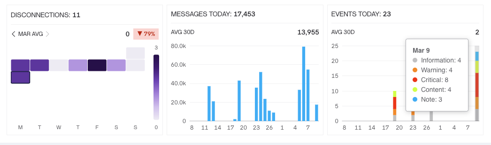

# Changelog

## Sep 15, 2026

**New Features**

**Email Delivery** — a new Developer Zone section for outgoing email: searchable logs with "Email type" and "Result" filters, a detailed view, and statistics behind "View stats" with Sent/Failed counters and a breakdown per kind of email.

**Demand Response Stats** — a new stats page showing participants by outcome, with all demand events stored and browsable.

**Device Lock/Unlock** — lock or unlock a device from its menu, for a whole segment, for several selected devices at once, or through the Platform API. For paid plans only.

**Device-to-Organization Sharing** — share a device with another organization, manually or automatically through a Rule Engine rule. Enterprise feature only.

**Platform API Stats (expanded)** — CSV and JSON export, full-table views, a "Failed requests per hour" chart, per-token request statistics, and the tokens of sub-organizations.

**Other**

* Dashboards side rail reworked into drag-and-drop sections, with the order saved per organization so it follows you between browsers
* HMAC signing functions in the Data Converter JavaScript
* Assets support GIFs, drag-and-drop upload and move, and folder renaming
* AnyWidget gained location history for tracking maps and a preset gallery
* Create a datastream directly from the device page, and open device drawers with a link
* The Users page is split into Members and External sections

**Improvements**

**Performance** — Dashboards and reporting queries hit ClickHouse with tighter time bounds instead of scanning whole tables, and the Errors and Platform API Stats pages fetch and redraw far less.

**Dashboards & widgets** — Charts reject duplicate series and share one date axis, the minimum Y-axis range option is back, the Segmented Switch only offers values its datastream allows, the Image Gallery holds up to 50 images, and edit mode keeps its header fixed while scrolling.

**Devices & templates** — Maps open at the maximum available zoom, LoRaWAN decoders appear as a Payload formatter card, the unstable-connection tooltip explains itself better, and datastreams, events and metadata open in edit mode from the template view.

**Elsewhere** — Metadata filters hide the hardcoded Device Name and Owner fields, Table metadata is validated and available in device filters, webhook forms hide CONTENT TYPE for GET requests, Developer Tools remembers the selected log period, and the Testing tab searches case-insensitively and never reports a send as successful while offline.

**Bug Fixes**

Three web crashes are fixed — opening the device map while creating a demand response event, a missing portal container, and a blank page caused by an import cycle.

On charts: LIVE mode showing stale data with the zoom snapping back, the broken Y axis in the Active devices and Activations widgets, an overlapping Gauge preview, Enum datastreams having no live chart, and the Map widget staying enabled when it should be disabled.

Elsewhere: device search in the demand response event flow, the Template filter's org-wide count, search and status filters on Static tokens, errors when transferring an organization, image widgets that could not be saved after a bad URL, and organization, SMS-status and device-row lists not refreshing after a change — plus a round of padding, alignment and dark-theme polish across the web app.

## Sep 2, 2026

**New Features**

**Platform API Stats** — A new usage view on the OAuth2 page shows your organization's API requests, errors, and current rate limits. Counters are collected hourly and broken down per OAuth token, per endpoint, and per organization. The page has its own URL, so it can be bookmarked and shared, and is available to everyone with access to the OAuth section.

**Data Object** (formerly Data Engine) — work in progress

**New Shipments** — work in progress

**Other**

* Devices show a connection-troubles indicator reporting the most severe connection issue, next to the device name and in the device header
* Unit conversion in the Metric by Device and Devices Table widgets, which now display the unit reported by the server
* Widget datastreams carry a color and a display name (alias), so custom and HTML widgets can render them; datastream aliases can be localized
* "Erase Data" can now delete history data and log events
* Templates show their template ID in the header; the vendor prefix appears in front of the broadcast name, with a minimum length enforced
* Application errors are stored per minute for finer-grained monitoring

**Improvements**

**Performance** — Substantially less per-query overhead in the ClickHouse driver: batch buffers built in a single allocation, primitives written straight into the buffer, LZ4 frames hashed in place, and the server timezone resolved once per endpoint. The database driver now uses the async HTTP client by default, user application errors are paginated in the database query rather than in memory.

**Connectivity** — Fragmented web, mobile, and device-forwarder messages are reassembled instead of dropped, and decoder exceptions that used to be swallowed are now reported. Connection resets and http-to-https redirects are handled without aggregating the request, and a device over its quota has the whole message dropped rather than a partial one.

**Permissions** — The HTML widget is locked and cannot be duplicated without MANAGE\_ASSETS, and template assets are no longer fetched without it. Automation sharing is rejected when SHARE\_AUTOMATION is disabled, the "Enable for Gateway API" OAuth switch is limited to Enterprise.

**Dashboards & widgets** — Chart widgets hide when their datastream is hidden, and the Map widget disables when its location datastream is disabled. Metrics by Devices respects dashboard side filters and keeps explicitly selected devices. Custom charts are limited to datastreams of the current template, and Any Widget code is stored as an asset link with presets shipping with the platform. Table column widths, the Customize View column set, and row selection all survive table reloads.

**Elsewhere** — Unsaved template edits survive a server deploy; static tokens of a deleted device return to the pool; future dates can no longer be picked for a Custom report period; AI chat gained better actions and blocks artifact application when no slots are free; transfer by organization name works while switched into a child organization.

**Bug Fixes**

Three web crashes are fixed — one in a background operation, one from a minified React error, and one after saving a data converter — along with endless dashboard loading and widgets failing to be added to a dashboard.

On dashboards: stale data after saving widget settings, wrong aggregation in Metric by Device, duplicated time labels, chart pan/close buttons drawn outside the chart, a line drawn before the first data point, a stale datastream color in the HTML widget bridge, and a `url` set-property overwriting `darkUrl`.

Elsewhere: PDF export in reports, IMEI metadata validation, the Table metadata preview layout, a subtitle missing when duplicating an in-app campaign, a "UserId can't be empty" error after closing user details.

***

## Aug 18, 2026

### 🚀 New Features

**Any Widget** — build your own widgets from HTML, CSS, and JavaScript: an in-place code editor with live preview and console output, a Testing tab for driving real datastreams, and a preset gallery to start from. Per-plan limits apply per template.

**Data Engine** — query your data with SQL through new Web and Platform APIs, including custom data tables, guarded by a dedicated "Query data engine" permission. A new **SQL Table** widget is built on top of it.

**Errors View** — a new Developer Zone section for device and user errors, split into Device (hardware) and User (web/mobile) tabs, with per-device and per-user error log drawers, aggregation by error type, a time picker, and an indication of new errors.

**OAuth 2.0 Token Scopes** — scope management for MQTT Gateway, Alexa, Google Home, and the Platform API, plus a token introspection endpoint.

**Platform & Management API** (expanded) — CRUD for automations, endpoints for custom data rows, and an aggregated multi-datastream history endpoint, plus ping, reconfigure, and reboot commands over the Management API.

**Condition-Triggered Events** — events now fire automatically when a datastream value meets the configured condition. User Note events gain tags and notification settings.

**Org Assets** (expanded) — folders with bulk removal and duplicate-name validation, `.html` upload and in-place editing, Duplicate and Download actions for files, and `asset://` URLs for referencing assets.

**Provisioning Sessions** (expanded) — full session details, summary statistics, and clear, localized error descriptions.

**Data Objects** — a new management UI and API.

**JWT Login on Mobile** — mobile apps can now sign in with JWT.

### ✨ Improvements

* **Performance** — a large speed-up across dashboards and reporting: streamed query responses, faster event counts, a lighter datastream update path, lazy-loaded Fleet Management lists, a much faster org-wide Errors view, and map data that is sampled rather than truncated.
* **Errors** — a default 1-day time filter and an "All" option, aggregation by type, error counts shown in red, a clickable organization, and a button to open the device straight from an error.
* **Provisioning Sessions** — human-readable signal quality, a more accurate success rate, a richer error catalogue, and informative tooltips.
* **Data Engine** — clearer error messages, proper timestamp columns, and documented SQL limits.
* **Automations** — a "Shared" label, a delete confirmation, and hints explaining why some automation types are unavailable.
* **Data Converters** — test message and request limits raised to 20000, and converters are now cloned along with the product.
* **Datastreams** — location datastreams keep RAW history so maps render, and Notes now show a character counter.
* **Devices** — dots and commas are allowed in device and template names, and connected devices no longer flip to Offline unexpectedly.
* **Widgets** — the HTML container widget is now available to everyone, and the device table supports unit conversion.
* **Security** — stricter Data Engine SQL execution and tighter custom data table access.
* **Email** — delivery is retried when it times out.

### 🐞 Fixes

* Resolved web crashes on the Devices page and across Fleet Management time fields, dates, and unsaved tours.
* Corrected event widget behavior — the wrong chart when hiding an event or resetting filters, chart flicker on time range changes, missing data on shared dashboards, and SQL Table pagination not loading further pages.
* Metadata fixes for invisible List and Timezone options, missing currencies in Cost, and Switch options that could not be cleared.
* Event and automation fixes: the event type reverting on save, event limit settings not saving, the condition value input clamped to zero, the "Add next action" dropdown not closing, and excluded recipients not showing.
* Shipment counters no longer double-count devices, and duplicated status events no longer appear in the Blynk.Air timeline.
* Webhooks are now fully removed when their device or template is deleted.
* Map fixes for the My Devices map not rendering, Geomap marker settings hidden before devices report GPS, and trip history showing stale data after switching devices.
* Fixed the daily upload limit being exceeded by multi-file requests and in-app campaign impression under-counting.
* OAuth token fixes for Custom access selection, group toggles not expanding, overlapping headers, and several styling issues.
* Dark theme, table header, border, and hover-visibility polish across the web app.

## July 15, 2026

### 🚀 New Features

**Provisioning Sessions** — a new section to monitor device provisioning end-to-end: per-session timelines and steps, success rate and session-duration stats, most-common-error insights, statuses (including Canceled/Aborted), filtering and search (by email, client, error), sorting, log download, and data export. A very handful feature, especially for Enterprise clients, which allows to simplify investigation of user device pairing problems.

<figure><figcaption></figcaption></figure>

**Custom Units** — define your own units and use them everywhere: datastream settings, number metafields, dashboards, the devices table, and widgets, with a redesigned units picker.

**Template & Product Version History** — every template/product edit is now tracked. View change history, see what was modified, and restore a previous version.

<figure><figcaption></figcaption></figure>

**Shareable Automations** — share an automation as a template, control creation/enablement across sub-organizations, and manage it with a dedicated sharing permission. Enterprise feature.

**Scheduled Reports** (expanded) — a full Reports page, a "Generate report" automation action with configurable report period, enhanced email delivery (recipient exclusions by user/role), and a polished "Events Summary" report layout. Enterprise feature.

**Crash Reports & Crash Dumps** — a new developer-zone section to review device crash reports and dumps, with filtering, bulk delete, and downloads. Enterprise feature.

**Org-level Assets** — assets are now managed at the organization level, with folders, increased storage, and improved file handling.

### ✨ Improvements

* **OIDC / SSO** — smoother registration and invitation flows, correct login and logout redirects, and password handling for SSO accounts.
* **Datastreams** — reworked creation flow with name presets, auto-filled display names, clearer validation, improved semantic-tag selection, and the ability to hide a datastream from the HTTP API.
* **Automations** — enhanced scheduling (multiple monthly dates, better schedule summaries) and a rebuilt email action.
* **HTTP / Platform API** — historical-data endpoints now support unlimited requests, raw data, and streaming JSON responses, plus a new endpoint to generate static tokens.
* **Dashboards & Widgets** — refinements to Total Events Over Time, Events Breakdown Over Time, the device table, image gallery, and AnyWidget; better organization and dashboard filtering.
* **Semantics** — smarter tag assignment and filtering that hides options not supported by a widget or column.

### 🐞 Fixes

* Resolved several web crashes across the Assets, Provisioning Sessions, and dashboard pages.
* Fixed device online/offline detection delays (including devices updating via MQTT).
* Corrected numerous report layout, scheduling, and email-recipient issues.
* Many custom-unit display, datastream naming/search, and widget-settings fixes for consistent behavior.
* Improved offline device handling and data-table cleanup for better reliability.

## June 18, 2026

### 🚀 New Features

**Scheduled Reports** — generate reports automatically on a schedule through automations, with a dedicated permission to control who can run them. (Only for dedicated Enterprise Servers)

**Unit Conversion & Custom Units** — pick your preferred units at the user and organization level, convert datastream values between units, and let **Smart Unit Scaling** automatically switch to the most readable unit (e.g., showing _12 h_ instead of _0.5 d_, or _30 mW_ instead of _0.03 W_) with short notations. (Only for dedicated Enterprise Servers)

**OIDC Login** — existing users can now sign in via OIDC. (Only for dedicated Enterprise Servers)

### ✨ Improvements

* **Dashboards & Widgets** — faster dashboards with live-updating label widgets; smoother "Metrics over time" and "Metrics of devices" widgets; label widgets now show enum values and colors correctly; Location datastream support in the Modules widget.
* **Data export** — CSV exports now follow the same event ordering shown in the widget.
* **Blueprints** — status indicators on "My Blueprints" cards, working Copy Code button, and cleaner text formatting.
* **Automation** — the editor no longer closes when you click outside it, devices are sorted A–Z, and automation tiles share a consistent size.
* **AI** — the Confirm button now works for accepting proposed changes, and AI chat handles data converters more reliably.
* **Templates & Metadata** — clearer metafield settings, better step and value handling, and products using the same digital/analog pin can now be saved.
* **Security** — OAuth client secrets are now shown only once.

### 🐞 Fixes

* Resolved crashes and out-of-memory issues when opening dashboards with aggregated "Metrics over time" widgets.
* Fixed data not appearing in the "Metrics of devices" widget and search missing datastreams lower in the list.
* Numerous unit-conversion display and formatting fixes for correct, consistent values.
* Widget, map, switch, and image-map polish across the dashboard.

## June 2, 2026

* Reordered and renamed sections in the template sidebar navigation
* Added datastream semantics
* Increased API rate limit for Pro and Production users for the "Get Report" HTTP API endpoint
* Redesigned the unit conversion feature
* Added Dutch locale

## May 20, 2026

* OAuth 2.0 section unblocked for Blynk Cloud
* Fixes for the OAuth 2.0 logs section
* Increased datapoints import per device per day from 10k to 100k
* Product datastreams section reworked: ability to show/hide required columns, sort, filter
* Added payment failure banner to the dashboard view
* Remove the limit on outdated devices per template
* Cleanup in frontend libraries, removed unnecessary dependencies to minimize bundle
* Better guard of data conversion with a rate limiter
* Data converters can now be used by free users
* Added a new "get sub-organizations" Platform API endpoint
* Removed paywall for free users for the tiny device map view
* Added ability to switch to 24h view in Device Vitals
* Chirpstack integration fixes

## May 7, 2026

* **Performance Enhancements**: Improved build and test speed, introduced a more efficient HTTP client to reduce allocations.
* **Widget Updates**: Developed "Any Widget" MVP; SQL Widget output now limited to 100k entries to prevent OOM errors.
*   **Developer Tools**:

    * Alert banner now displays in the Developer Tools section for server errors (e.g., rate limit, parsing error, incorrect type):

    <figure><figcaption></figcaption></figure>

    * Tabs/end-of-line characters are highlighted for detecting incorrect inputs quickly.
*   **Device Vitals**:

    * Double-click a specific date to switch to a 24-hour view.
    * Changed the disconnection heatmap to a bar chart:

    <figure><figcaption></figcaption></figure>

    * Display HTTP API messages and other sources (MQTT, Blynk firmware) in the "Messages" chart.
* **API and Endpoint Enhancements**:
  * New Platform API endpoint for event resolution.
  * Enhanced performance of "delete" queries and OTA file parsing.
  * Introduced synchronization for shipments created manually or via API.
  * New optional field expansion for GET /api/v1/organization/devices.
* **Feature Releases**:
  * Implemented segment sharing.
  * Improved search by action name in "User actions log."
  * Increased default limit for report downloads via HTTP API.
  * Erase data now also clears device statistics (disconnections, messages, and events count).
* **Roles and Permissions**:
  * Improved functionality for changing the roles of invited users, especially in multi-organization enterprises.
  * Resolved a bug preventing root org admins from transferring devices between sub-orgs and root org via UI.
* **Miscellaneous**:
  * Migration for segments will change IDs displayed in browser URLs.
  * Location CRUD operations are now instantly indexed.
  * Fixed bug when root org admin couldn't transfer devices from sub-org to root org via UI.

## Apr 20, 2026

* **Platform API Enhancements:**
  * Added API to manage shipments.
  * Added API for webhooks.
* **Code and Performance Improvements:**
  * Refactored OTA-related code for better performance in file operations.
* **Developer Tools:**
  * Introduced "Errors" tab.
  * Enhanced data collection for individual device operations.
* **Enterprise Features:**
  * Implemented web session rotation.
  * Enabled updates for specific products in mobile apps.
* **Plan Updates:**
  * Removed graph datastream limits for Free plans.
* **Import and Data Handling:**
  * Extended the minimum timestamp in the import handler from 1 to 3 months.
  * Increased data converter character limit from 5k to 10k.
  * Enabled metadata value reading in product decoders.
* **Dashboard Enhancements:**
  * Added new aggregation type for label widgets.
* **Metadata Improvements:**
  * Added filtering support for metadata of List type.
* **Performance Fixes:**
  * Improved web console load speed by reducing initial HTTP requests.
  * Resolved delays following organization transfers to higher levels.

## Mar 31, 2026

### Platform Updates

* **Analytics & Performance**: Added additional platform analytics and improved performance of MQTT flows.
*   **User Interface**:

    * Added a "Download Firmware" button to the shipment info and actions menu.

    <figure><figcaption></figcaption></figure>

    * Introduced "Start From Scratch" in the Create New Device flow.
    * Implemented a "SQL Label" widget and a "Device Count Label" widget on aggregated dashboards.
    * Added a "SMS Logs" tab to the Developers tools.

### API & Integration

* **Platform API**: Launched API for batch datastream updates.
* **Integration**: Integrated Chirpstack for enhanced connectivity.

### Device & Data Management

* **Device Management**: Enabled instant indexing for new entities like devices, users, or organizations.
* **Firmware Management**: Prevented the removal of firmware files when shipment is stopped or finished.

## Mar 12, 2026

#### New Paid Plans

* **Production 100**: 100 users, 100 devices
* **Production 200**: 200 users, 200 devices
* **Production 300**: 300 users, 300 devices
* **Production 400**: 400 users, 400 devices
* **Production 500**: 500 users, 500 devices
* **Production 750**: 750 users, 750 devices
* **Production 1000**: 1000 users, 1000 devices

#### SMS Providers

* Added Twilio and TextGrid for Production Plans. You can find it in "Developer Zone" -> "Integrations" section:

<figure><figcaption></figcaption></figure>

<figure><figcaption></figcaption></figure>

#### Image Uploads

* Users on Production and PRO plans can upload up to 10 images per device per day.

#### Developer Tools Enhancements

* Device Vitals now features a scrollable disconnections graph.
* Added graphs for messages sent and events over the last 30 days.
* UI performance in Device Vitals significantly improved.

<figure><figcaption></figcaption></figure>

#### Bug Fixes and Improvements

* Fixed the infinite loader during organization transfer.
* The new Web Button widget is now accessible to all users.
* Improved server monitoring and other optimizations.

#### Limits and Features

* Enterprise servers can now create up to 20 analytics dashboards.
* New free plans have a cap of 100k device messages.
* Introduced a Platform API endpoint for device reconfiguration.
* Devices without access are no longer shown in automations unless used by the owner/creator.
* Haptic feedback has been added to Mobile Control Widgets.

#### Enterprise Features

* Aliases can now replace datastream names universally.

#### Future Additions

* Round-trip time (RTT) data collection will be available in Device Vitals soon.

## Feb 23, 2026

#### New Features and Improvements

* **New Button Widget:** Unveiled a highly anticipated button widget.
* **Performance Enhancements:** Numerous server optimizations implemented for increased speed.
* **Device Info Update:** Developer Settings now display hardware protocol type and connection security level.
* **New Platform API Endpoints:**
  * Manage device claims/unclaims using static tokens.
  * Create users within specific organizations.
* **Bug Fixes:**
  * Resolved the issue preventing real-time updates in the datastreams tab.
  * Multiple fixes for the "Total Events Over Time" reporting widget.
* **Blynk MCP Introduced:** Rolled out the new Blynk MCP.
* **Automation List Boost:** Enhanced device sorting for automation lists.
* **Location Metadata:** Addressed issues with location metadata, resulting in improvements.

## January 29, 2026

#### New Features

* **Increased Datastreams Limit**: Extended the maximum number of datastreams from 256 to 1000 for Enterprise servers.
* **New Analytics Widget**: Introduced the "Total events over time" widget.
* **Platform API Enhancements**: Automatically sets "Content-Type" to "application/json" if unspecified; added a new endpoint to "unclaim static token."

#### Improvements

* **Location Metadata**: Refactored and redesigned to enhance customer usability.

#### Bug Fixes

* **Data Converters**: Fixed a crash in certain Data Converters configurations.
* **Template Parsing**: Resolved "parsing error" when editing templates for specific setups.
* **Sub-Organization Switching**: Fixed the "You have to specify organization ids" error.
* **Devices Table Display**: Show Outcome value for enum datastreams in the devices table.

## January 5, 2026

**Bug Fixes**

* Resolved an issue in the terminal widget where only the first message was displayed during real-time updates.
* Fixed loading issues on the web hooks attempts screen.
* Corrected parsing errors in location metadata.
* Implemented various fixes for filters and search functionality.
* Fixed non-functional "Contact Sales" button.
* Sub-organization data is now included in the "Events by Organizations" widget.
* Resolved error message: "Your organization plan doesn't allow extra users".
* Addressed the default value setting issue of 0 for data streams.

**New Features**

* Added a new chart to Dashboards: "Events by Templates".
* Introduced a new Platform API endpoint for unclaiming static tokens.
* Improved visibility by adding "Auth token" to multiple device screens.

**Improvements**

* Enhanced performance for "Edit template" flow.

## December 8, 2025

**Bug Fixes**

* Fixed the incorrect order of event notifications in mobile apps.
* Resolved a permission issue preventing admins from performing certain actions on devices.
* Addressed performance and loading issues with the CSV import in the SQL widget and the "Devices" tab for some organizations.

**Enhancements**

* Improved performance for handling multiple queries and editing templates in large fleets.
* Added the Spanish locale.
* SQL widget now displays an error for malformed queries.

**Features**

* Limited user access for downgraded organizations: Only the first user can log in when downgrading from a PRO plan to a single-user plan.
* Shipments now support `.yaml` and `.yml` Docker compose files for Raspberry Pi.
* Added a new event widgets in analytics dashboards with improved filtering by events.
* The device token is now displayed in the device header and info view.
* Added measurement unit `pH` to the datastreams.

**Platform Changes**

* New API endpoint to remove empty organizations.
* Applied a rate limit for the Platform API: 10,000 requests per minute per organization.
* Increased metadata limits to 10 for all free plans.
* Shipments allowance reduced to 1 for new free plans.

**User Interface**

* Roles and Permissions view improvements.
* Added "Registered At" column in the organization users list.
* Changed service charts to show enum strings instead of numbers.

**Device Management**

* Device Lifecycle offline period now recognizes seconds, with maximum wait interval extended to 30 minutes.

**Authentication**

* HTTPS converter now returns the device authentication token.

## November 14, 2025

**New Features**

* **Starter Plan:** Introduced a new pricing tier with tailored features and limits.
* **HTTP Product Decoder:** Added support for unclaimed static tokens.

#### Improvements

**Billing**

* Overhauled the interface with updated plan displays, color schemes, and comparison tables.
* Removed decimal places from device/user count displays.
* Eliminated obsolete limits like "Multiple devices per template".

**Datastreams**

* Removed global limits; they're now bound only by platform maximums (200 for cloud, 255 for enterprise).
* Enhanced the datastream table to display real values, not placeholders.
* Improved display and functionality of automation switches.
* Disabled '+ New Datastream' button is enabled upon reaching the limit.

**AI Chat**

* Revamped metafield creation with better defaults and validation.
* Improved handling of metafields and added features like persistence and user-notification enhancements.

**Custom Data**

* Fixed errors in database table fields, record displays, and snapshot date representations.

**Permissions & User Interface**

* Made additional features like "Device actions log" available for all plans.
* Aligned various UI elements and addressed inconsistencies.

**Performance**

* Optimized multiple queries for better user activity reporting.

#### Bug Fixes

**AI Chat**

* Resolved issues blocking AI requests and cleared confusion in metafield ID and creation.

**Datastreams & Dashboards**

* Corrected datastream access and plan-specific dashboard limits.

**Billing & White Label**

* Fixed mismatched plan values and organizational functionality issues.

**Automation**

* Addressed automations not being correctly sent or executed.

## October 30, 2025

**New features**

* New Blynk firmware API to get device owner locale

**Improvements**

* Free plan hardware messages limit increased 30k -> 200k

Cleanup & Fixes

* **AI Chat:**
  * Fixed metadata addition issue on request.
  * Corrected suggestions for `int` datastream with invalid min/max values.
  * Ensured widget creation requires a relevant datastream.
  * Corrected Vpin format to prevent product crashes.
  * Prevented changes to datastream type (e.g., Enum to Int, GPS to String) during settings modification.
  * Stopped duplication of datastreams when edits are made.
  * Fixed coordinate parsing and non-existent parameter usage.
  * Resolved the mode switch issue when already in Edit mode.
  * Ensured user confirmation before reporting successful changes.
  * Restricted User Notes to one per user.
  * Addressed missing SMS notification recipients in event creation.
* **Dashboards:**
  * Improved GeoMap widget performance with large datasets.
  * Reinforced the limit of 5 Image Map widgets per dashboard.
  * Resolved indefinite dashboard loading due to filters (QuotaExceededError).
  * Corrected pop-up placement when images are zoomed.
  * Prevented Image Map markers from being placed outside visible image areas.
  * Fixed console errors during long editing sessions.
* **Artifacts:**
  * Corrected the "Edit Template" button to switch to edit mode successfully.
* **Device Reports:**
  * Addressed discrepancies between device reports and Service Charts caused by timezone issues.
* **UI:**
  * Corrected font weight for column headings in all tables.
* **Server:**
  * Stopped duplicate replacements of the heartbeat handler on device connection.
  * Fixed memory leaks in the MQTT encoder.
  * Added internal worker for system resources monitoring for self-hosted environments

## October 13, 2025

**New Features**

AI Chat Features

* **Availability:** AI Chat is now accessible for Free and Plus users with a 100-message limit. Pro users can use up to 1000 messages.
* **Expanded View:** The AI Chat interface can now be expanded to 40rem (640px) width, with preferences saved for user convenience.

MQTT Converter

* **Downlinks:** Added downlink functionality in MQTT converters to trigger device actions.

SQL Widget

* **Download Confirmation:** A download confirmation popup is now available for CSV report exports in SQL widgets, aligning with device reports.

**Improvements**

* **AI Chat Interface:** Enhanced code block display for improved readability.
* **AI Chat UX:** Replaced the "New Chat" icon with a broom icon for better clarity.
* **AI Chat Performance:** Optimized database queries for quicker AI message history retrieval.
* **Converter UI:** "Create" buttons are auto-hidden when datastream/event limits are reached.
* **Device Interface:** Resolved no-device screen issue for non-developer users.
* **Modules Widget:** Made "Create more datastreams" text non-interactive when no datastreams match.
* **Email Validation:** Improved registration email validation to support special characters.
* **OpenWeather Optimization:** Reduced API call frequency for better performance.

**Cleanup & Fixes**

AI Chat

* Resolved crash issues during product edit mode.
* Fixed server message content errors after restarts.
* Corrected datastream spec artifacts.
* Adjusted single backtick wrapping in code blocks.
* Fixed crash due to "undefined is not an object" error.

Automation

* Fixed editing window closure issue when deselecting datastreams.
* Resolved marking issues for datastreams in automation.
* Hide "Duplicate" button when only one action exists.

Control Segments

* Fixed name cropping issues in the automation interface.

Converter UI

* Resolved template name overflow hiding additional action buttons.

Device Customization

* Fixed non-functional search in the "Customize View" tab.

Device Map

* Fixed map button visibility on "My Devices" page after refresh.
* Fixed map not displaying when adding a new location in device info.

Geographic Map Widget

* Prevented devices from displaying on the Design tab without available devices.
* Fixed double map loading on the Design tab.
* Resolved widget name cropping with "Upgrade" button visible.

Icon Alignment

* Corrected misaligned icons.

Webhook Parameters

* Fixed missing timestamp and tag values in webhook calls.

## September 30, 2025

> ### **New Features**
>
> * **Customize View Accessibility**: The "Customize View" button for the device list is now available to all plans, broadening its previous accessibility from just Plus/Pro users.
> * **New Column in Customize View**: We've added a "Last Connected At" column to enhance the "Customize View" options.
> * **New Webhooks for Enterprise Plans**:
>   * "New Organization Created"
>   * "Product Log Event"
> * **Rule Engine Update**: Introduced a new Rule Engine flow to cater to "Plan Changed" triggers for Enterprise end-user billing.
> * **AI Helper Chat**: A new AI helper chat feature is now available to make template editing and configuration easier.
> * **Automations for Segments**: Our automation now supports device segments, allowing for dynamic device list generation.
> * **GeoMap Widget**: A new GeoMap widget has been introduced.
> * **CSV Download Features**:
>   * Button added for downloading uploaded CSV files for In-App campaigns.
>   * Organizations list can now be downloaded as CSV files.
>
> ### **Cleanup & Fixes**
>
> * Reformatted datastream values in the devices table.
> * Enhanced error messages for data converters.
> * Fixed memory leak in rare cases during data converter usage.
> * Corrected incorrect counters in running shipments.
> * Added a link to documentation in the Data Converter view.
> * Boosted performance for ARM servers in self-hosted environments.

## September 12, 2025

> ### **New Features**
>
> * **Data Converters**: A user-defined JavaScript for HTTPS/MQTT messages that can decode/encode messages on the fly and perform other Blynk operations like sending log events, changing multiple data streams at a time, data filtering, and conversion, etc. Available for Enterprise and PRO users.
> * **Root Org Level Webhook**: With "Organization Created" trigger. Available for Enterprise users.
> * **Image Map Widget**: Upload your image of a building, floor, room, etc., and pin devices on it. Available for Enterprise and PRO users.
>
> ### **Cleanup & Fixes**
>
> * The maximum number of data streams for Enterprise clients is now 256 instead of 255 as it was before.
> * Fixed broken percentage counters in dashboard widgets "Active Devices" / "Total Devices."

## August 18, 2025

> ### **Enterprise features**
>
> * Event and push messages are now translated based on each receiver’s locale, ensuring notifications are delivered in the user’s preferred language.
>
> ### **Improvements**
>
> * Added the “Download all” button in Assets to easily export all files with assets JSON as a ZIP archive.
> * **OTA:** status now displays only the actual state per device, simplifying managing multiple devices
> * Added a download popup for SQL widget reports, giving users clearer control over exporting data
>
> ### **Cleanup & Fixes**
>
> Ongoing stability improvements and resolution of various UI, logic, and performance issues.

## August 4, 2025

> ### **New Features**
>
> * **Dashboards:** New Bitmask Table widget that visualizes binary states as LED indicators in a table, supporting customizable rows, endianness, and per-bit inversion for efficient status monitoring.
> * **Dashboards:** Added support for entering decimal values in the slider widget to enable precise control, e.g., setting temperature thresholds.
> * **Datastreams:** When saving with invalid fields, the editor now automatically opens the tab containing the errors to improve visibility and user feedback.
> * **Platform API:** Added Get Base Device Info endpoint with minimized response for faster device lookup and improved performance.
>
> ### **Improvements**
>
> * **OTA:** Implemented gradual shipment rollout for over 100k devices to prevent system overload by staggering firmware delivery when targeting fleets over 10k devices.
> * **Intercom Integration:** Improved security by implementing JWT-based user authentication for the Intercom messenger across platforms.
>
> ### **Enterprise Features**
>
> * **Datastreams**: Added support for storing string datastream values, including integration into device reports and history data export.
> * **Platform:** Implemented support for HTTP range requests in the static file handler to enable partial downloads, such as segmented firmware retrieval.
>
> ### **Cleanup & Fixes**
>
> Ongoing stability improvements and resolution of various UI, logic, and performance issues.

 

## July 7, 2025

> ### New Features
>
> * **Blynk.Apps**: Stop Automation allowing users to halt running automation directly from the automation settings or card.
>
> ### Enterprise Features
>
> * **Custom Data:** allows users to view, create, edit, and manage custom database records with proper validation, nested relations, and access control—supporting both structured data management and field operations. It is available in Blynk.Console and Blynk.Apps.
>
> ### Cleanup & Fixes
>
> Ongoing stability improvements and resolution of various UI, logic, and performance issues.

## June 23, 2025

> ### New Features
>
> * **Blynk.Console**: more dashboard features are now available to users on the Free plan.
>
> ### Improvements
>
> * **Blynk.Apps**: Android – Developer Mode UX Improvements for theme sync and editing flow.
> * **Enterprise**: Enhanced email notifications.
>
> ### Cleanup & Fixes
>
> Ongoing stability improvements and resolution of various UI, logic, and performance issues.

## June 9th, 2025

> ### New Features
>
> * **Get Started With Blynk**: New first-month experience with streamlined onboarding and a unified device connection flow covering all supported connection methods.
>
> ### Enterprise features
>
> * **Intercom Integration**: platform-wide support for Intercom chat with configurable settings and user activity sync.
> * **Custom Roles**: enabled support for the creation, modification, and management of custom roles, featuring hierarchical synchronization, limit enforcement, and granular permission control across organizations
>
> ### Cleanup & Fixes
>
> Ongoing stability improvements and resolution of various UI, logic, and performance issues.

 
