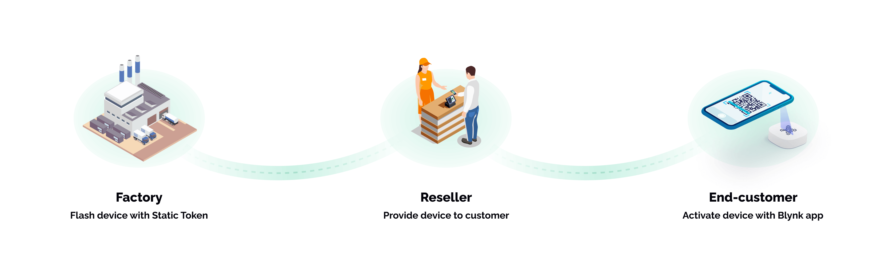

# Deploying Products With Static Tokens

Deployment of commercial IoT products for use by end-customer is a challenging process. Blynk offers tools to simplify this process for manufacturers, developers, and end-users.

There are three ways to obtain AuthTokens for your devices:

1. [Manually](../getting-started/activating-devices/manual-device-activation.md): typically used at prototyping stages or in non-commercial applications
2. [Automatically, using Blynk.Inject](deploying-products-with-dynamic-authtokens.md) : can be used for WiFi devices only
3. Using **Static Tokens**

This article will help you to understand the key concepts related to Static Tokens and guide you through the steps required at all stages - from manufacturing to delivery of your devices into the customer's hands

## What is a Static Token and when to use it

Static Tokens are designed for non-wifi devices (cellular, Ethernet, etc.). These devices can connect to the Internet automatically and don't require any additional user input (e.g. WiFi credentials) to get online.

Use-cases can be broader than this, of course. For example, your devices can connect to a mobile (cellular) hotspot using hardcoded WiFi credentials. In such cases, Static Tokens are applicable as well.

When you create a new Static Token using the tools we offer, two related items are created: **AuthToken** (Device Token) and **QR Token**. Static Token always belongs to a specific Device Template and specific Organization.

###

### AuthToken (Device Token)

Every device on Blynk platform has an AuthToken (OAuth Token), also often called as Device Token. This is a unique identifier of the device and it's used to authenticate, validate, and connect devices to Blynk.Cloud.

AuthToken is stated in the firmware code and is flashed to the device before it is delivered to the end customer.

AuthToken is usually not exposed to the end users due to security reasons (for the same reason you should not display it for public view anywhere).

###

### QR Token

This is a special token encoded into a QR code image. QR code is used only for assigning a certain device to a certain user within a certain organization. This process is also called **Device claiming**.

During device claiming, your customers scan the QR code using Blynk.Apps or Blynk.Console and it's automatically assigned to their account and their organization.

Users can claim the device regardless if it has already been online and connected to the Blynk.Cloud or not.

QR token is secure. It can only be used for claiming purpose. Unlike AuthToken, nobody can access the device by knowing the QR token.

After the QR token was used, device can't be claimed by anyone else. It can be unclaimed only by the owner of the device or by the manufacturer.

###

### Relationship to the Device Template

Static Tokens are generated for a specific Device Template. When device connects to the Blynk.Cloud for the first time, AuthToken is used for authentication. Then the server checks whether such AuthToken belongs to a Static Token. If this is true, this device will be using a corresponding Template.

###

### Relationship to the Organization

When you generate Static Tokens, they are created in your organization. You will have all the visibility on them and access the tools to manage these tokens further.

A common scenario is when the device goes online before getting into customer's hands. Such device will be authenticated by Blynk.Cloud and placed into the organization where the Static Token was created. Device will have **unclaimed** status. When end user claims it, device ownership will be updated and device will be transferred to the user's organization automatically.


Blynk currently doesn't support over-the-air firmware updates for devices that utilize Static Tokens. Such functionality is planned for future releases.


## Proposed Workflow

The workflow proposed below covers these steps:

1. Generating Static Tokens
2. Flashing Tokens to your devices
3. Prepare for the product delivery. Working with QR codes
4. Claiming devices by end-customers
5. Managing Static Tokens

## 1. Generating Static Tokens

You have two options for generating the number of Tokens you need based on the number of devices you plan to deploy:

* Automatically generate the number of tokens you need
* Generate Tokens based on the CSV file you provide&#x20;

### Generate tokens automatically

This is the simplest way to generate any number of Static Tokens you need.


The number of tokens you can create is limited by your plan limits. If you need more tokens, upgrade to a higher plan.


1. Go to Blynk.Console → Static Tokens&#x20;
2. Click on **Create Static Tokens**
3. Choose Auto-create
4. Choose the Template to create tokens for
5. Input the number of Tokens you need
6. Each token can now be seen in the list. Each token is associated with a QR code image.
7. Export the full list as a zip file which will contain a CSV file with all the AuthTokens and a folder with all the QR code images as PNG files. You can also extract the detail of each token in the list one by one.

Now the new AuthTokens are ready to be flashed to the hardware.

####

### Generating  Static Tokens from a .CSV file

In some cases, you may already have devices ready for a specific customer, or you already have some information like serial number on the devices and you need to map this information to Static Tokens.

The process of generating Static Tokens from a file looks like that:

#### **1. Data preparation:**

* Identify the data you would like to associate with devices
* In the Device Template -> Metadata create Metadata fields for each data item you would need
* Create a .CSV file with headers that correspond the Metadata fields names. See below.

_Example:_ Let's say you have 3 devices and they already have a Serial Number, a MAC address and device names \_\_assigned.

First of all, you would need to create 2 new metadata fields in the Device Template: Serial Number and MAC address. Device Name is a default Metadata provided by Blynk and there is no need to duplicate it.

Then create a CSV file like the one below.

| Serial Number | MAC address       | Device Name                 |
| ------------- | ----------------- | --------------------------- |
| SN000001      | 2C:54:91:88:C9:E3 | Temperature Sense Node AGHJ |
| SN000002      | 5C:62:91:82:C9:E8 | Temperature Sense Node KJGF |
| SN000003      | 4A:33:54:68:K9:F1 | Temperature Sense Node CVBN |


CSV file headers are case sensitive and should fully match Metadata Field names.


#### 2. Generate Static Tokens from file

1. Go to Blynk.Console → Static Tokens&#x20;
2. Click on **Create Static Tokens** → Create From File
3. Choose Template
4. Upload the file
5. Blynk will parse the CSV file and will identify all the columns (or find errors in the file)
6. The number of Tokens will be based on the number of rows in your file
7. You will have an ability to remap the columns in your file to metadata fields

After this process is finished each token can be found in the list of Static Tokens. Each token is associated with a QR code image. Now you can export Tokens as a .zip file. It will contain AuthTokens and a folder with all the QR code images as PNG files.

Now you have AuthTokens that can be flashed to devices.

## 2. Flashing AuthTokens to devices

While Static Tokens are favorable for end-users because they enable an amazing user experience (scan the QR code and device is ready), working with them brings challenges to the manufacturing process.

The biggest challenge is that since every device would need to have a unique AuthToken stated in the firmware, every firmware file will be different. For example if you have 100 devices, you would need 100 versions of the firmware file.

Depending on the volumes you are working with, you should take this factor into account.

#### EOL Inject Utility

Blynk offers an utility that allows flashing AuthTokens at EOL (end-of-line). This means that you can flash all devices with the same firmware, and then this utility will "inject" AuthTokens only.

This tool simplifies the flashing process significantly. Contact us if you would like to purchase it (only available for White-Label plan customers).

## 3. Preparing for device delivery

Once your devices are flashed with AuthTokens and tested, you would need to prepare QR codes. These codes will be used by your clients to claim their devices.


If you plan to test, setup, calibrate or perform any actions with the device before sending it to customer, you can do safely do so. Devices will remain working in your organization, but stay unclaimed before the QR code is scanned.

Only after the QR code is scanned, device will change status to "Claimed" and moved to the client's organization.


#### Printing QR codes

QR code images can be printed on the packaging, inserted in the box, or delivered to your clients electronically.

All you need to do is export QR code images by going to Blynk.Console → Static Tokens. There you can select the tokens you need and export them. You can also do it manually for an individual token.

Every QR code image file is named after an AuthToken it belongs to.


Printing QR codes and putting them onto the device with the same AuthToken can be challenging. You need to plan this process together with flashing the firmware to the devices. These two processes should be synchronized.


#### Manual for end customers

It's also beneficial to prepare a manual for your customers outlining the steps they need to make to activate their device (read below).

## 4. Device claiming (activation) by end customers

When customers receive your device, they would need to claim (activate) it. For that they would need:

* The device itself (this is optional because the device can be activated with just a QR code)&#x20;
* QR code image
* Account in Blynk

Have in mind, that in order to claim the device it shouldn't be connected to the Blynk.Cloud. End user can claim both connected and non-yet-connected devices. Both Blynk.Apps ans Blynk.Console have "device online" indicator, so the user will always know if device is connected or not.

This is how the flow with connected device looks like in details:

* User unpacks your device
* User turns on the device
* Device shows some indicator that it's online
* When the device connects to the Blynk.Cloud it doesn't have an owner yet. So at that moment the device is placed under the organization of the manufacturer (the organization where Static Token was created) &#x20;
* User accepts you invite within Blynk.App
* User scans the QR printed on the device box
* The device is transferred from the manufacturer organization to the end user organization

###

### Deleting device by the end customer

If the user deletes the device from their account, it becomes unclaimed. After that, it can be claimed again by other customers by scanning the QR code.&#x20;

###

### PRO Plan Workflow

1. Create a new sub-organization for your client in **Blynk.Console → Organizations**
2. Invite your client to this organization using their email. Your customer will get an invitation to create a new account by simply creating a password.
3. Customer logs in using Blynk.Apps for iOS and Android or Blynk.Console in their broswer.
4. Make sure your customer has a QR code image
5. Customer scans the provided QR code
6. Device appears under their account and is ready for use

###

### "Discovery" plan workflow (delivery planned for Q2-Q3 2022)


This feature is not available yet.


When you enable Discovery add-on, you no longer need to invite each client manually like in PRO plan. They can create accounts and claim devices by themselves. Here is how it works:

1. Customers download Blynk.Apps and create new account there. Or they can use Blynk.Console.&#x20;
2. When logged in, customer scan the provided QR code by clicking on Add New Device
3. Device appears under their account and is ready for use


It's beneficial to prepare instructions for your customers outlining the steps they need to take to activate their devices


## 5. Managing Static Tokens

Blynk.Console allows you to manage Static Tokens.&#x20;

### Disclaiming a Static Token

Disclaiming removes any ownership of the device and sets it back as unclaimed. After that it can be used again.

Disclaiming can only be done by organization where it was created.

After the Static Token becomes unclaimed, the device is removed from the organization it belonged to, but it stays in the system. If it connects to the cloud again, it will automatically return to the organization where the Static Token was created.

Examples when disclaiming can be needed:&#x20;

* **Testing**. You may test the tokens and then disclaim them before sending the device to end customers.
* **Device return**. If device was returned and you need to resell it again. Disclaiming will allow new customers to claim device again.
* **Ownership change**. When your customer wants to give the device to another user. (You can also use device transfer for that without disclaiming)

### Deleting Static Token


This is a critical action that can't be undone. You won't be able to restore this device


When you delete a Static Token, an associated AuthToken becomes invalid. If it was flashed to the device, this device will not be able to connect. You need to generate a new Static Token and use new AuthToken.

1. If you delete a Static Token after device was claimed, this device will be deleted permanently. Customers won't be able to claim it. &#x20;
2. If you deleted a Static Token before the device was claimed, the device will not be able to connect.

