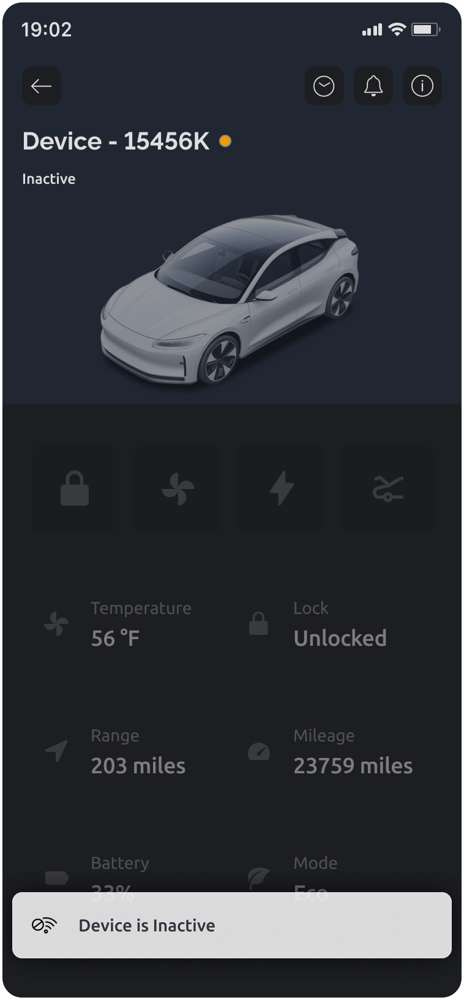

# Connection Lifecycle

_Is my device online right now? Is it "sleeping"? Did it report on time? What happens if I press this button in the app, but device is offline...  🤷‍♂️_

These are all valid questions your customers may have when they remotely operate an IoT device.&#x20;

Different business cases and connectivity methods may require different ways to tell your users what's happening with the device's Internet connection at the moment which can also change how users can interact with the device based on this status.

Connection Lifecycle helps you set up the complete flow: starting from device going online, then being in different connection statuses, and all the way down to "retiring" (if needed).

A simple example of such a flow can be:

Device is **Online ->** Device went **Offline ->** Device is **Inactive** (Offline for too long)

A more complex flow could be:

**Device is online:** connected to server and reporting data successfully  **-> Standby:** Device goes into low-power sleep mode **-> Offline:** Device didn't report on time **-> Inactive:** Device is offline for too long

## Connection status and user experience&#x20;

### Indication

Connection Status is displayed in Blynk mobile apps and in Console. It's visible to the users in the list of devices and on the device page. It can also be displayed on Device Timeline in both Console and mobile apps.

<figure><figcaption>
Device connection statuses in Blynk.Console and Blynk.Apps
</figcaption></figure>

### Notifications

You can notify users about the changes in device connection status of their devices. Keep in mind, that notifications can be blocked in smartphone settings.

### Interactions

You can set up how users can interact with the device when it's in a certain Connection Status. For example, you can disable the use of any controls when device is Offline. Or, instead, show users a notification about changes that will be applied when the device gets back Online.&#x20;

<figure><figcaption>
Mobile app with blocked interaction
</figcaption></figure>

## How to set up custom device connection flow

Connection lifecycle setting is part of Template. To set it up navigate here:

**Developer Zone** -> **My Templates** -> **Template** -> **Connection Lifecycle**

Blynk.Cloud automatically tracks device connections, disconnections, and data transactions. These events, together with [configured timeouts and device heartbeat](disconnections-and-heartbeat.md) are used to update device connection status.

By default, every template has 2 predefined lifecycle events: `Online` and `Offline`**,** and `wait` timeout in between. You can't remove these events, however, you can configure them by changing the name and other settings.


[connection-lifecycle.md](../../blynk.console/templates/connection-lifecycle.md)


SOON: You can update device status using Blynk.Library and HTTP APIs.&#x20;

Before you start designing your own flow, make sure to get a good grip on the fundamental concepts, such as Graceful Shutdown and Heartbeat.


[disconnections-and-heartbeat.md](disconnections-and-heartbeat.md)


