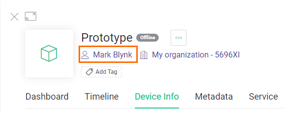

# Device

A device can be an MCU-based hardware \(e.g. NodeMCU, Arduino, Raspberry Pi, etc\), a finished physical product like a Smart Air Conditioner, or a virtual service that sends data to Blynk.Cloud using REST API.

## AuthToken

Every device on the Blynk platform has an AuthToken – a unique identifier generated by Blynk.Cloud. You can find it in the Device Info section of the required device:

You can read more about it [here](../getting-started/activating-devices/#2-activating-device-with-static-auth-token).

## Template Inheritance

Every device inherits a [Device Template](device-template.md). Make sure you understand this concept before you start building something on Blynk platform.

## Ownership

A Device always belongs to an Organization and usually has an owner. In most common cases, it's a user who activated the device. However, ownership can be changed by transferring the device to a different user or Organization. Owner of the device could be found under the device name:

Click on the owner name will open the user profile in case you have enough permissions to view it. Device owner is used mostly for the permissions to restrict the devices access within the organization.

## Access

Access to a particular device can be limited based on the user role and a set of permissions.

