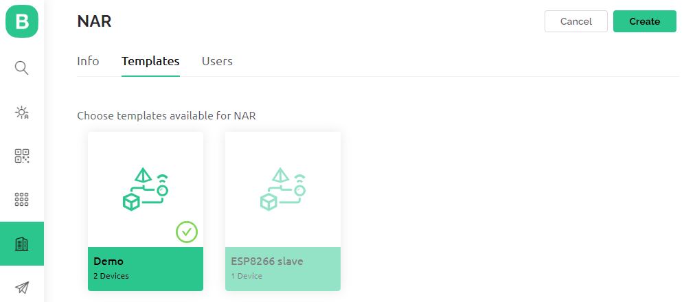

# Organizations

Every user of Blynk is a member of an Organization. This could be a one-person organization, a family, or a company with hundreds of employees.


Creating an multi-level organizational structure is a feature available for **PRO or higher** paid plans.&#x20;

The **FREE and PLUS** plans support multiple users, and assignment of roles to those users (see plan limits).


### Introduction

Organizations enable you to categorize your devices and users, assigning them roles, permissions, and locations. The structure is a tree-like hierarchy, where a user assigned to an organization has permission to all sub-organizations beneath it, and the assigned devices and data. This multi-tenancy functionality allows you to easily scale your project, and customize it to your particular needs. The maximum depth of organizations is four, as shown in the example image below.

<figure><figcaption></figcaption></figure>

The first Blynk account created for an organization becomes the root organization. It is defined under ‘Settings - ORGANIZATION SETTINGS’.  If you invite users by email that do not have a Blynk account, they will inherit that root organization.  You cannot invite users that already have a Blynk account.

Every Organization consists of:

* Users  with assigned roles and permissions
* Templates
* Devices
* Locations
* Sub-organizations

#### Users

Every user of Blynk is a member of an organization. This could be a one-person organization, a family, or a company with hundreds of employees.  Every member of an organization has a role. Roles control how users access the data with a set of permissions.

#### Templates

A template must be [enabled](https://docs.google.com/document/d/1y\_PpM8KAuvTYCgAaOjuDmh5oL637Vq4Dcuel07LGCkM/edit?pli=1#bookmark=kix.6fjbrnh26jrt) for the sub-organization in order for devices associated with it to be transferred to a user.  Templates are created by the root organization. &#x20;

#### Devices

Every device has at least one user assigned as the owner to it via [device transfer](https://docs.blynk.io/en/blynk.console/devices/actions-with-devices#device-transfer).  [Multiple users](https://docs.blynk.io/en/blynk.console/devices/device-sharing#sharing-via-sub-organization) may view a device (see [device sharing](https://docs.blynk.io/en/blynk.console/devices/device-sharing)). &#x20;

#### Locations

[Locations](https://docs.blynk.io/en/blynk.console/locations/locations) allow you to tag devices with a named location details (address and latitude/longitude).  Use sub-organizations to group users and devices, and to control access/permissions for users,  device configuration, and data. &#x20;

#### Sub-organizations

Sub-organizations can be of four [types ](https://docs.blynk.io/en/blynk.console/settings/organization-settings/general)that are available only for Business users. For the PRO plan the sub-organization type is assigned automatically and defaults to 'client'.

### Planning Your Organization

The full management and configuration is more easily accomplished using the Blynk.Console.  Blynk.App does allow you to add / invite new users and devices to the root and sub-organizations, edit many of the organization settings, and to browse the sub-organizations.

You need to be logged into Blynk as a user with a role and set of permissions that will allow you to create/edit organizations, templates, users, etc.  The organization you are assigned to as a user has access only to that organization, and any sub-organizations.  The root organization user with ‘Admin’ role and default permissions is sufficient.

Sketch out your current root organization including templates, devices, and users.  Then lay out the sub-organization and include the templates, at least one user with ‘Admin’ role, one device, and the user who will be assigned as the device owner.

<figure><figcaption>
Multi-level organizational structure
</figcaption></figure>

In the example above in Muller Boiler Group organization user R has access to the Thermostat of the user W and vice versa, user W has access not only to their own Thermostat but also to the Boiler owned by R.&#x20;

For the users to have access only to their own devices, create a structure like United Heaters Inc. on the image, where a sub-organization is created for each user, so M only has access to Pool Heater, while H can only see data from their Thermostat and manage this device only.

User A from the parent organization has access to all devices in the sub-organizations within their hierarchy.

Decide on roles for the users (‘Admin’, ‘Staff’, ‘User’), and what permissions you want to configure for each role.  Review this by accessing ‘Settings -> Roles and permissions’ from the sidebar.


Keep in mind that by default, members assigned the ‘Staff’ role will be able to see and manage devices.&#x20;

And by default, members assigned the ‘User’ role with default permissions cannot see or manage devices, even those devices transferred to them.&#x20;

The organization permission ‘View devices’ under ‘Owned Devices’ must be enabled for the ‘User’ role by the organization ‘Admin’ user (or other with appropriate permissions). This is the same for other device permissions such as provision, edit, control, etc, and those under the roles and permissions group ‘Organization Devices’.


Every sub-organization should have at least one member assigned the role ‘Admin’.  The only way to assign a user with the ‘Admin’ role to a sub-organization is to invite someone who is not currently assigned a Blynk account.  Invite the user to join the sub-organization and assign them the role of ‘Admin’.

After the sub-organization ‘Admin’ member has been assigned, other Blynk members may be transferred by providing the email for the sub-organization ‘Admin’ or invited by providing their email address. The transfer is possible only within the same hierarchy of organizations.


Although you can define what devices users may see and manage through roles and permissions, it is easier to manage that for multiple users by assigning those users and devices to a sub-organization.  \

1. Create a sub-organization
2. [assign an administrator](https://docs.google.com/document/d/1y\_PpM8KAuvTYCgAaOjuDmh5oL637Vq4Dcuel07LGCkM/edit?pli=1#bookmark=id.7fj59ora61c5), [invite](https://docs.google.com/document/d/1y\_PpM8KAuvTYCgAaOjuDmh5oL637Vq4Dcuel07LGCkM/edit?pli=1#bookmark=kix.x92xrbhclhr6) or [transfer](https://docs.google.com/document/d/1y\_PpM8KAuvTYCgAaOjuDmh5oL637Vq4Dcuel07LGCkM/edit?pli=1#bookmark=kix.x92xrbhclhr6) the user to that sub-organization
3. Create the device or transfer it to the user. &#x20;

It is important to assign an appropriate role to the user that gives them permission to view and/or manage the devices assigned to the organization (by default, ‘User’ role is insufficient, but ‘Staff’ is). &#x20;

Note that device templates may not be viewed or edited by users in the sub-organization unless you [assign a template to the sub-organization](https://docs.google.com/document/d/1y\_PpM8KAuvTYCgAaOjuDmh5oL637Vq4Dcuel07LGCkM/edit?pli=1#bookmark=kix.6fjbrnh26jrt).


### Creating a Sub-Organization

The workflow is to log in to Blynk, create the sub-organization(s), assign templates, assign an ‘Admin’ member, transfer or create users, and finally create or transfer devices (assign a user to the device).  Members with the correct roles and permissions can also create and provision devices.

Login to Blynk as a user with a role and permissions that will allow you to create/edit an organization, add/edit templates, edit devices, and transfer users.  The ‘Admin’ role with default permissions is sufficient.

From the Blynk.Console sidebar, click on the ‘Organizations’ icon, and then the ‘+ Create New Organization’ button.

<figure><figcaption></figcaption></figure>

Under the ‘Info’ tab, assign a ‘NAME’, and optionally a ‘DESCRIPTION’ and logo.  Logo image must be between 500x500px and 4096x2048 pixels. &#x20;

Click on the ‘Templates’ tab, and then click on one or more templates to be enabled for the sub-organization. Enabling a template will permit devices to be later transferred to designated users in that sub-organization.

<figure><figcaption></figcaption></figure>

Click on the ‘Users’ tab to add members who will have access to the devices and data associated with the templates selected.

You can dynamically invite users that currently don’t have a Blynk account and assign them the [roles](https://docs.blynk.io/en/blynk.console/settings/access#roles-and-permissions) of ‘Admin’, ‘Staff’, or ‘User’ on this tab as well.  See ‘[How to Assign a Device to a User](https://docs.google.com/document/d/1y\_PpM8KAuvTYCgAaOjuDmh5oL637Vq4Dcuel07LGCkM/edit?pli=1#bookmark=id.je16rq9h3eu)’ for more details.

Existing Blynk members will need to be transferred via [Search -> Users -> All](https://docs.blynk.io/en/blynk.console/users/users-list#users-table) -> Actions -> Transfer User, or [Search -> Organizations](https://docs.blynk.io/en/blynk.console/settings/organization-settings/users#hover-options), [Settings -> ORGANIZATION SETTINGS -> Users](https://docs.blynk.io/en/blynk.console/settings/organization-settings/users#hover-options).


Users can only be transferred within the same hierarchy. E.g.: If a user has a Blynk account, that's not within your organization structure, they will have to delete their account prior to being added to your organization or use a different email that hasn't been in use on Blynk.&#x20;


Click the ‘Create’ button when finished.  Repeat the process to create any other sub-organizations. &#x20;

Once a sub-organization is created, you may transfer devices to the sub-organization by [assigning a user to a device](https://docs.google.com/document/d/1y\_PpM8KAuvTYCgAaOjuDmh5oL637Vq4Dcuel07LGCkM/edit?pli=1#bookmark=id.je16rq9h3eu).  You may also create new devices and then [assign a user to the device](https://docs.google.com/document/d/1y\_PpM8KAuvTYCgAaOjuDmh5oL637Vq4Dcuel07LGCkM/edit?pli=1#bookmark=id.je16rq9h3eu), or the user may [provision the device](https://docs.blynk.io/en/commercial-use/deploying-products-with-dynamic-authtokens#delivering-products-to-clients-pro-plan-workflow).

### Creating a multi-level organizational structure

There are two key ways to create a tree-like multi-level structure.

* from the root-level organization
* from the parent organization

#### Creating a third-level organization by the root-org admin

The flow is to [create all the organizations](organizations.md#creating-a-sub-organization) you need as sub-organizations of the root org using the 'New Organization' button and after that assign the child sub-organizations to their parent sub-organizations according to your planned structure.

To assign a child sub-organization to a parent sub-organization go to Search -> ORGANIZATIONS -> My organizations -> Actions and select 'Transfer Organization' from the drop-down menu. You will be taken to a dialog where you can type in the name of a parent sub-organization or select it from the list to assign the child sub-organization to it. You will be able to review the new hierarchy before confirming the transfer.


When transferring organization, you will move all the assets, including devices, users, sub organizations (and their assets) under another organization in the hierarchy.



The transfer can be reversed by transferring the sub-organization back.


#### Creating a third-level organization by the parent-org admin

The admin of the parent sub-organization creates a sub-organization of the deeper level using the common [sub-org creation flow](organizations.md#creating-a-sub-organization).


As a root-org admin you can create sub-organizations under the sub-organizations in your hierarchy if you switch to the sub-organization that is planned to be the parent one. Then follow the flow of the parent-org admin described above.


Read more about how to work with organizations [here](https://github.com/blynkkk/docs/tree/2dc305739ee5d42b5fd9d7af9c9d6c057276a5fe/blynk.console/organizations/README.md).

Learn about existing limitations [here](https://docs.blynk.io/en/blynk.console/limits#organization).
