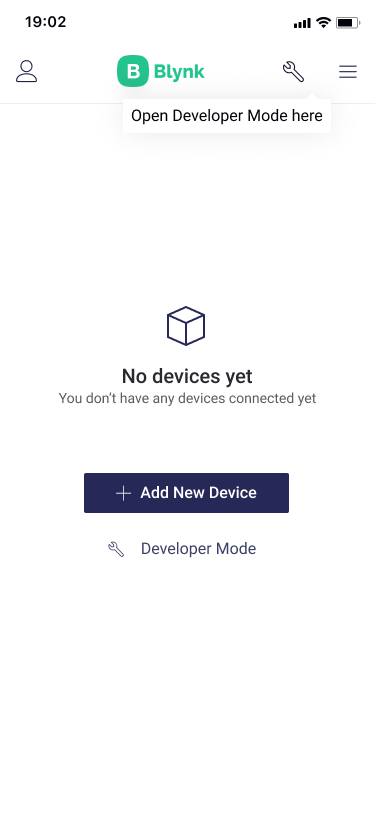

# Developer Mode

Developer is a user who has access to all the functionality required to configure the platform for use by end-users \(also called Clients\). This is usually someone who builds the hardware, develops the firmware, and does all the needed configurations.

By default, the ****first user in the Organization becomes a Developer.

Developer can: 

* Create and configure New Device Templates
* Create and configure mobile dashboard
* Publish Templates to Blynk.Marketplace \(work in progress\)

## Enable Developer Mode 

1. In the Blynk app or in Blynk.360
2. Navigate to **My Profile**
3. Check that **Developer Mode** switch is set to ON

Now you should be able to see


Currently, **only one developer is allowed per Organization** to avoid sync issues. This limit can be changed later.


## Linking the Templates

Tap **Wrench** pictogram at the top right of the screen near to Menu pictogram

In Developer Mode screen you can set up Tiles for the Devices that will use Templates created in Blynk.360

1. tap Tile containing Add Template in it's bottom
2. select Template Tile Action Type and confirm by tap
3. set up Tile Icon, Interaction, Datastreams, Shape and other settings
4. tap X at top left to exit Tile Settings window and save the changes


If you need to edit the Tile, **hold** it for about a second.

Tap **Delete** button if you need to re-select Tile Interaction Type and repeat the actions from step 1 

Tap on Template Tile opens [**Constructor**](constructor/) from now on.


### Tile Types

There are 6 Devices tiles presets with different actions applied on tap : 

* **Default** – views selected Datastream value in the tile \(e.g.: temperature, volume, percentage, etc.\)
* **Icon Button** – tap on the Device Tile will trigger an action or switch ON/OFF state
* **Icon Level** – displays proportional level \(brightness, power, etc.\) based on selected Datastream value
* **Color Brightness** – allows to view and edit Color, Power status and Brightness level of the Device
* **Image** – shows Icon/Image on the Tile. No quick actions. It can be used for recognition purpose. 
* **3 Labels** – it's a hybrid of Default and Icon Button. Up to 3 Datastream values display is supported

