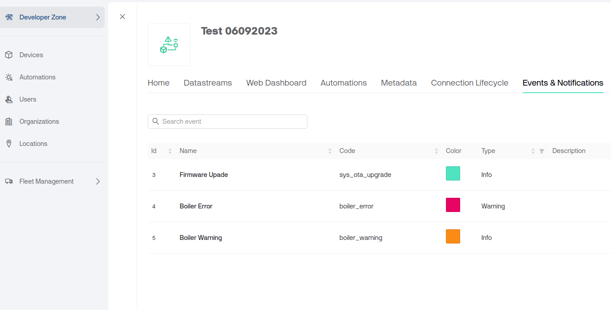
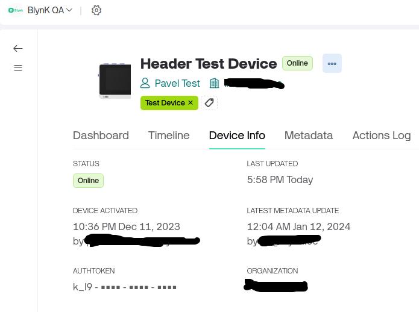

# Events

Events are used to track, log, and work with important events that happen on the device.&#x20;

Events are also used for notifications which can be sent over email, delivered as push notifications to the user's smartphone, or sent as an SMS.

Events are pre-configured in Blynk.Console and can be triggered with a [Events Firmware API](../blynk-library-firmware-api/log-event.md) from the device or using [Events HTTP API](../blynk.cloud/device-https-api/trigger-events-api.md).

_Examples of an Event:_

* _Log a moment when a temperature reaches a certain threshold and send a notification to selected users_
* _Track the total working hours of the device. If it approaches or goes beyond a maximum value, you would need to notify technical support so that they can replace the device or provide warranty service_

<figure><figcaption><p>Events list in the template</p></figcaption></figure>

## Types of Events

There are three types of Events in Blynk:&#x20;

* **System Events:** Default Blynk platform events, like "OTA Update"
* **Custom Events:** Events you can create and configure for your needs
* **Content Events:** Informative events that are shown separately in the app

### System Events

You can't delete the system events or edit them.

#### Firmware Over-The-Air Update status

This is a system event to track firmware updates. It can't be configured.


### Custom Events

These are Events you can configure based on what your device does. Read these articles to start logging events and sending notifications:&#x20;

* [**Event Settings**](../blynk.console/templates/events/custom-events/events-general-setting.md)
* [**How to send custom events from hardware using Firmware API and HTTPS API**](../blynk.console/templates/events/custom-events/events--how-to-log-events.md)&#x20;
* [**Content Events**](../blynk.console/templates/events/custom-events/events-content-events.md)


## How to log an event in Blynk

### 1. [Create a Template](template-quick-setup/) or use an existing one

### 2. Create a New Event

Go to Developer Zone -> My Templates -> Select a template -> Open the "Events & Notifications" tab.

1. Click **Edit** Template
2. Click **+ Create Event**
3. Name the first event with the name Hello
4. Click **Create** (the event will appear in the Events tab list)
5. Repeat the previous step for the second event with the name Error
6. Click **Save** to save and apply the changes made (select Update active device this time)


Note that each event has`EVENT_CODE`. This event code will be used in firmware API or HTTPS API


### Send Events Using Firmware API

1. Create a new Event named `High temperature` with code `high_temp`
2. Use the `Blynk.logEvent(event_code)` firmware API command to trigger a new event:

```cpp
if (temperature > 35)
{
   Blynk.logEvent("high_temp");
}
```

When this code works, an Event will be logged and the system will act accordingly to the Event setup (render on the timeline, send notifications, etc.)


Don't log an event too many times to avoid hitting daily limits. You can use timers or flags to mark the already-sent events. Check this [article](how-to-display-any-sensor-data-in-blynk-app.md) on how to avoid spamming the server with events



The current limit is 100 events per device per day. This limit could be increased for business clients to fit their needs.


#### Custom Event Description

You can change the description of the event when it's rendered on the timeline in Blynk.Console and in Blynk.Apps. For example, you can include the current data

```cpp
if (temperature > 35)
{
  Blynk.logEvent("event_code", String("High TemperatureDetected! Tº: ") + temp);
}
```


Make sure you enabled [Timeline recording](../blynk.console/templates/events/custom-events/events-general-setting.md#show-event-on-the-timeline) in the Event Settings to see the result in the apps



### Send Events Using HTTPS API

To log an event via GET request:&#x20;

```
`/external/api/logEvent?token={AuthToken}&code={event_code}
```


To add a custom description to the event, use this GET request

```html
`/external/api/logEvent?token={AuthToken}&code={event_code}&description={event_description}
```


Example:

```
https://blynk.cloud/external/api/logEvent?token=GVki9IC70vb3IqvsV0YD3el4y0OpneL1&code=firmware_update&description=test
```

##

## 3. Sending Events

You can test the Event creation by sending it from Device using Blynk.Edgent firmware API, or with REST API.

### Use Blynk.logEvent() firmware API

`Blynk.logEvent("event_code", "optional message");`

For this tutorial, you would need to use hello as a name. Here is a pseudo-code:

```cpp
if (some_condition){
    Blynk.logEvent("hello");
}
```

Optionally, you can send a custom description of the event. This description will be rendered on Device Timeline.

```cpp
if (some_condition){
    Blynk.logEvent("hello", "Hello World,") ;
}
```

### Use HTTP REST API

1. Navigate to the Device
2. Click on its name
3. Open the Device Info tab
4. Find Auth Token there and click on the icon to copy it to the clipboard

<figure><figcaption><p>Device Info tab with Auth Token</p></figcaption></figure>


Now make an HTTP request with the tools you use for that. Make sure to change the `AuthToken` to the one you copied in the previous step.

You can even use your browser for that. Just put it in the URL field and press Enter.

```http
https://blynk.cloud/external/api/logEvent?token=AuthToken&code=hello
```

Repeat the same with `code=error`

```http
https://blynk.cloud/external/api/logEvent?token=AuthToken&code=error
```

## 4. Checking if the Event was logged

First of all, check [Device Timeline](../blynk.console/devices/device-profile/timeline.md) by going to Device -> Timeline tab


You should see 2 events on the timeline! If you set up notifications, they should have been delivered as well.

## Limitations

* You can send only 100 events per device per day (Adjustable in Business Plan)
* When the limit is reached you'll see the notification on the UI in the Device Timeline section
* The maximum description length for the event is 300 characters

