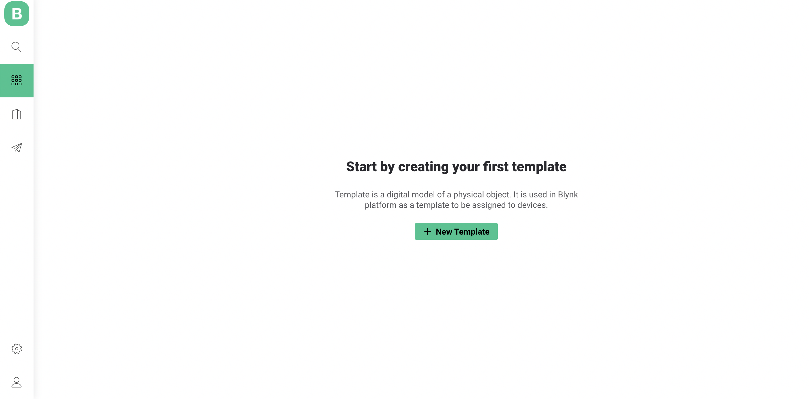
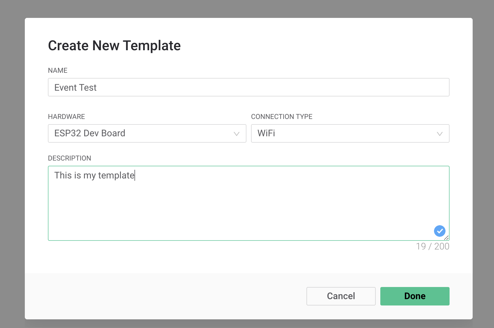
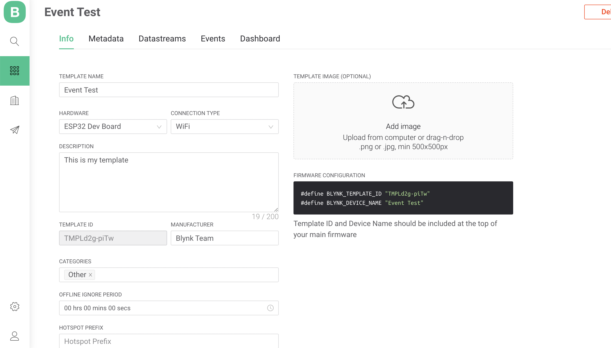
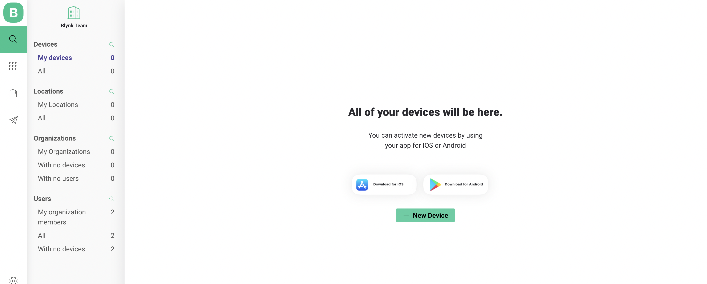
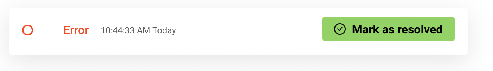

# Events Tutorial

Events shows the current status of the device on Devices Timeline in historical order.  
This feature is extra handy for monitoring informational, warning and critical states of the Devices.

## [Create a Template](working-with-templates/) or use an existing one

1. Open Blynk.360
2. navigate to **Templates** 
3. select Template or click New Template
4. click **Edit** button \(if you've selected an existing Template\)



5. provide general information about the Product



6. Fill in the necessary field in the [Info tab.](../web-dashboard/products/info/)



## [Create the Device](../web-dashboard/search/devices-1/#create-device) that will be used with this Template



## Create Events 

\(also this could be done at Template creation stage\)

Return to Template settings and open Events tab and click Edit at top right.  
_**Note:**_ there are two default events \(and they can't be edited\): Online and Offline.


### Let's create 2 events with names Hello and Error

1. click **Add New Event**
2. provide info on ****[**General tab**](../web-dashboard/products/events/general.md)\*\*\*\*
3. name first event with the name Hello
4. click **Create** \(the event will appear in Events tab list\)
5. repeat previous step for second event with the name Error
6. click **Save** to save and apply the changes made \(select Update active device this time\)


## Check Events to be applied.

We'll do this using [HTTPS API](../https-api/trigger-events.md)

1. navigate to Device yoo've created
2. click on it's name
3. open Device Info tab
4. find Auth Token there and copy it to the clipboard


5. create \(paste Auth Token to it's body after token=\) and send API request














it's taken from Device Info tab





it's taken from Event Code field










```

```





6. repeat the same with code=error  
7. check [Device Timeline](../web-dashboard/search/devices-1/device-view/timeline.md)


Congratulations! We have 2 events now!

Also we can mark Critical and Warning events as resolved after it's fixed. Please mind to comment this action in the modal window appeared.



From now on this event can be found under Resolved filter tag.

