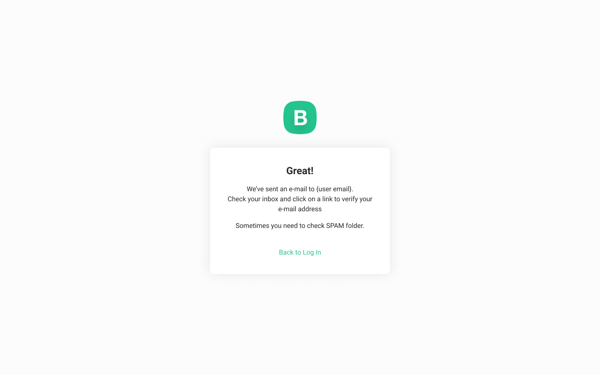

# Partner Sign Up

This is a separate flow ****used to register company partners: Distributors, Retailers, Contractors, etc who will get access to special app functions.

1. Click **Sign Up as a Partner**  

2.Fill in the Company Name, Partner Type, E-mail, check that  you agree to [Terms and Conditions](https://dash-qa.blynk.cc/dashboard/terms-and-conditions) and accept [Privacy Policy](https://dash-qa.blynk.cc/dashboard/privacy-policy) and click **Sign Up** 

3.Check your inbox for an email with instructions.   

4.Click **Create Password** in your invitation email 

5.Provide your Organization required and optional information.  

6.Provide your primery contact  information.   

7.Press **Done**   to complete registration

