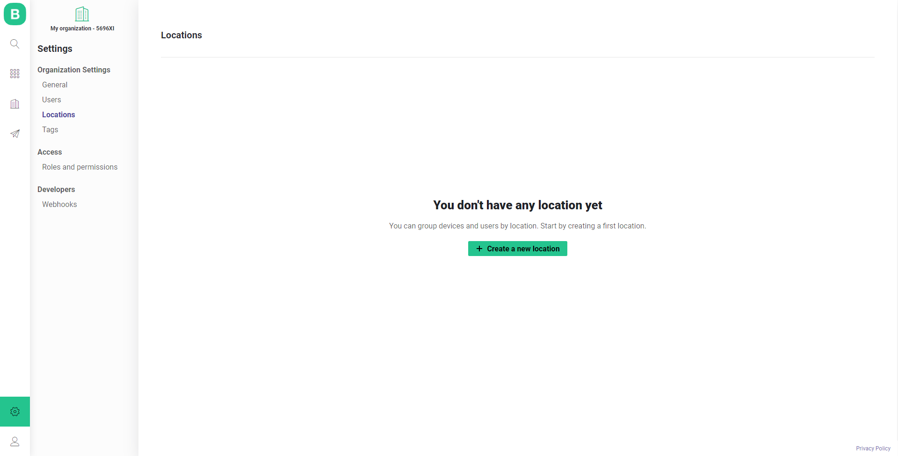
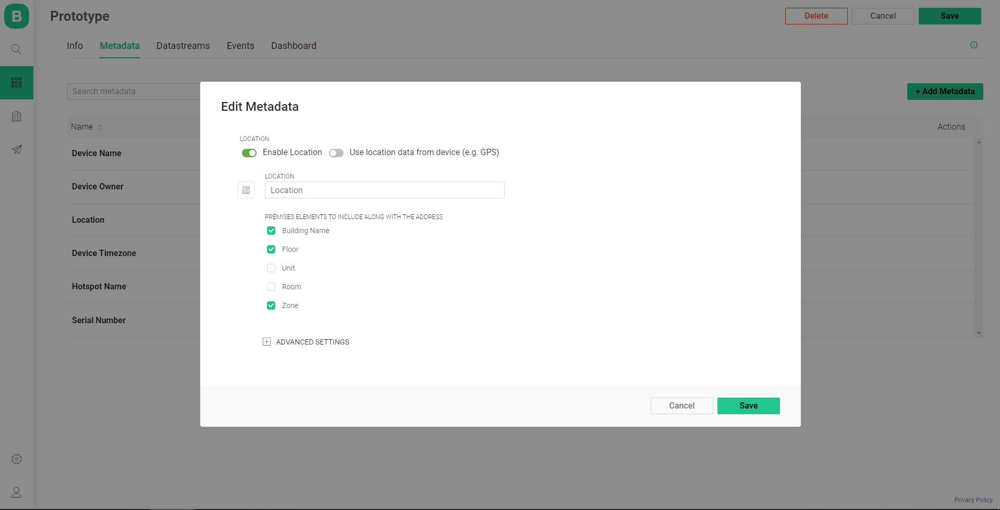

# Locations

### Create a new Location 

1. Navigate to Settings - Organization Settings - Locations 
2. Name it \(let it be in `Factory` this example\)
3. Type the address in the corresponding field \(you can provide details s.e. ZIP, state, etc. in the modal window appearing after **Manual Input** click\)
4. Confirm by clicking **Done**

After you've created first Location you'll see Locations table[. ](../web-dashboard/search/locations.md#table-contents)You can find more details about it [here](../web-dashboard/search/locations.md#table-contents).

Repeat steps to create another location \(let's call it `Office` \)

### Enable Location Metadata

1. Navigate to Templates section  
2. Click **Edit** button 
3. Switch to Metadata tab 
4. Click on **Location** 
5. Toggle switch to **Enable** in the modal window 
6. Click **Save** 
7. **Save** the Template
8. Set **Update active devices** option in Apply Changes modal window 
9. Click **Continue** button

### Assign Device to Location

Search   
Device   
Metadata tab   
Choose location   
Save   
  
Create another Device   
Choose Template   
Metadata   
Edit   
Select second Location 

Settings   
Locations   
Check Devices to be assigned to Locations 

### Edit Location details

#### Edit in Search section

Search   
Locations   
View them   
Edit   
Locations 

#### Edit in Settings section

Settings   
Locations   
Search Devices   
Edit Locations   
Check in Settings / Locations 

### Advanced Location Settings

Template   
Edit   
Metadata   
Advanced Location settings   
Save   
Apply to active Devices 

Check in Search / Device   
Search   
Devices   
Map Mode 

### Describe Map view settings

