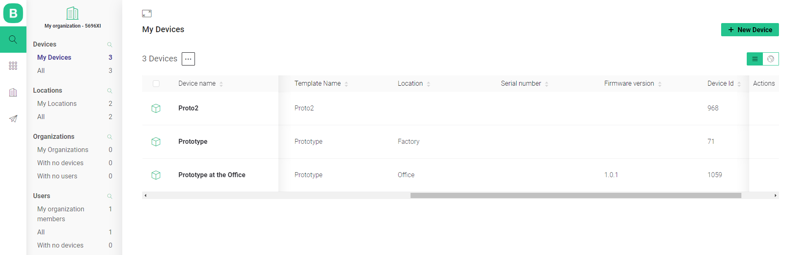
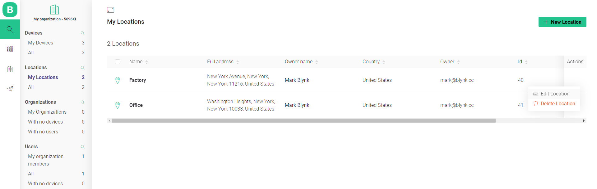
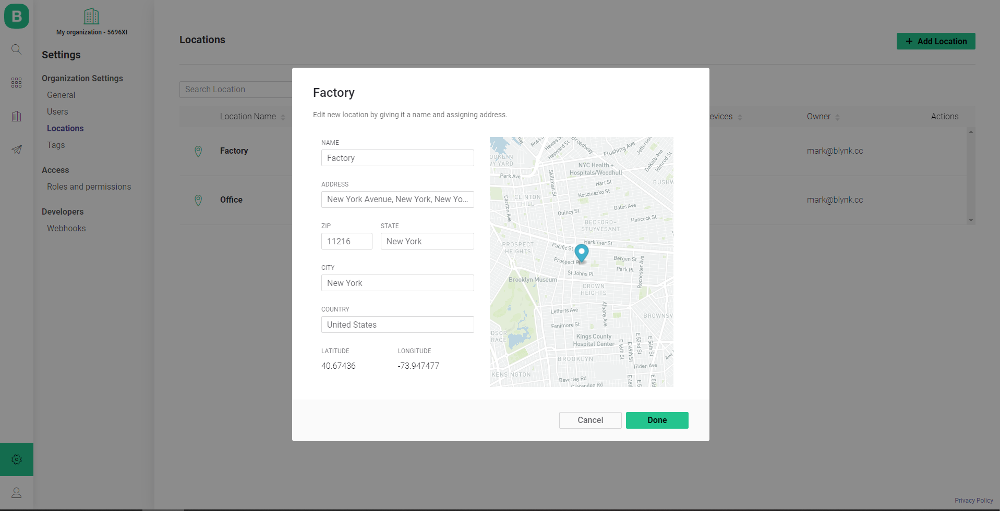

# Assigning Devices to the Locations

## Create a new Location 

1. Navigate to Settings - Organization Settings - Locations 
2. Name it \(Let's use `Factory` in this example\)
3. Type the address in the corresponding field \(you can provide details s.e. ZIP, state, etc. in the modal window appearing after **Manual Input** click\)
4. Confirm by clicking **Done**

After you've created first Location you'll see Locations table[. ](../web-dashboard/search/locations.md#table-contents)You can find more details about it [here](../web-dashboard/search/locations.md#table-contents).

Repeat steps to create another location \(let's call it `Office` \)

## Enable Location Metadata

1. Navigate to Templates section  
2. Click **Edit** button 
3. Switch to Metadata tab 
4. Click on **Location** 
5. Toggle switch to **Enable** in the modal window 
6. Click **Save** 
7. **Save** the Template
8. Set **Update active devices** option in Apply Changes modal window 
9. Click **Continue** button

## Assign Device to Location

1. Navigate to Search - Device - My Devices
2. Click on the **Device** you want to assign the Location
3. Switch to Metadata tab 
4. Hover the **Location** row
5. Click **Edit**
6. Select Location from the **dropdown list** \( `Factory` \)
7. Provide additional data in the modal window opened
8. Click **Save** 

9. Create or chose another one Device  
10. Repeat the steps below to assign location Office to your second Device  

## Check the locations assignment

#### Locations assigned to the Devices

1. Search - Devices - My Devices
2. Use horizontal scroll to get to Location column

#### Quantity of the Devices assigned to the Locations

1. Navigate to Settings - Organization Settings - Locations 
2. Check the rows contents, Devices column 

## Edit Location details

### Edit in Search section

1. Search - Locations - My/All Locations
2. Hover **Actions** column in desired Location's row
3. Click **...**
4. Click **Edit Location** 
5. Change the values in the modal window opened
6. Confirm the changes with click on **Done** button

### Edit in Settings section

1. Navigate to Settings - Locations  
2. Click desired Location name
3. Change the values in the modal window opened
4. Confirm the changes with click on **Done** button

## Advanced Location Settings

1. Navigate to Template section 
2. Click **Edit** 
3. Switch to Metadata tab
4. _Hover_ Location
5. Click **Edit** button appeared
6. Here you can specify additional Location settings.
7. Click **Save** once it's done
8. Select appliance option and confirm by click on **Save** button

