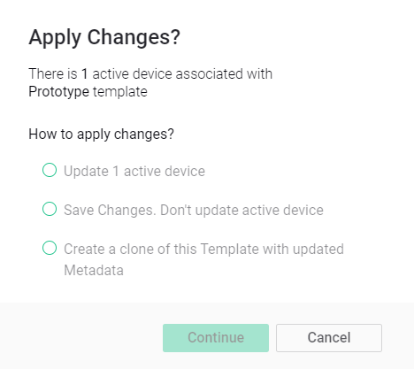
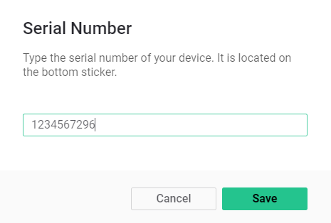

# Metadata Tutorial

Metadata is a set of characteristics \(or configurations\) applied to every Template and associated with every Device. This information will be used for Device Provisioning and [Device Management](../mobile-applications/device-management/).   
****Staff, installing the equipment will be able to fill it in.

### **1.** [Create a Template](working-with-templates/) or use an existing one

### **2. Create Metadata**

1. Open Template
2. Click **Edit** at the top right
3. Switch to Metadata tab

4. Click **Add Metadata**.   
Choose the most relevant [type ](../web-dashboard/products/metadata/metadata-types.md)for every characteristic. For example, if you would need to associate Serial Number with every product, add the “Number” metadata field.   
5. Set it up and click **Create** button once you've finished with this characteristic 

6. Repeat steps 4 and 5 untill you create Metadata list you need  
7. Click **Save** Template at the top right  
8. Choose Apply Changes option \(let's select Save Changes. Don't update active device this time\) and click **Continue**


You can edit Product's Metadata settings any time you need it by following the steps above.


### 

### 3. [Add Device](../mobile-applications/device-management/add-new-device.md) and provide it's Metadata

1. During the provision there will be prompts to input Device Metadata:

2. Change default value to actual one by tapping step buttons or direct input to the field.  
3. Follow provision flow till it's end.

### 

### 4. View Metadata

#### Blynk.App

1. Tap Device tile
2. Tap top right Menu button
3. Scroll through Information tab untill you see Metadata you need

#### Blynk.360

1. Navigate to [Search section](../web-dashboard/search/)
2. Find your Device
3. Click on it's name or row in the table
4. Switch to Metadata tab

### 

### 5. Edit Device Metadata

#### Blynk.App

1. Tap Device tile
2. Tap top right Menu button
3. Scroll through Information tab untill you see Metadata you need
4. Tap Metadata value field
5. Change the value
6. Return to the previous screen

#### Blynk.360

1. Navigate to [Search section](../web-dashboard/search/)
2. Find your Device
3. Click on it's name or row in the table
4. Switch to Metadata tab
5. Hover Metadata value you want to change
6. Click **Edit**
7. Change the value
8. Click **Save**

