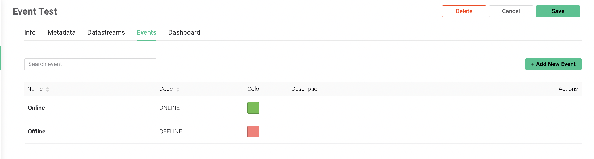
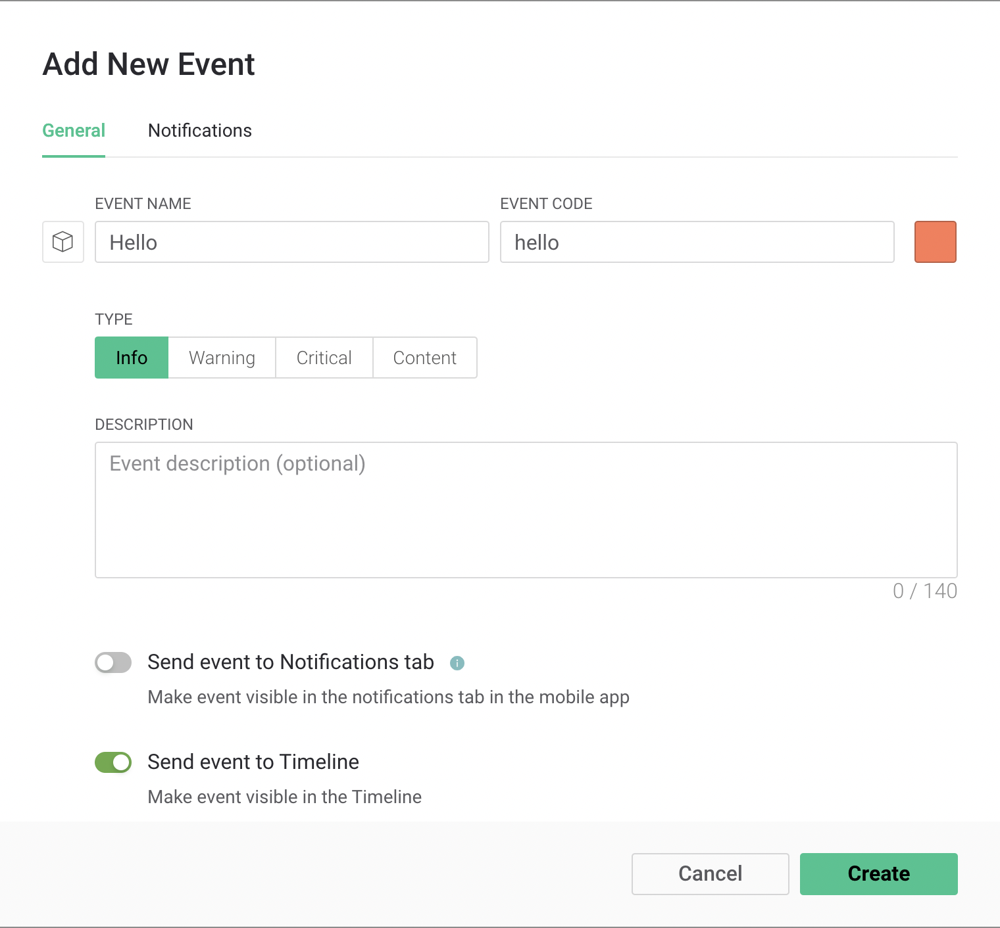
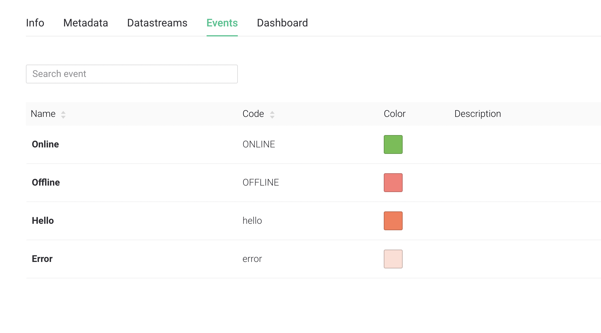
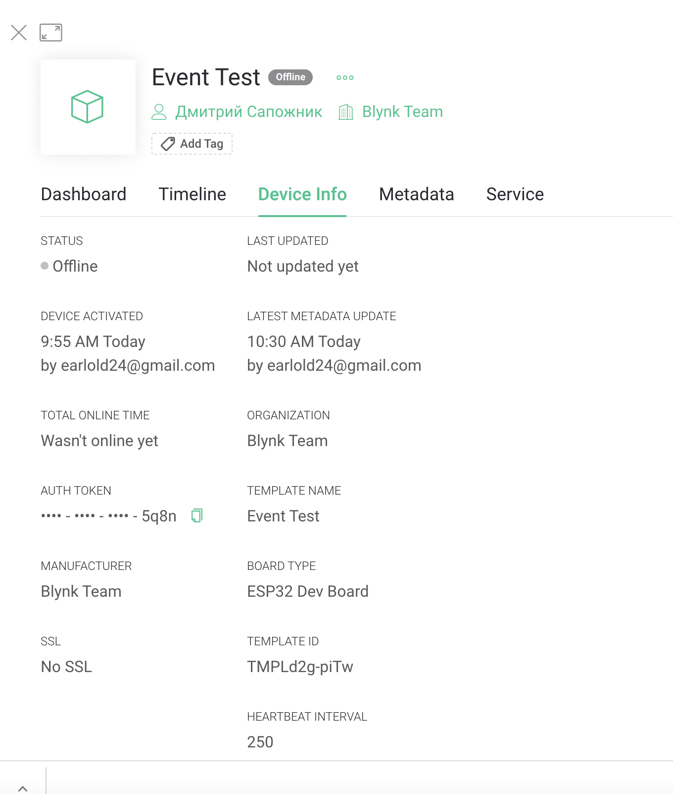
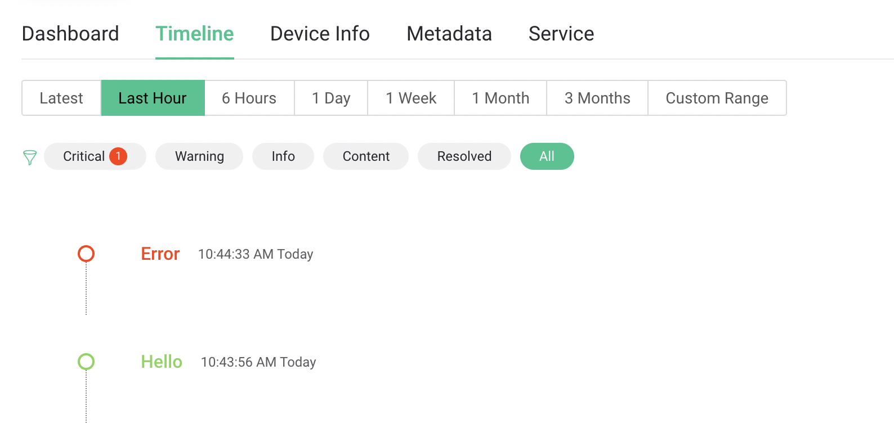

# Events Tutorial

Events are used to track and log important events happening on your devices. Events can also trigger different types of notifications which can be sent over email, as push notifications to Blynk app, or as SMS.

Examples of an Event: 

1. _You need to log a moment when a temperature reached a certain threshold and send a notification to selected users._
2. _You need to log a total working hours of the device. If it approaches or goes beyond a max value, you would need to notify technical support so that they can replace the device._ 

Events that happened can be viewed on the device dashboard in web and mobile apps in the [Timeline](../../web-dashboard/devices/device-profile/timeline.md).  


### 1. [Create a Template](../working-with-templates/) or use an existing one

### 2. Create Event

Go to Template -&gt; Edit -&gt; Events tab.  
_**Note:**_ there are two default events \(and they can't be edited\): Online and Offline.



#### Let's create 2 events with names Hello and Error

1. Click **Add New Event**
2. Name the first event with the name Hello
3. Click **Create** \(the event will appear in the Events tab list\)
4. Repeat the previous step for the second event with the name Error
5. Click **Save** to save and apply the changes made \(select Update active device this time\)


Note that each event has `EVENT CODE`. This event code will be used in the firmware or HTTPS call to trigger it.







### 3. Sending Events

You can test the Event creation by sending it from Device using Blynk.Edgent firmware API, or with REST API.

#### 

#### Use Blynk.logEvent\(\) firmware API. 

`Blynk.logEvent("event_code", "optional message");` 

For this tutorial you would need to use hello as a name. Here is a pseudo code: 

```cpp
if (some_condition){
    Blynk.logEvent("hello");
}
```

Optionally, you can send a custom description with the event. This description will be rendered on Device Timeline.

```cpp
if (some_condition){
    Blynk.logEvent("hello", "Hello World,") ;
}
```


#### Use REST API

1. Navigate to the Device
2. Click on its name
3. Open Device Info tab
4. Find Auth Token there and click on the icon to copy it to the clipboard




### 

Now make an HTTP request with the tools you use for that. Make sure to change the `YourAuthToken` to the one you copied in the previous step.

You can even use your browser for that. Just put it in the URL field and press Enter.

```http
https://blynk.cloud/external/api/logEvent?token=YourAuthToken&code=hello
```

Repeat the same with `code=error`

```http
https://blynk.cloud/external/api/logEvent?token=YourAuthToken&code=error
```

  


### 4. Checking if Event was logged.

First of all, check [Device Timeline](../../web-dashboard/devices/device-profile/timeline.md) by going to Device - &gt; Timeline Tab



You should see 2 events on the timeline! If you set up notifications, they should have been delivered as well. 

