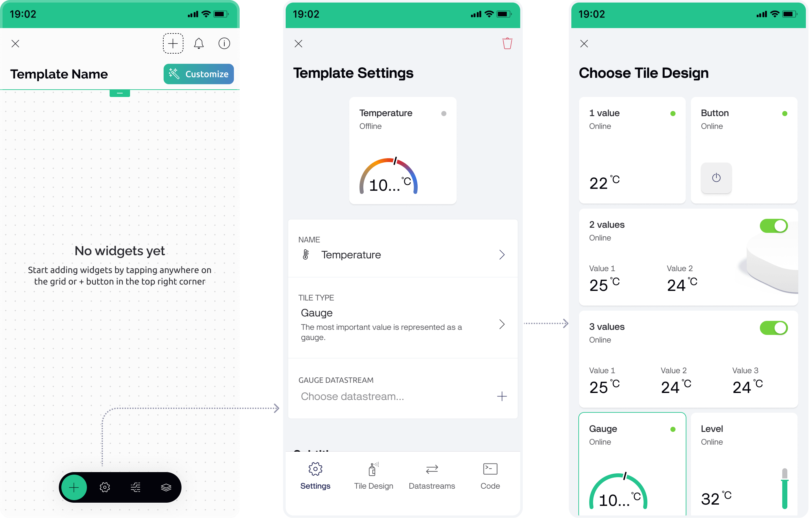
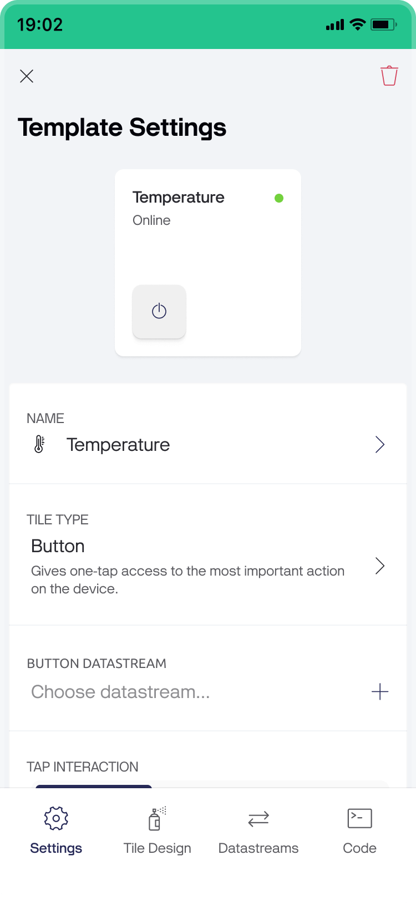
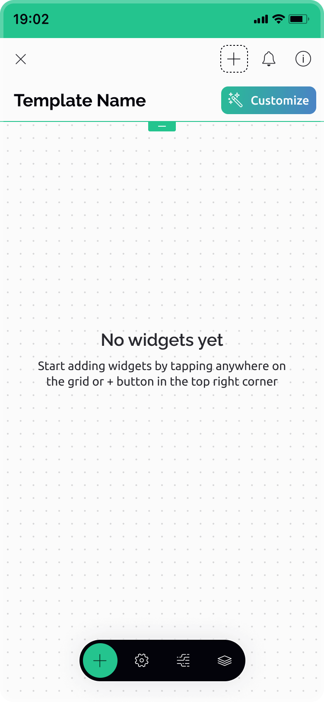
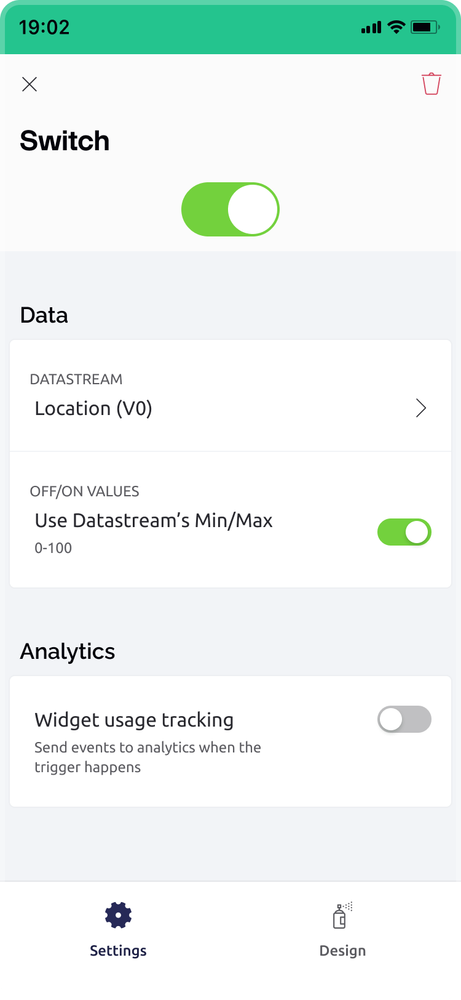
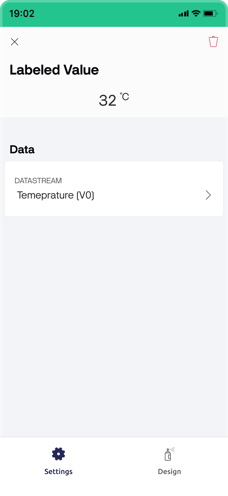
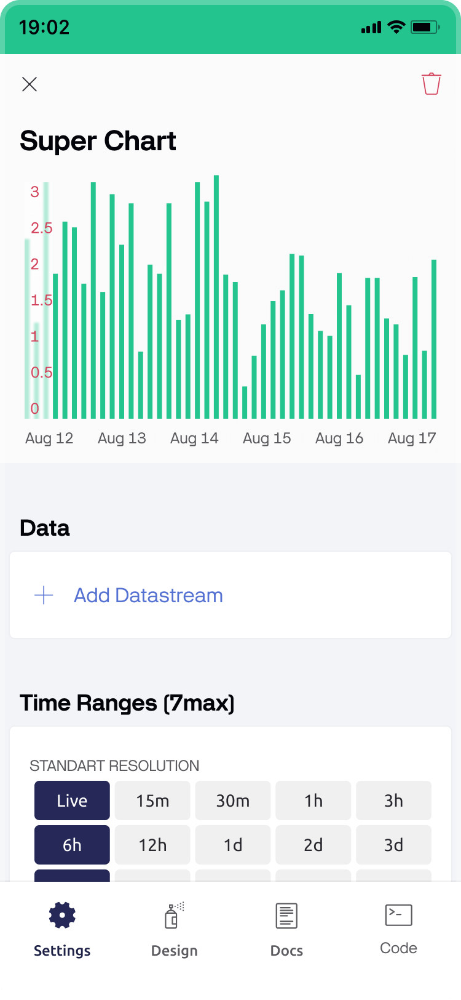
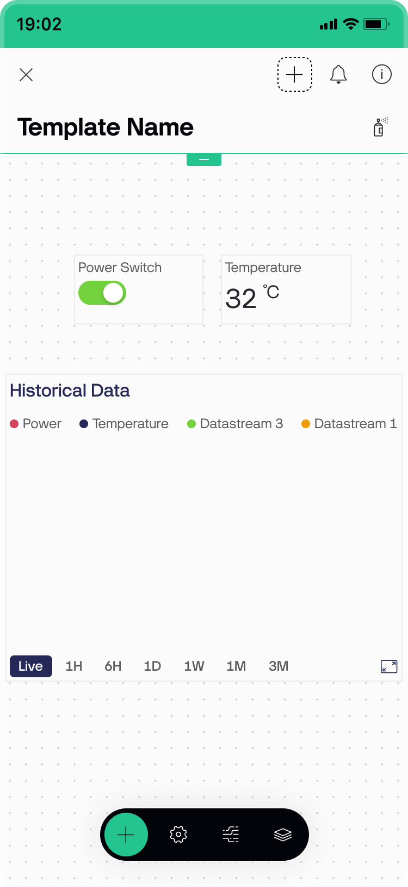

# Set Up Mobile App Dashboard

Now let's set up the mobile UI for our device.

In Blynk you can build different dashboards for the web and for the mobile app. Because screen sizes are all different, you can adapt the interface to make it user-friendly.

You would need Blynk mobile app for iOS or Android to continue. Make sure Developer mode is turned _on_ in your Profile.

## Select the template

Tap on _Go to Developer Mode_ to get to the Developer zone with the list of templates.&#x20;

<figure><figcaption>
Developer Zone
</figcaption></figure>

Tap on the template you would like to work with. If you are new to Blynk and used the Quickstart flow to get your device online, there will be just one template named Quickstart Template. Now you can configure how your device's dashboard should work in the mobile app.

## Choose the Tile Design

You can choose how a device tile will look in the list of devices when added using this template. Tap on the _Settings_ icon in the design panel at the bottom, then tap on _Tile type_ to select the preset from the menu.

<figure><figcaption>
Choose the tile design
</figcaption></figure>

There are currently 8 Device Tile presets with different interactions:

* **Key Value** – shows Datastream value in real-time (e.g.: temperature, volume, percentage, etc.)
* **Button** – tap on the Device Tile will trigger an action or toggle ON/OFF state. Tap on the name to open the device dashboard
* **2 Labels** – you can display up to 2 values, a device image, plus a switch control
* **3 Labels** – you can display up to 3 important values plus a switch control
*   **Gauge** - displays values of datastream of data type integer as a gauge. The visual options that may be set are:

    * **Template Icon** - the icon chosen here will be the default device icon.
    * **Value** - the display of the numerical value under the gauge may be enabled or disabled. Choose the color, alpha, or define custom colors for the value based on the datastream value.
    * **Label** - choose an icon (optional), and/or a label. A switch enables or disables the display of the label + icon above the gauge. The icon and label color may be customized.
    * **Gauge** - set the line width and gauge color. The gauge color can be solid and with a specific color and alpha, or choose ‘Ramp’ and to assign either a linear or step gradient with up to six colors and datastream values.

    <figure><figcaption></figcaption></figure>

    * **Indicator** - set the style (dot or tick), and the color of that indicator.
* **Level** – visualizes a certain level (brightness, power, water level, etc.) based on selected Datastream value
* **Image (default)** – shows device image or icon. Tap anywhere will open the device dashboard&#x20;
* **Color** – indicates color, brightness, etc., and can quickly turn the device ON/OFF. Tap on the name to open the device dashboard

Let's select _Button_ for this demonstration (you can edit it later). On choosing the preset, tile settings will open. Select the datastream that will be linked to the tile action.

Select the _Tap Interaction_ - Switch. It will allow toggling the device ON/OFF when tapping on the device tile.&#x20;

Tiles can feature one of the additional labels to show connection status, last reported time, or battery level as a subtitle.


Subtitle labels are available with plan PRO and higher.


<figure><figcaption>
Button tile settings
</figcaption></figure>

Tap on 'x' to exit the screen. All the edits to your tile will be saved automatically.

## Create Mobile Dashboard

Now you can start building a mobile UI for your device. Tap anywhere on the canvas and add these widgets:

* Switch
* Labeled Value
* SuperChart

<figure><figcaption>
Empty mobile dashboard editing
</figcaption></figure>

### Switch widget settings

Select the datastream that will be connected to the widget's action. Use the datastream's default min/max  values or set up your own.&#x20;

In the _Design_ tab give the widget a title (optional), and set up colors for the light and dark theme.

<figure><figcaption>
Switch widget settings
</figcaption></figure>

### Labeled Value widget settings

For example, you want to show a temperature in the labeled value widget.\
Pick a datastream for temperature. In the design tab you can choose to use _Title_ field to place the label above the value or _Label_ filed to configure the message of your choice, placing the text to the right and/or to the left of the value.

<figure><figcaption>
Labeled Value widget settings
</figcaption></figure>

### SuperChart widget settings

Now choose a SuperChart widget, and set up 2 datastreams, for example for power and temperature. Adjust the colors, graph type and axes for each datastream to your needs. Select the predefined time ranges you'd like to use and set up other settings. You can adjust the widget's title, legend and time axis visibility in the design tab.

<figure><figcaption>
SuperChart widget settings
</figcaption></figure>

Now your template is ready. Let's finish with the sketch and make it work.

<figure><figcaption>
Mobile dashboard editing
</figcaption></figure>

