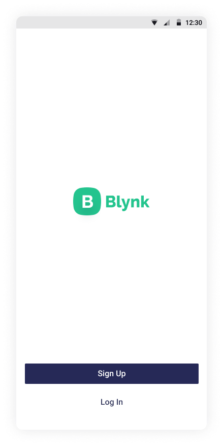
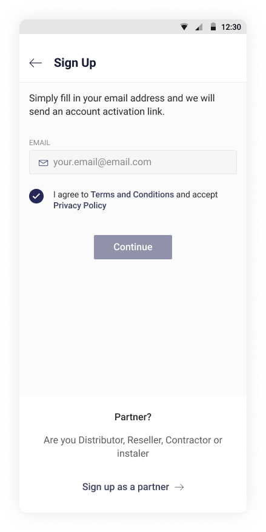
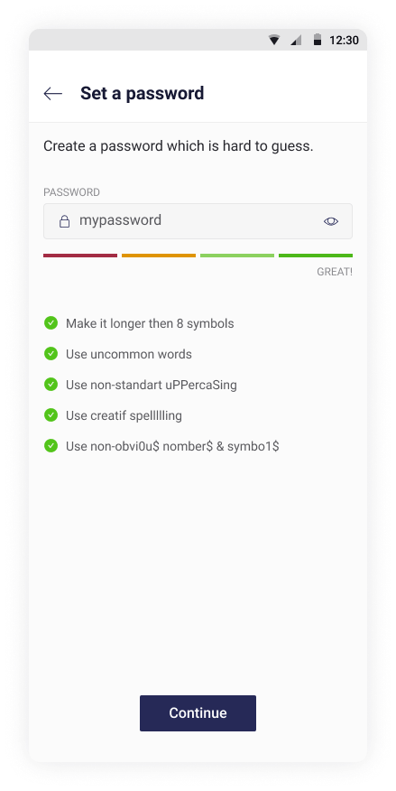
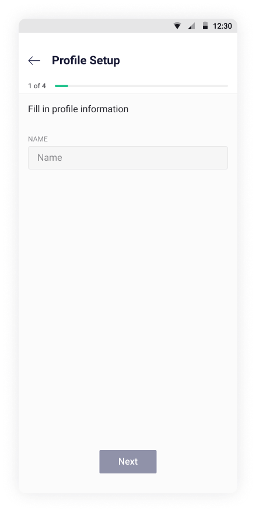

# Sign Up / Sign In

In order to use Blynk IoT platform products you would need an account. A valid email address is required to create a new account. 

User account is needed to enable secure access to your data from different devices and from anywhere in the world.

Blynk never sells your data to any other companies and passwords are always stored encrypted. 

You can create a new account either in the mobile app or using Blynk.360

## **Sign Up**

Open the [Blynk app for iOS or Android](../../downloads/blynk-apps-for-ios-and-android.md) or go to [Blynk.360](https://blynk.cloud).

You'll get to the first screen after application launch \(in case you're not logged in\):

Tap **Sign Up** button if you don’t have an account. Sign Up screen will open:

Enter your E-mail and agree to the Terms and Conditions. Then press **Continue** and check your inbox for an email with instructions.


Tap Resend a Link if you can't find the invitation email \(also mind checking Spam folder\) after 1 minute interval\) to send it again.


Tap **Create Password** button. The link will return you to the application.

Enter the password following the hint below the field and tap **Continue**

Fill in your profile required and optional information.


Once you've finished with Profile setup your Sign Up is complete and you can add and manage Devices!


## Sign In

Open the [Blynk app for iOS or Android](../../downloads/blynk-apps-for-ios-and-android.md) or go to [Blynk.360](https://blynk.cloud).

## Password Reset

  
****  

