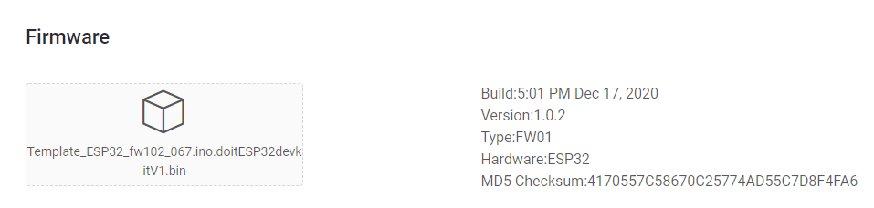
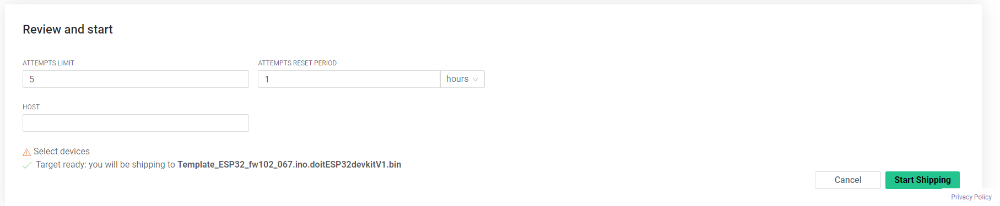
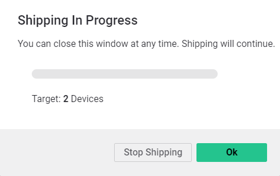

# Firmware Over-The-Air \(Blynk.Air\)

Blynk offers an interface to easily update your devices over-the-air.

_**Note:**_ currently, OTA provisioning works on ESP32, ESP8266, Seeed WiO Terminal, Arduino MKR1010, Arduino Nano 33IoT, and Texas Instruments CC3220. Raspberry Pi will be supported soon.

## Overview

The process of updating the device firmware over the air looks like this:

1. Prepare your board to accept firmware over the air from Blynk
2. Compile a binary file from your sketch using Arduino IDE
3. Create new firmware shipping and update device

## 1. Prepare your device for OTA updates

First, we need to prepare your device to work with Blynk.Air service. Follow the steps below to make it work

In Arduino IDE open the Blynk.Edgent example sketch for your board.


Double-check that `Template ID` is defined in the sketch. You can always find the `TemplateID` in Blynk.Console →Template → General Settings


Upload this sketch to your device and make sure it shows up online in Blynk.Console and Blynk.Apps.

## 2. Compile a Firmware binary file

At this stage your device is ready to accept firmware over the air with Blynk. Now you can write your own code and deliver it wirelessly.

First of all, you need to change the Firmware version. Otherwise, your device will not know this is a new firmware and will ignore it.

In the code find the firmware version and increment it. For example, if it was `0.1.0`, change it to `0.1.1`. You should do it every time you plan to update your device with new version of code.

```cpp
define BLYNK_FIRMWARE_VERSION "0.1.1"
```

Now we need to export your code as a binary \(.bin\) file.

First of all, go to Arduino -&gt; File -&gt; Save


Now go to Sketch -&gt; Export compiled Binary


The `.bin` file is now in the same sketch folder with other files.


Now you are ready to ship it.

## 3. Create Shipping

1. Go to [**Blynk.Air**](https://github.com/blynkkk/docs/tree/874cbfc84deeb7af25fc16dc69cc0aabc984189c/blynk.console/blynk.air) in Left Menu
2. Click **New Shipping** button
3. Specify Target Selection 


1. Select a **Template** available in the dropdown menu  
2. Select Devices available in the **Devices list** if you want to update certain devices. If you leave the selection empty, all of the devices made from this Template will be updated. 6. **Upload** **Firmware** file. Click the area with cloud pictogram and select .bin, .tar binary file in your PC file explorer. Drag'n'drop is supported.
3. Check **Firmware info**



1. Check for **Optional Settings** under Template selection field and in \_\*\*\_Review and start area
2. Press **Start Shipping**



Now you are all set. The shipping has started.

You will see the progress of the shipping. You can close it, the shipping will continue working.



You can always check your Shippings status and progress by accessing list of all OTA updates.


Read more about over-the-air updates here:

