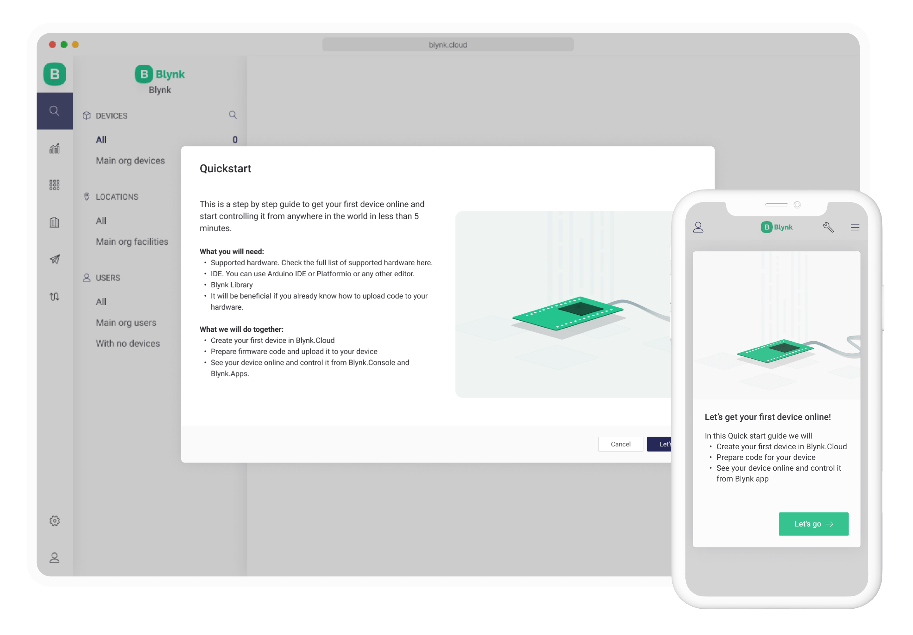

# Quickstart

We've prepared a quick and easy way to connect your first device. Whether you are using Blynk.Console or Blynk.Apps, on your first login, it will start automatically. We highly recommend to follow these guides to manually connect your first device and get an idea of how it all works. Explore WiFi provisioning and OTA updates later.

### To get started:

1. Create a Blynk account using [Blynk.Console](/broken/pages/-MbocQkJaC0zuVVnD7pi) or [Blynk.App for iOS or Android](../../downloads/blynk-apps-for-ios-and-android.md).
2. Switch to [Developer Mode](../../concepts/developer-mode.md) in Blynk.Console or Blynk.App
3. Have a supported hardware (ESP32, Arduino, Raspberry Pi, etc). The list of supported devices is [here](../supported-boards.md).
4. Be familiar with the basics of electric circuitry and know how to at least blink an LED using Arduino boards, know how to install new Arduino libraries, etc.


If you skipped **Quickstart** on the first app launch, you can always find it in the Help menu  in the top right corner of Blynk.Console or in Blynk App:&#x20;

        


When your device gets online,  learn how it was set up:


[how-quickstart-device-was-made.md](how-quickstart-device-was-made.md)


