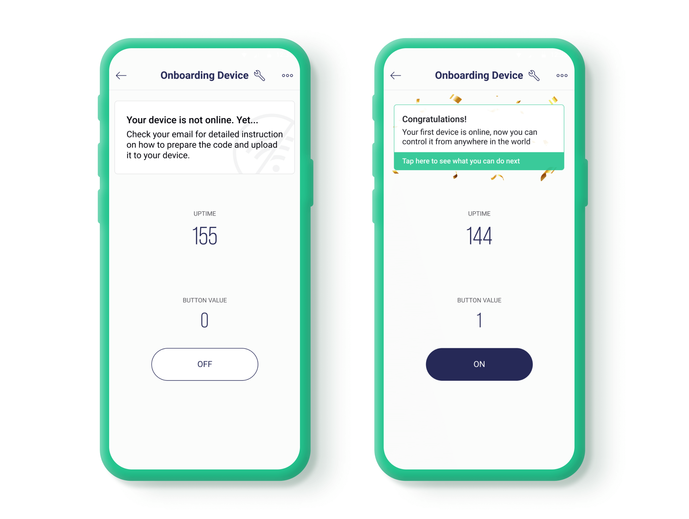

# Next Steps After Quickstart

Congrats on getting your first device online! Now let's take a look at what happened during the Quickstart process. This will help you to understand important details of how the Blynk platform works and will get you comfortable with building your own logic.


**Make sure you are in** [**Developer Mode**](../developer-mode.md) **before you continue**


Here is what happened during the Quickstart flow:

1. We automatically created a Quickstart Template for you.
2. Using this Quickstart Template, we then created a Quickstart Device.
3. For this device, we generated the sketch with all the parameters including [Auth Token](../activating-devices/manual-device-activation.md#step-3-getting-auth-token).
4. You uploaded the sketch to your board and it used the parameters to connect to Blynk.Cloud and to become visible in the apps.

### What is a Device Template?

In Blynk, we use Device Templates to make it easy to work with multiple devices that perform the same functions. On a high level, Device Template is a set of configurations. Once you have created a template, you can create devices from this template and they will inherit all of the same configurations.

 (1) (1) (1) (1) (1).jpg>)

In the diagram above, you can see that we've created a Quickstart Template and one Quickstart device. When you decide to create your own device, you will first create your own Template and then create devices from it.

Think about smart home switches. They all perform a similar function and it's safe to assume that they should have the same data model, GPIOs, firmware code, etc. You can create Smart Switch template and use it to create multiple smart home switches.

### Device Template Elements

Each Device Template contains a lot of settings. In this guide, we will only look at the most important ones.


#### TemplateID

The most important element of the template is `TemplateID`. This is a unique identifier of every template which should be specified in the code on your device. If you check the code we generated for your device, you will see it there:

```cpp
#define BLYNK_TEMPLATE_ID      "SomeTemplateID"
#define BLYNK_TEMPLATE_NAME    "Quickstart Device"
```


Definition of Template ID should **always be** **the** **first** line in your code


You can always find TemplateID in [Blynk.Console](https://blynk.cloud) → Templates → YourTemplate. There is a code snippet you can copy/paste for your next devices.

#### Datastreams

Think of a Datastream as a channel to transfer data between your device and Blynk.Cloud. To process it correctly, Blynk.Cloud needs to know what kind of data is being transferred.


If you used an old version of Blynk, Datastreams are somewhat similar to **Virtual Pins** but more enhanced.


During the Quickstart process, we created and configured four Datastreams for you, but when you continue building your own device, you will need to do it by yourself.

You can go to [Blynk.Console](https://blynk.cloud) → Templates → Quickstart Template → Datastreams

Once defined, Datastreams are heavily used in mobile apps and web dashboards when visualizing the data in Widgets.

#### Web and Mobile app dashboards

The main purpose of Blynk is to make it easy to control and monitor your devices from web and mobile apps.

Dashboards are made from building blocks we call **Widgets**. These UI layouts are part of the Device Template. When you update the layout in the template, UI will be updated for every device. How cool is that!

For the Quickstart demo, we've created dashboards with a few simple widgets to demonstrate how they work. Of course, you can build your own dashboards. The best part is that you can have two different dashboards: one on the mobile apps and another one for desktop computer, they will not automatically mirror each other.



### **At this point, you should have a bit more understanding of the relationship between templates, devices, datastreams, and widgets on the dashboard.**

Now take a closer look at what was happening on the device:


[quickstart-device-code-overview.md](quickstart-device-code-overview.md)

