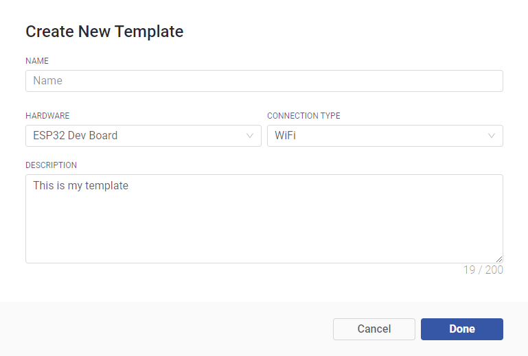

# Create Device Template

## What is Device Template

Device Template is a set of configurations inherited by devices of a similar type. 

Think about smart home switches. They all perform a similar function and it's safe to assume that they should have the same data model, GPIOs, firmware code, etc. If you would need to introduce changes to all these devices, instead of editing each of them you could just edit a Device Template and all devices will be updated.

Every Device Template has a **Template ID** – ****a unique template identifier that helps Blynk to recognize the type of added device and attach all other template elements:

**General Settings:**  general settings of the device

**Metadata**: a table of `key:value` data attached to every device. `Keys` are static, and `values` can be different for each device. For example Serial Number. 

**Datastreams:**  channels for any time-stamped data that flows in and out from the device to the cloud. For example sensor data should go through a Datastream. If you used the first version of Blynk platform, these are Virtual Pins. 

**Events:**  important events in the life of the device that should be logged and, if needed, used for notifications. Events can be triggered from the device itself or externally using HTTP API

Template also includes 2 dashboards: one in the mobile app and the second one on the web.

**Web Dashboard:**  a set of UI elements \(widgets\) to visualize the data from the device accessible for the users in Blynk.360 – a web-based application.

**Mobile Dashboard:**  a set of UI elements \(widgets\) to visualize the data in Blynk mobile apps for iOS and Android. Mobile apps also contain a template of how device is represented in the list of devices \(tiles\) 

## Create a Template

1. Open [Templates](https://docs.blynk.io/en/web-dashboard/for-developers/products) section

2. Click **+ New Template** button to start configuring your product Template

3. Provide basic information about your Product in Create New Template modal window

4. Provide basic [Information](https://docs.blynk.io/en/web-dashboard/for-developers/products/info) about the product you want to create:

5. Set up your product's [Metadata](https://docs.blynk.io/en/web-dashboard/for-developers/products/metadata) that will describe user's device or environment settings.

6. Configure [Datastreams](../web-dashboard/products/datastreams/) that you would like to use with your product Devices.

7. Create [Events](https://docs.blynk.io/en/web-dashboard/for-developers/products/events) for your product if you want to monitor devices current status and inform about important events.

8. Set up [Dashboard](https://docs.blynk.io/en/web-dashboard/for-developers/products/dashboard) for your product that will ease your devices interaction for users

## Link mobile dashboard with your product:

1. Open [Blynk.App](../mobile-applications/overview.md)
2. Log In to your account
3. Switch to [Developer Mode](developer-mode/)
4. Add a new Template 
5. Link it to your Product 
6. Add the widgets you need and assign them Datastreams
7. Publish the changes 

## Configure your board:

1. Open Dynamic Provisioning Template: - [ESP8266 ](https://github.com/blynkkk/blynk-library/tree/master/examples/Blynk.Inject/Template_ESP8266)- [ESP32 ](https://github.com/blynkkk/blynk-library/tree/master/examples/Blynk.Inject/Template_ESP32)- [MKR1000 ](https://github.com/blynkkk/blynk-library/tree/master/examples/Blynk.Inject/Template_MKR1000)- [MKR1010](https://github.com/blynkkk/blynk-library/tree/master/examples/Blynk.Inject/Template_MKR1010) 
2. Specify [TMPLID](https://docs.blynk.io/en/web-dashboard/for-developers/products/info/template-ids), [SSID WiFi](../web-dashboard/products/info/hotspot-prefix.md) and Board Name in the [sketch](activating-devices/)
3. Flash this template to your board

### Congratulations, you have configured your Product and it is ready to use!

Now all that remains is to [add your test board using Blynk.App](../mobile-applications/device-management/add-new-device.md), make sure it works as you expect, and integrate your code.  
****

