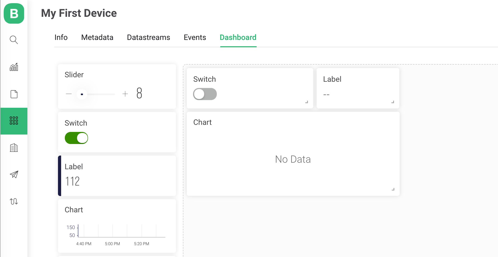

# Set Up Web Dashboard

#### Let's set up the web GUI for our device. 

Go to Dashboard Tab and drag-n-drop these widgets to the canvas:

* Switch
* Label
* Chart

#### 

### Switch Widget Settings

Hover on the widget and you will see a gear button. This will open widget settings. Set up widget like this: 

### 

### Label Widget Settings

On this widget, we will be showing data from the device in real-time from the `V0` Datastream 

### 

### Chart Widget Settings

On this widget, we will be showing historical data from the device from the `V0` Datastream 

## 

