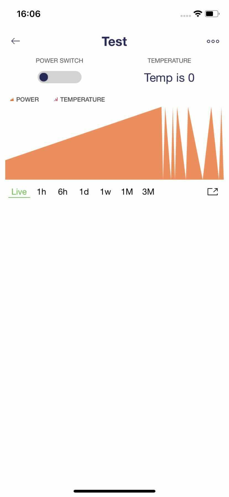

# Test your Template

Let's check if everything is up and running! 

## Add device

You can add your device using built-in [WiFi Provsioning](https://docs.blynk.io/en/getting-started/activating-devices/blynk-edent-wifi-provisioning#activating-device-using-blynk-app) or using [Static AuthToken](https://docs.blynk.io/en/getting-started/activating-devices/blynk-edent-static-authtoken).

After you add the device it will appear in the Devices section of the Blynk App. Tap on it to open Device page

Now try triggering the switch ON / OFF states and you'll see the data appear on the SuperChart \(in Live mode\)

Device will be also visible in the dashboard. You can open it and see it's web version of the dashboard

## What to check:

#### 

#### Data visualization and control 

Check how data flows from the device, how widgets work.

For example, the latest value is displayed in the label widget as well as historical data is displayed in the chart.

#### Syncing between mobile and web

When you click the switch on the web dashboard you will see it changes the state everywhere: in the mobile app and in the dashboard

