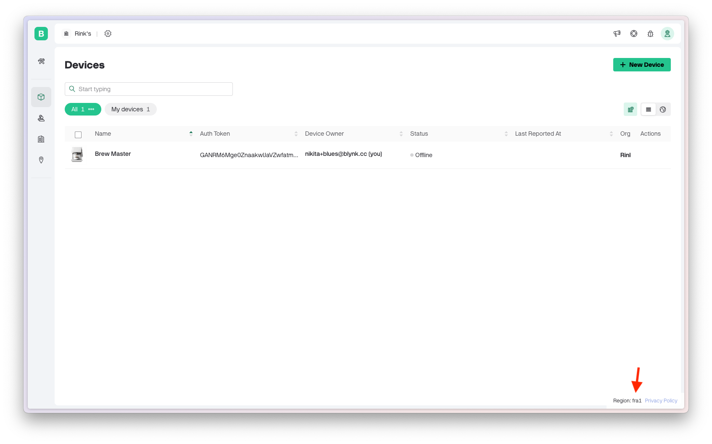

# Blues

[Blues](https://blues.com/) is a hardware manufacturer that specializes in IoT connectivity solutions, offering efficient, secure, and low-power data communication. Their tools enable developers to integrate cellular IoT functionality into devices with minimal coding and setup, streamlining global data transmission.

Blynk offers built-in integration with Blues, enabling seamless data visualization, downlink scheduling, lifecycle status monitoring, and simplified device provisioning, along with other advanced features.

## Getting started

To begin, configure the Blues integration by connecting your Notehub project to your Blynk organization. Open [Notehub](https://notehub.io/), create a new project or select an existing one. Navigate to **Settings** in the left menu bar, then go to **Programmatic API Access** and select **Generate Programmatic Access**. Save the generated credentials and click **Save**.

<figure><figcaption><p>Notehub Project settings page</p></figcaption></figure>

Next, open the Blynk Console, go to **Developer Zone** -> **Integrations** -> **Blues**, and enter the **Client ID** and **Client Secret** generated from Notehub. Click the **Connect** button, and the integration status should update to "Connected".

<figure><figcaption><p>Blynk integrations page</p></figcaption></figure>

Finally, create the Blynk Route in your Notehub project:

1. Open your Notehub project and navigate to **Routes** -> **+ Create Route** -> **Blynk**.
2. Fill in the Blynk region and click **Save**.

<figure><figcaption><p>Blynk Route creation on Notehub</p></figcaption></figure>

You can find the Blynk region at the bottom right of the Blynk Console:

<figure><figcaption></figcaption></figure>

## Configuring a Device Template

Now that the integration is configured, you can create a device template. Each template is mapped to [a Notehub ProductUID](https://dev.blues.io/api-reference/glossary/#productuid) to group common devices.

<figure><figcaption><p>Template datastreams configuration example</p></figcaption></figure>

Ensure that your datastream name matches the keys your device sends to Notehub. By default, Blynk will attempt to map all keys from all Notefiles to their corresponding datastreams.


Use the ['Log when device reports any data'](../blynk.console/templates/connection-lifecycle.md#log-when-device-reports-any-data) feature in Lifecycle to mark the device as online with each uplink received from Blues.


For downlinks, Blynk will send a `blynk.qi` [Notefile](https://dev.blues.io/api-reference/glossary/#notefile) with the datastream name as the key. Below is an example of the Notefile body that Blynk will create:

```json
{
  "coffee_strength": 3
  "idle": false,
  "state": "Working",
  "location": [-73.935242, 40.730610]
}
```

Once you have completed the template configuration, save it and navigate to **Developer Zone** -> **Integrations** -> **Blues**. In the **Data Mapping** section, locate the Blues ProductUID you will use and select the created template in the **Blynk Template** column. Click **Add**.


At this point, the _Blues Device_ metafield will be created in the template if it wasn't created before. Blynk uses this metadata to identify each device in the Notehub.


<figure><figcaption><p>Blues Integration page</p></figcaption></figure>

Optionally, if you already have devices connected to your project, you can click the import icon in the **Actions** column to import those devices from Notehub.

## Device provisioning

At this point, your integration should be working. However, importing devices from Notehub might not always be necessary, and you may prefer to create devices directly within Blynk.

To provision a device using Blynk, create it manually and configure the Blues Device ID metafield:

1. In the Blynk Console, navigate to **Devices** -> **+ New Device** -> **From Template**.
2. Select the template and give the device a meaningful name.
3. After creating the device, open the **Info & Metadata** page and enter the Blues Device ID in the **Blues Device** field.

Once you save the value, Blynk will automatically create the device in your Notehub project.

<figure><figcaption><p>Configuring a Blues Device ID manually</p></figcaption></figure>

## Mass device provisioning with Static Tokens

To simplify device provisioning for end-users, you can use Static Tokens:

1.  Create a CSV file with Blues Device IDs listed in each row. For example:

    ```csv
    Blues Device
    dev:951624746484292
    dev:869120174936381
    ```
2. Navigate to **Developer Zone** -> **Static Tokens** -> **+ Generate Static Tokens** -> **Create From File**. Select the template and upload the file.
3. Map the row with Blues Device IDs to the Blues Device metafield and click **Create**.

You will receive a separate QR code for each row in your CSV file. Users can scan these QR codes using the Blynk Mobile app or Blynk Console. Once scanned, the device will be automatically created in both your Blynk organization and Notehub project.


## Next steps

With a configured Blynk template and a working device, you can now start creating a [Web Dashboard](../blynk.console/templates/dashboard/) and [Mobile application](../blynk.apps/constructor.md).

Next, take advantage of other powerful Blynk features, such as [Automations](../concepts/automations.md), [WebHooks](../blynk.console/settings/developers/webhooks.md), [Device Connection Lifecycle](../concepts/connection-lifecycle-management/), and the [Device HTTPS API](../blynk.cloud/device-https-api/), to build more advanced workflows.
