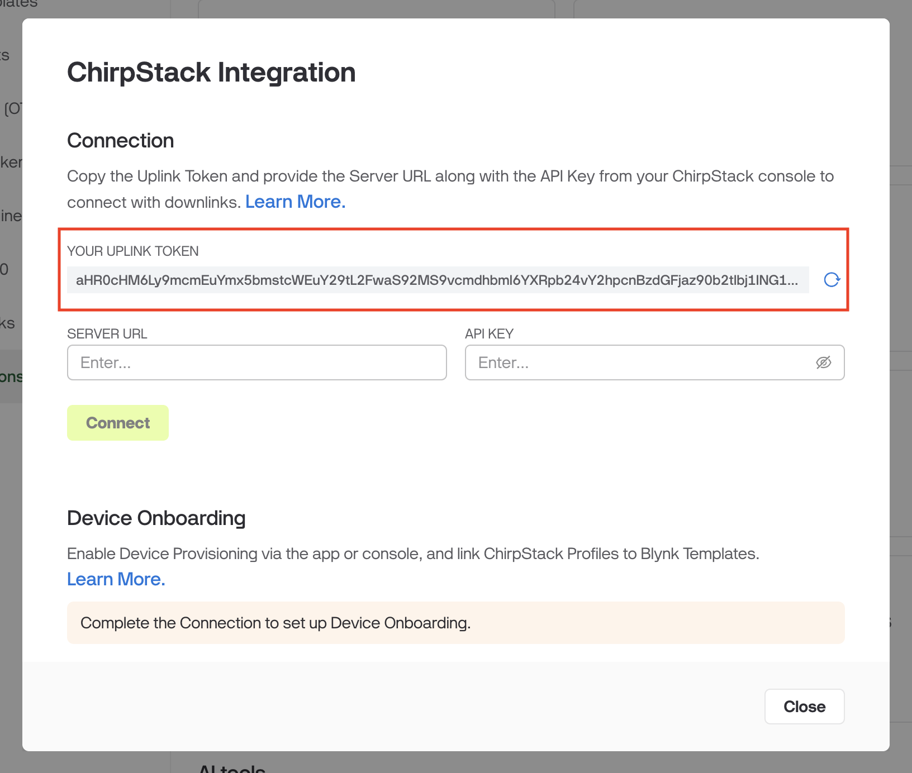
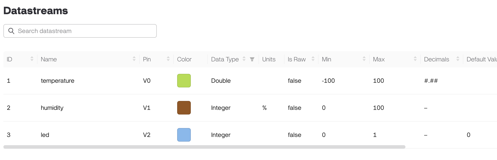
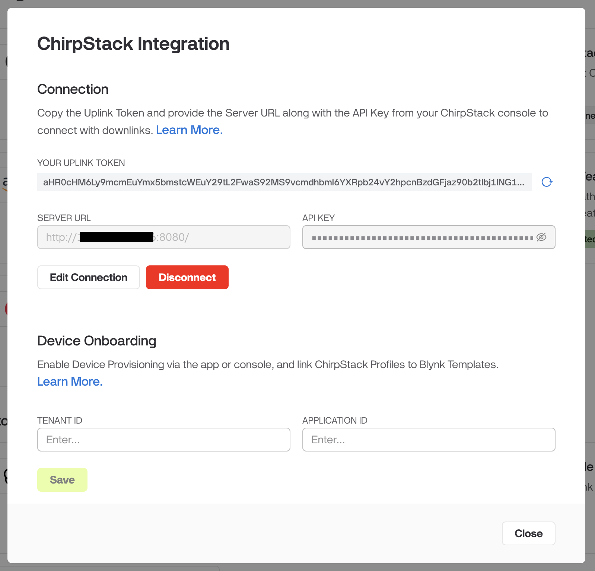
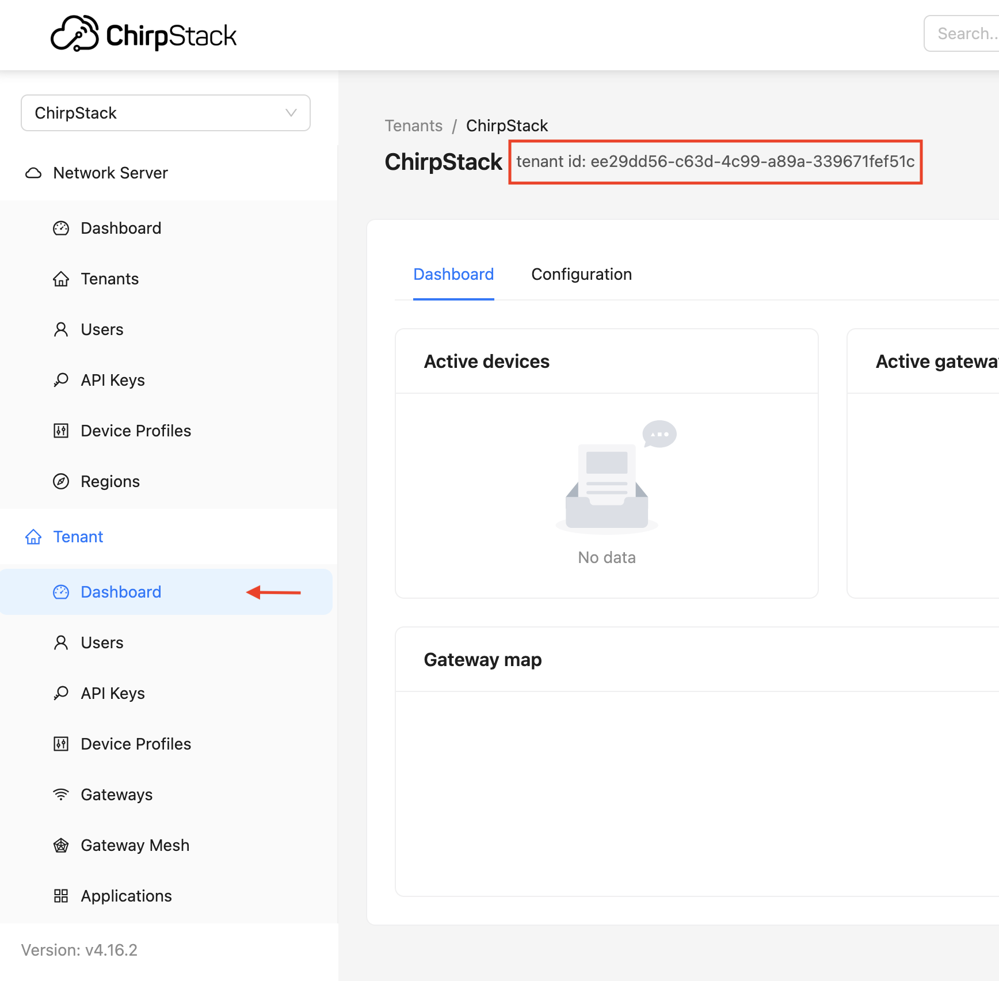
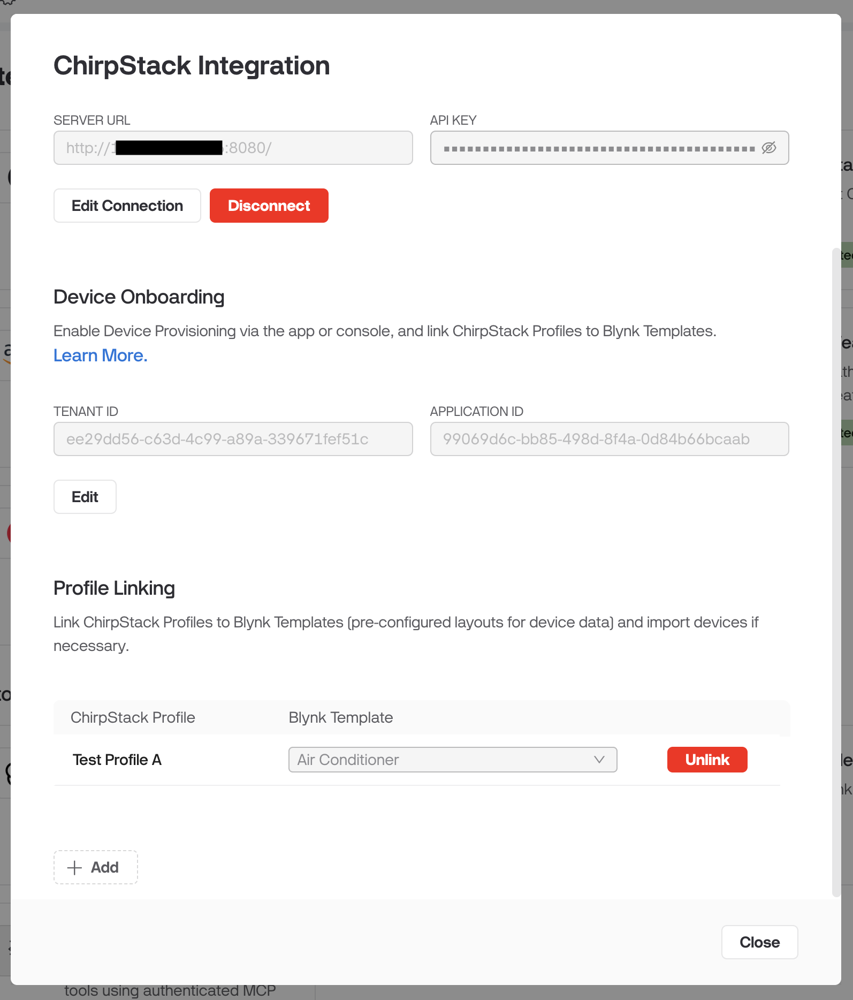

# ChirpStack

The ChirpStack integration enables the seamless connection and management of LoRaWAN devices within the Blynk ecosystem. By bridging these platforms, data from devices registered with a ChirpStack Network Server is surfaced directly in Blynk, enabling advanced visualization and remote control.

## Configuring Uplinks

To visualize data from your LoRaWAN sensors in Blynk, you must configure ChirpStack to forward uplink payloads to the Blynk Cloud.

#### **Step 1: Obtain the Blynk Uplink Token**

* Log in to your Blynk account and open Developer Zone.
* Navigate to Integrations > ChirpStack.
* Under the Uplink tab, copy your Uplink Token. This token acts as the secure bridge for your specific organization.

<figure><figcaption></figcaption></figure>

#### **Step 2: Configure the Integration in ChirpStack**

* Log in to your ChirpStack Web Console.
* Select your Tenant and open the specific Application containing your devices.
* Go to the Integrations tab and choose Blynk.
* Paste your Uplink Token into the provided field.
* Click Submit to finalize the connection.

#### **Step 3: Map Devices via Device EUI**

Blynk uses the Device EUI metafield to route data from ChirpStack to the correct device.

* In your Blynk Template, go to Metadata and add a new Device EUI metafield.
* For each device created under this template, enter the specific Device EUI from ChirpStack into this metadata field. This way, you tell Blynk how to map a device on ChirpStack with a device on Blynk.

#### **Step 4: Align the Payload Codec**

For data to populate your dashboards, the keys generated by your ChirpStack Device Profile Codec must match your Blynk Datastream Label.

Here is an example ChirpStack decoder and the template configuration:

```javascript
function decodeUplink(input) {
  return {
    data: {
      temperature: 22.5,
      humidity: 45,
      led: false
    }
  };
}
```

<figure><figcaption></figcaption></figure>

## Configuring Downlinks

Downlinks allow you to send commands or configuration updates from the Blynk dashboard back to your LoRaWAN devices via the ChirpStack API.

#### Step 1: Generate a ChirpStack API Key

Blynk requires an API key to authenticate requests sent to your ChirpStack server.

1. Log in to your ChirpStack Web Console.
2. Navigate to Tenant > API keys.
3. Click Add API key, provide a name (e.g., "Blynk Integration"), and click Create.
4. Copy the API key immediately, as it will not be shown again.

#### Step 2: Configure the Connection in Blynk

1. In the Blynk Developer Zone, navigate to Integrations > ChirpStack.
2. Enter your ChirpStack Server URL (e.g., `https://chirpstack.example.com:8080`).
3. Paste the API Key generated in the previous step.
4. Click Connect. A successful connection status will appear if Blynk can reach your server.

<figure><figcaption></figcaption></figure>

#### Step 3: Handling Downlink Payloads

When a value changes in a Blynk Datastream (via a dashboard switch, slider, or automation), Blynk sends a JSON payload to the `encodeDownlink` function in your ChirpStack Device Profile.

The payload format sent to ChirpStack is:

```json
{ 
  "dataStreamLabel": "dataStreamValue" 
}
```

#### Step 4: Update your ChirpStack Codec

Your `encodeDownlink` function must be written to interpret the Blynk Data Stream Label and convert it into the byte array required by your LoRaWAN hardware.

Example Codec Snippet:

```javascript
function encodeDownlink(input) {
  var bytes = [];
  if (Object.hasOwn(input.data, 'power')) {
    bytes.push(input.data.power ? 0x01 : 0x00);
  }
  return {
    bytes: bytes,
    fPort: 10
  };
}
```

## Device Onboarding

For large-scale deployments, Blynk can automatically provision devices in ChirpStack. When you create a device in Blynk and provide a Device EUI, the integration will instantly create and configure that device in ChirpStack for you.

#### Step 1: Locate your ChirpStack IDs

Blynk needs to know exactly where to place new devices.

1.  Tenant ID: In ChirpStack, go to the Tenant Dashboard and copy the ID from the top of the page.

    <figure><figcaption></figcaption></figure>
2.  Application ID: Go to Applications, select your specific application, and copy the ID from the application dashboard.

    <figure><figcaption></figcaption></figure>

#### Step 2: Enable Onboarding in Blynk

1. In the Blynk Developer Zone, go to Integrations > ChirpStack.
2. Enter the Tenant ID and Application ID in the configuration fields.
3. Click Save.

#### Step 3: Configure Profile Linking

Profile Linking tells Blynk which ChirpStack Device Profile to use when creating a device on ChirpStack.

1. In the Profile Linking section of the ChirpStack integration settings, click + Add.
2. Select ChirpStack Device Profile: Choose the profile from your ChirpStack server.
3. Select Blynk Template: Choose the corresponding template in Blynk.
4. Click Link.

<figure><figcaption></figcaption></figure>

#### How it Works

Once configured, your workflow becomes:

* Create a new device in Blynk using the linked template.
* Input the Device EUI into the device's metadata field.
* Result: Blynk automatically provisions the device in the specified ChirpStack Application using the linked Device Profile.


**Pro Tip:** Use [Static Tokens](../commercial-use/deploying-products-with-static-authtokens.md) for device provisioning. You can provide a Device EUI metadata value during Static Token creation, and Blynk will automatically create the device in ChirpStack once the static token is scanned.

