# NCD Industrial Vibration Sensor

### Pre-requisites

In order to send data from NCD Industrial IoT sensors to Blynk you need to cover a set of requirements, as the sensors work in a specific way. You would need the sensor itself in this case the following one:

[NCD Industrial IoT Wireless Vibration Temperature Sensor V3](https://blynk.io/product/industrial-iot-wireless-vibration-temperature-sensor-v3)

You would also need a gateway to ingest the data coming from the sensor. You could think of it as a Wi-Fi router, that utilizes a specific wireless protocol called DigiMesh®, which is specifically designed for industrial applications. You can grab one of NCD’s gateways from the list below:

[NCD Enterprise IIoT Gateway](https://blynk.io/product/ncd-enterprise-iiot-gateway)

[Enterprise IIoT Gateway Lite](https://store.ncd.io/product/enterprise-iiot-gateway-lite/)

Once you have these two components you will be able to connect the sensor to the gateway and use its build-in Node-RED instance to forward the data via MQTT to the Blynk Cloud broker.

This tutorial will cover all the configuration steps you need to go through, from connecting the devices, to registering with the platform, throughout configuring you Blynk Datastreams and Dashboard, so you can in the end visualize the sensor data.

Let’s begin with setting up the Gateway and Sensor and connecting them to each other.

### Configure the NCD devices

#### Connecting to the Gateway and Node-RED

This step is straightforward, and we won’t spend much time on it, as NCD already offers a comprehensive guide. We will provide a brief overview here, but for detailed instructions, please refer to the two NCD documents.

[Quick Start Guide for the NCD Enterprise IIoT Gateway](https://ncd.io/blog/quick-start-guide-for-the-ncd-enterprise-iiot-gateway/)

[Enterprise IIoT Gateway Network Settings](https://ncd.io/blog/enterprise-iiot-gateway-network-settings/)

Simply unbox your gateway and connect and power it on as per the instructions. Connect the ETH0 port to your DHCP capable router (it will work as a DHCP client if you utilize it this way). It will obtain an IP address and after giving it some time to boot you should be able to access the Node-RED instance running on it via its local IP address or domain name with the port 1880 appended to it (this is the default Node-RED port).

We recommend using the local domain name, in the format _ncd-xxxx.local:1880_, where _xxxx_ are the last 4 symbols of the Gateway MAC address (printed on the side of the device).

For example, http://ncd-c398.local:1880

#### Connect the Sensor to the Gateway

You should see a Wireless Gateway node and a debug node in your flow, this is the default configuration.

You only need to add a Wireless Device node that will represent the sensor. Navigate to the NCD section in the pallet menu on the left and drag and drop the Wireless Device node.

<figure><figcaption></figcaption></figure>

As we want to monitor only the output of the sensor for debug purposes for now, move the debug node, disconnect it from the Wireless Gateway node and connect it to the Wireless Device node.

<figure><figcaption></figcaption></figure>

Now that we have our basic flow, we need to configure it. The Wireless Gateway is configured by default, you need not change anything in its node settings.

Double click on the Wireless Device node and its menu will pop up. In order for data to properly flow between the sensor and gateway they need to utilize the same port. Thus, you need to select the Serial Device and Serial Device for Config ports (a drop-down menu is provided for each). As the gateway in this case has only one port created (default), there is only a single choice, select it for both (refer to the image below, your ports should have the exact same notation).

<figure><figcaption></figcaption></figure>

Next, you need to select the Sensor Type, this particular one is the 80 – One Channel Vibration Plus.

<figure><figcaption></figcaption></figure>

This takes care of the basic settings, press the Done button and finalize the changes to the Wireless Device node.

<figure><figcaption></figcaption></figure>

You should end up with a flow that looks like the one in the image below, the only thing left now is to Deploy it.

<figure><figcaption></figcaption></figure>

At this point the gateway will attempt to connect as the flow is now running, this is indicated by the Connecting message below the node.

<figure><figcaption></figcaption></figure>

It should take no more than 2-3 seconds for the gateway to mode to the Ready state, indicating it has connected and can receive sensor data. If you check the debug window on the right at this point you will see that the gateway has reported its MAC address, which is an indication of the connection being established.

<figure><figcaption></figcaption></figure>

At this point everything is prepared and you can turn on your sensor. NCD Industrial Sensor come pre-provisioned with batteries and in order to turn them on you have to open up the casing and toggle a switch. We advise you to refer to the official NCD documentation on the topic - [Industrial Vibration Sensor V3 Product Manual](https://ncd.io/blog/industrial-vibration-sensor-v3-product-manual-2/).

Your sensor is now connected to the gateway and data is flowing between the two. You should see it going into FLY mode, which is a mode that lets it pull any config changes wirelessly (in our case there aren’t any).

<figure><figcaption></figcaption></figure>

It will shortly move into RUN mode and start sending data over its predefined interval.

<figure><figcaption></figcaption></figure>

Now you have your sensor data at your disposal, but only locally (Gateway). In order for it to reach Blynk, we need to connect the Gateway to the Blynk MQTT broker.

### Creating a Template for the Sensor in Blynk

Blynk utilizes what is called Datastreams, a way to structure data that flows into the platform. In order for the flow to properly happen the format coming out of the NCD Sensor needs to match the one in Blynk.

Let’s go through the process where we create a Template for our NCD Sensor device that has the proper Datastreams and a Dashboard to display the data incoming from the aforementioned Datastreams. Once we create the Template, we can easily create one or more devices based on it, so you can have many of the same sensor type.

This tutorial assumes you are already have created an account in Blynk, if not head to the [link](https://blynk.cloud/dashboard/login) below make one.

#### The Template

We are going to assume this is your first time using the platform, thus your workspace will be empty, and you will be greeted by the Blynk Tour screen.

<div align="left">

<figure>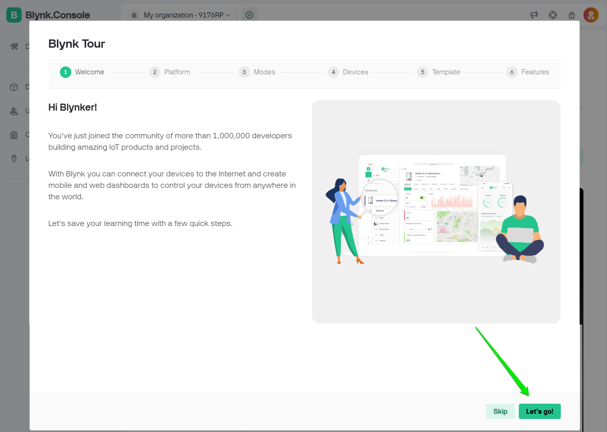<figcaption></figcaption></figure>

</div>

Click on the Let’s go! button and navigate through the windows till the end. You should see an invitation to create your first Template (in case you navigate away, a template is normally created in the Developer Zone).

<div align="left">

<figure>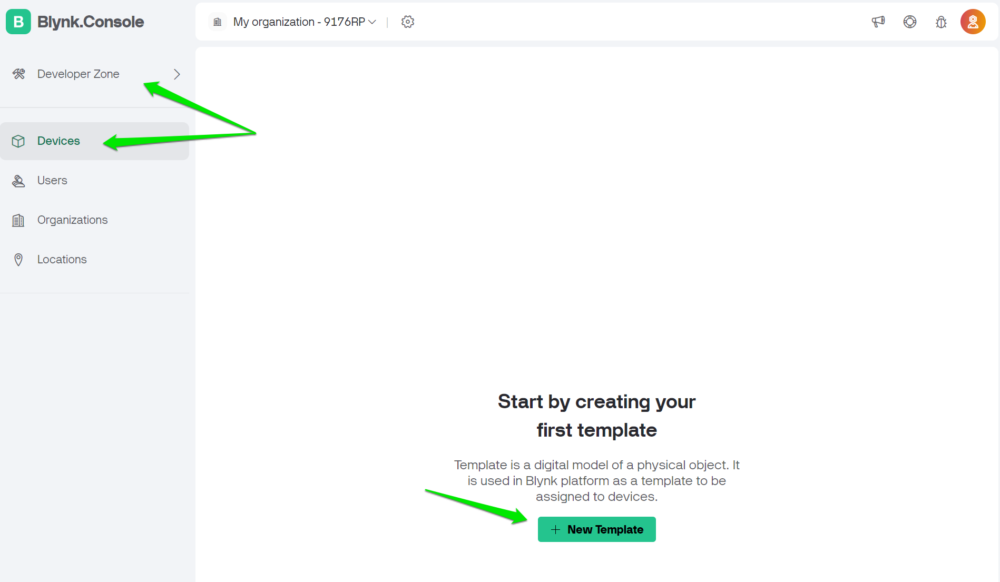<figcaption></figcaption></figure>

</div>

Give your Template a name, for the hardware select Other and set the connection type to WiFi. Press on the Done button and the Template will be created, now you need to configure it.

<div align="left">

<figure>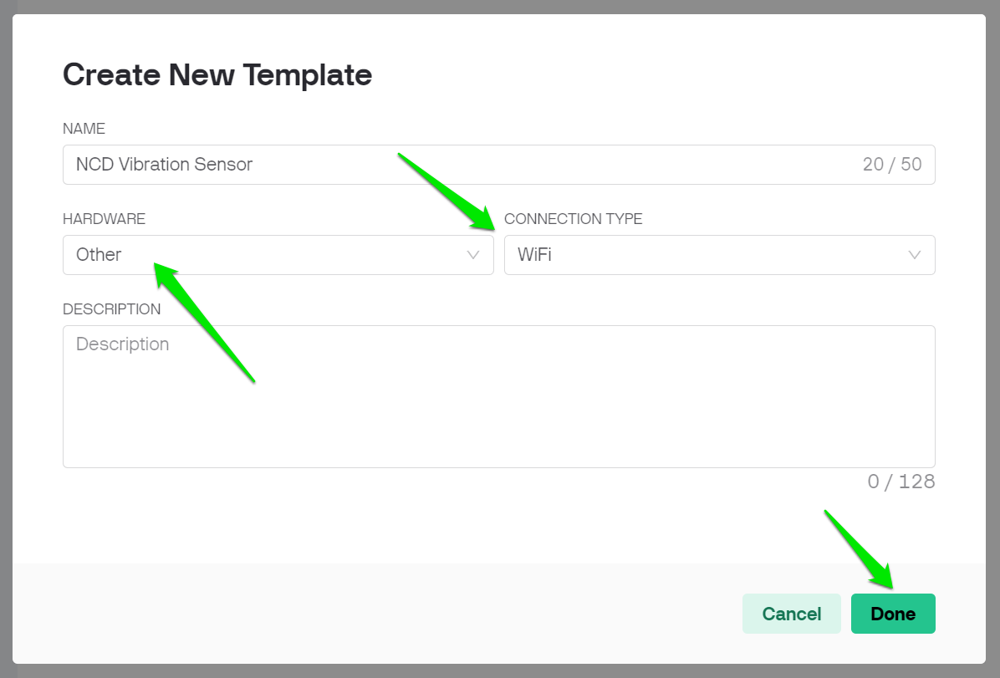<figcaption></figcaption></figure>

</div>

#### Datastreams

Go to the Datastreams tab and create a New Datastream. When you press on the button a drop-down menu will appear with a few options. For the purpose of this tutorial, we will keep it simple and utilize only the Virtual Pin Datastream type.

<div align="left">

<figure>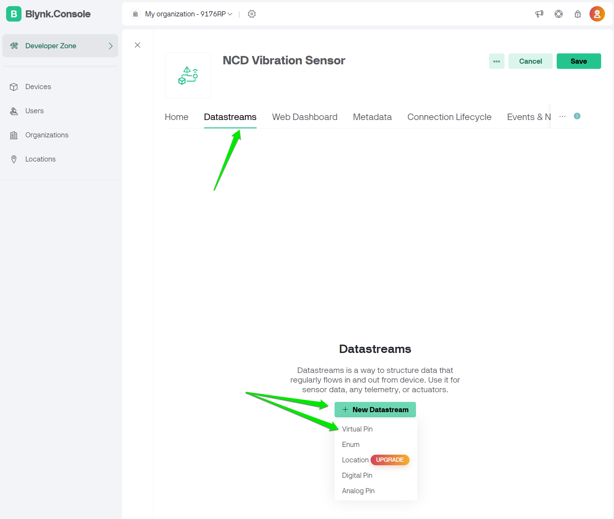<figcaption></figcaption></figure>

</div>

In order to stay consistent, we are going to adhere to the same naming notations that the NCD sensor uses, which you can see in the payload in Node-RED (refer to the image below).

<div align="left">

<figure>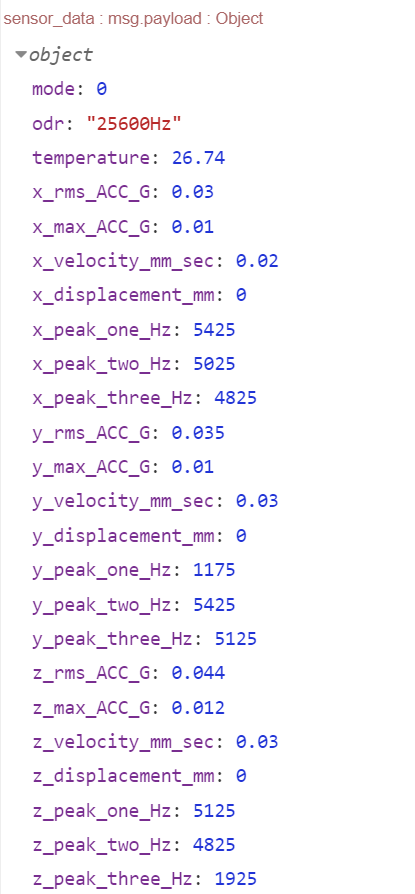<figcaption></figcaption></figure>

</div>

We will start from the first parameter, the _temperature_ (any parameter you want forwarded and displayed on Blynk needs to have its own Datastream). Fill in the Template data (refer to the image below) as follows:

NAME: temperature

PIN: V0

DATA TYPE: Double

MAX: 100

Enable history data: ON&#x20;

<div align="left">

<figure>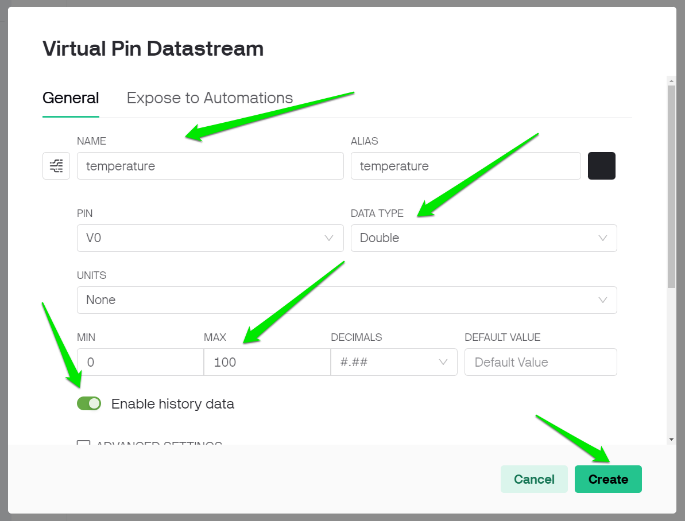<figcaption></figcaption></figure>

</div>

Press on the Create button and your first Datastream will appear in the table, you can edit it by clicking on the Name if you want to change anything. The process for the other Datastreams we are to create is similar, simply click on the New Datastream button and make more.

<figure>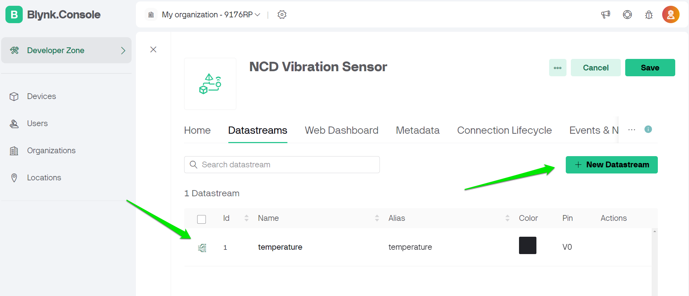<figcaption></figcaption></figure>

Add 3 more streams for the maximum acceleration over the x, y, and z access and you should end up with a total of 4.

<figure>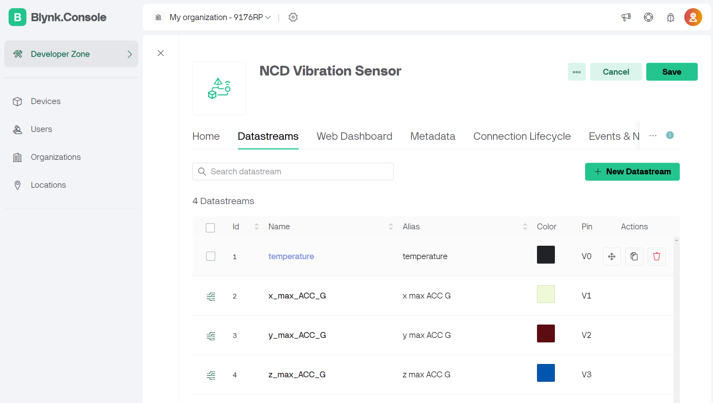<figcaption></figcaption></figure>

Let’s add one more Datastream, this one would be a bit different as it will be for the frequency where the first vibrational peak over the X axis is detected (_x\_peak\_one\_Hz_). These frequency peaks are useful to identifying specifically which component of the machine is causing the increased vibration and is likely to experience failure, thus a good thing to have for our observation.

This time the parameter values are:

NAME: x\_peak\_one\_Hz

PIN: V4

DATA TYPE: Integer

MAX: 10000

Enable history data: OFF

<div align="left">

<figure>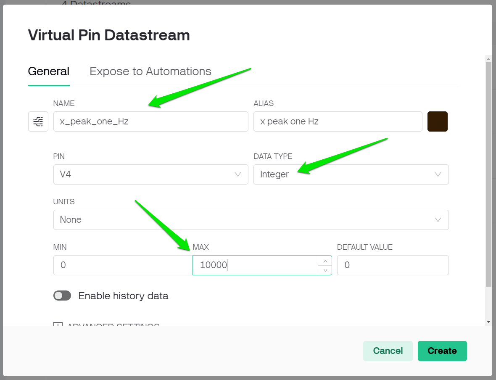<figcaption></figcaption></figure>

</div>

This sensor measurements differs, it comes in Integer form and also, we need to adjust the range as the value is in Hz and vibrations up to a few kHz are not uncommon, thus the MAX is set to 10000.


Take note that if you are using the free version, you will have 5 Datastreams at this point, which is the limit, if you want to add more you will need to upgrade.


We are using the upgraded version so we add more datastreams, if you are limited you will simply have to choose a subset of the measurements you are going to end up with, which will still give you plenty of data to look at.

<figure>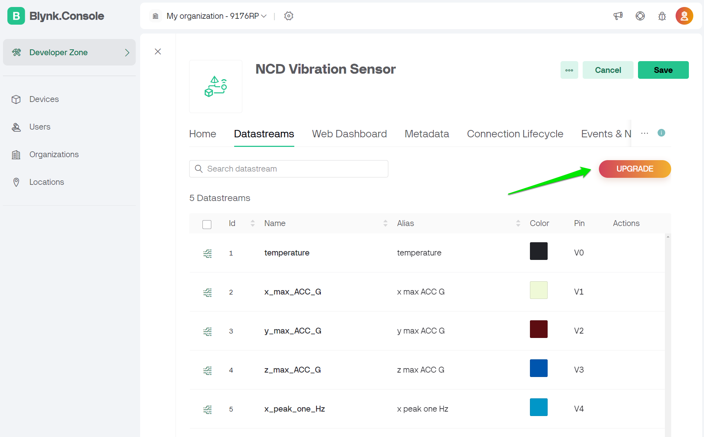<figcaption></figcaption></figure>

&#x20;

Continue adding Datastreams until you are satisfied. This particular sensor outputs 22 metrics; however, the following subset of 13 is sufficient in 80% of cases to conduct a full vibrational analysis.

At this point, we have mapped the Sensor metrics to the Datastreams and we can continue to the Web Dashboard.

#### Web Dashboard

In Blynk data is displayed in a Web Dashboard, where Widgets are associated with Datastreams. Thus, we would have at least as many Widgets as Datasteams if we want to show all the measurement data we are receiving from the sensor.

We will have the 2 following widget types:

**Gauge** – for the temperature, so we can easily tell if it is approaching the critical limit

**Label** – visualize the value of a parameter, this we will use for the acceleration and the frequency components as we want to look at the values in real time and determine whether they are too high.

Go to the Web Dashboard tab, scroll down on the Widget Box and double click on the Gauge Widget. This will put it in the dashboard area.

Resize it to your liking and press on the Gear icon in order to open up the configuration window.

<figure>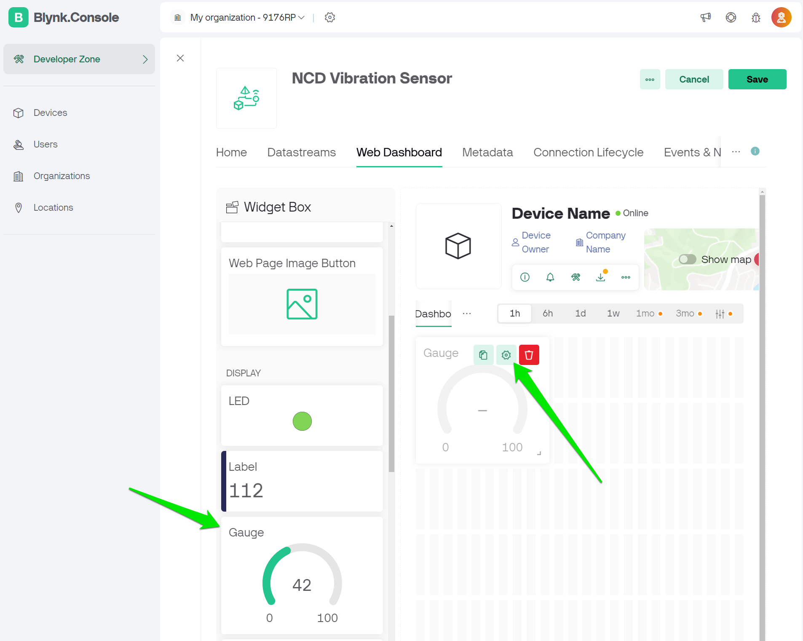<figcaption></figcaption></figure>

Give the it a name (optional) and select the _temperature (V0)_ Datastream we created earlier that is tied to the temperature measurement.

<div align="left">

<figure>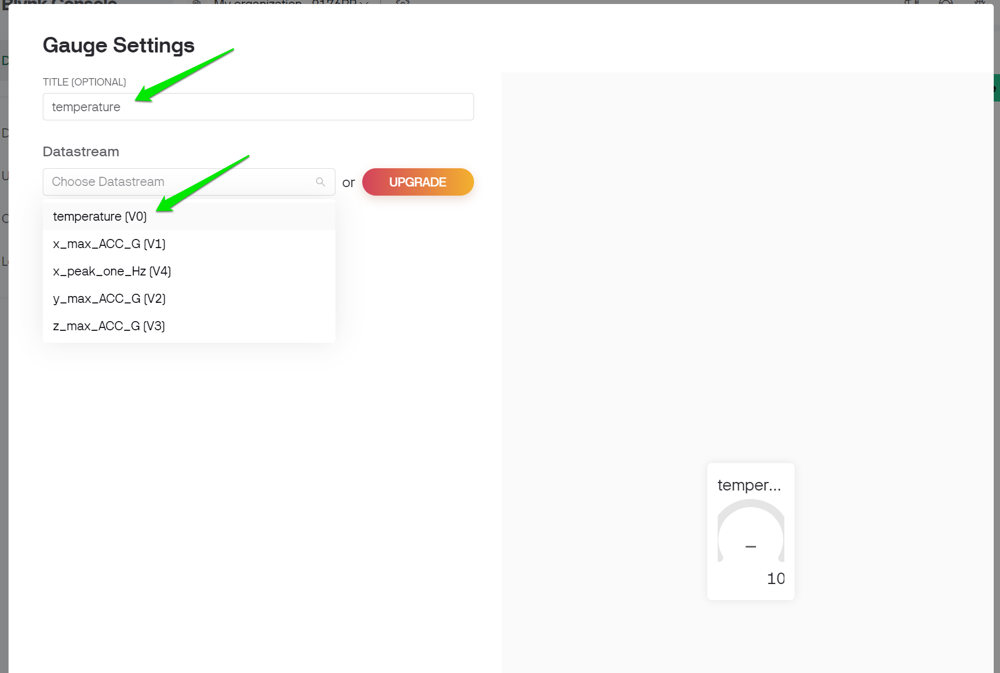<figcaption></figcaption></figure>

</div>

&#x20;Once you select the Datastream more configuration options will open up. Enable the Change color based on value toggle and select a color scheme that is to your liking. Finalize by pressing the Save button.

<div align="left">

<figure>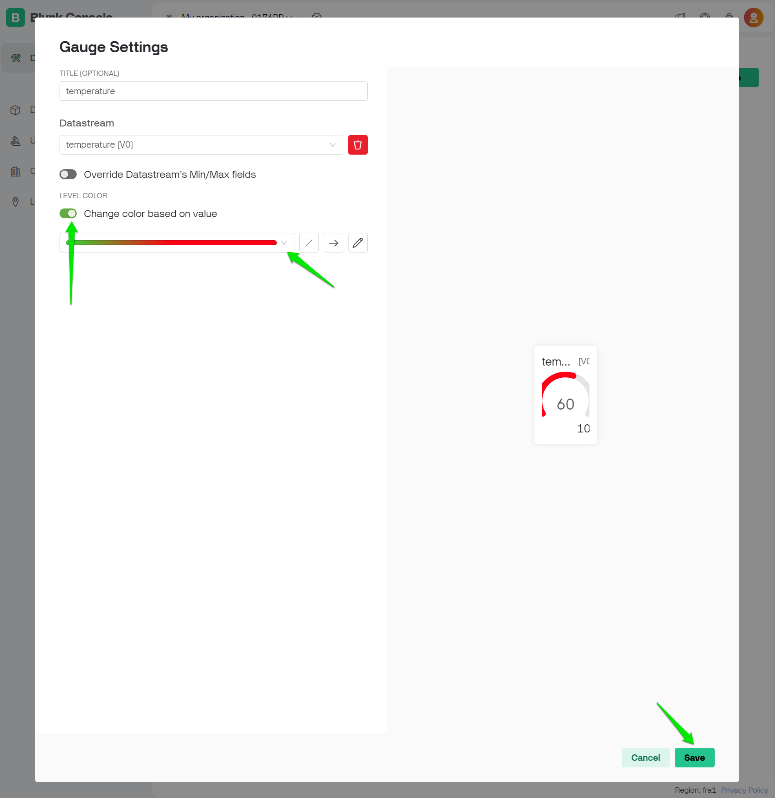<figcaption></figcaption></figure>

</div>

Your first Widget should now be visible, lets add another, this time a Label. Let’s keep it simple for this one, just select the _x\_max\_ACC\_G_ Datastream and name it.

<div align="left">

<figure>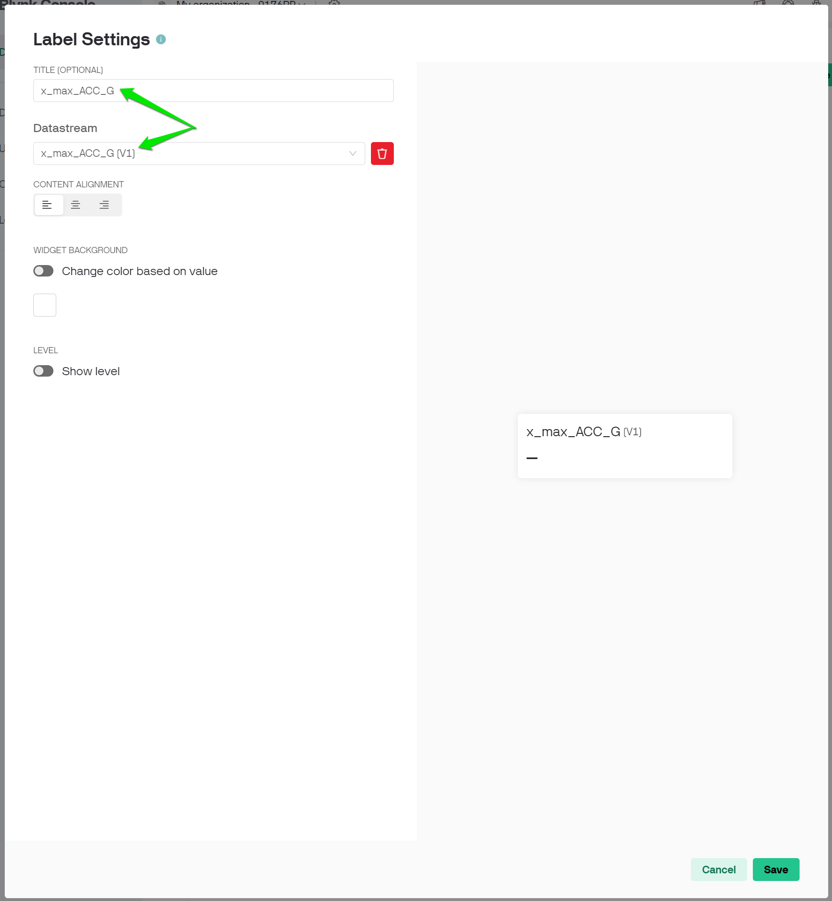<figcaption></figcaption></figure>

</div>

&#x20;You now have 2 Widgets in the Dashboard. Continue adding Label Widgets until you have the full set, or a subset if you are using the Free version, eventually you should have a nicely looking Dashboard similar to ours (after some rearrangement and resizing of Widgets).

<figure>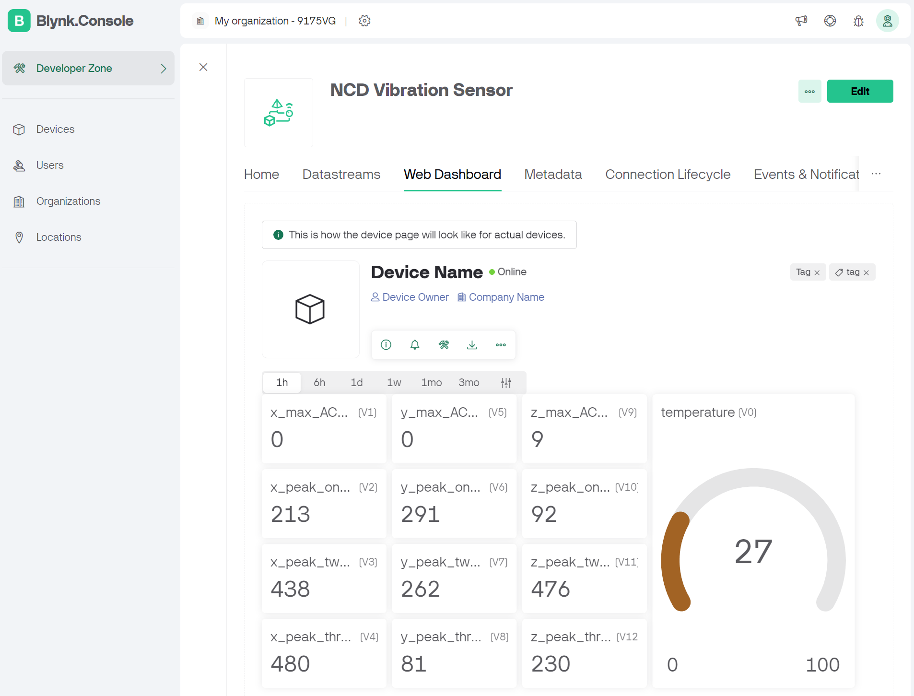<figcaption></figcaption></figure>

#### The Device

Go to the Devices menu on the left and add a New Device.

<div align="left">

<figure>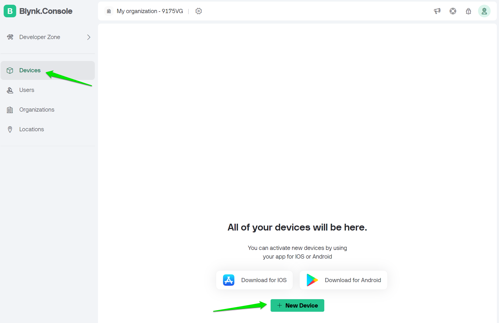<figcaption></figcaption></figure>

</div>

Choose the _From template_ option, as we have created one in the previous step.

<div align="left">

<figure>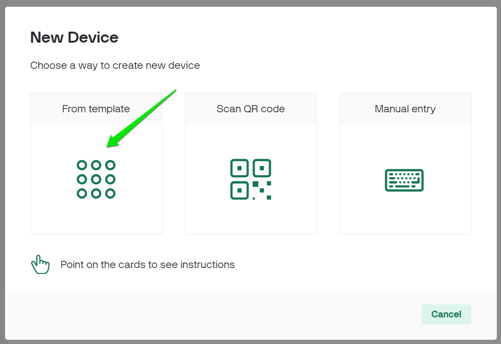<figcaption></figcaption></figure>

</div>

You should have a single choice here, select it and press the Create button.

<div align="left">

<figure>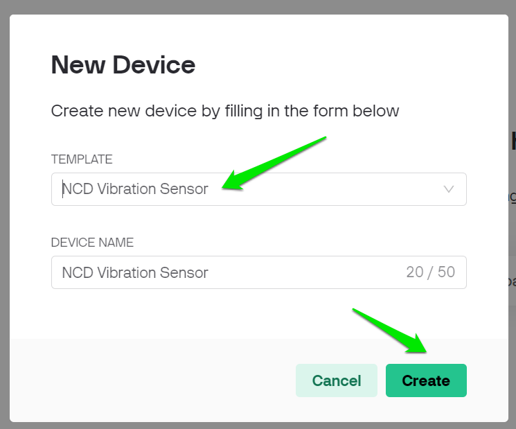<figcaption></figcaption></figure>

</div>

You will be taken to the main device screen, where we can note the following: the Widgets display no data (which is to be expected as we have not bridged the Gateway and Blynk quite yet).

There is a window at the top right that gives you some important information, in this particular case the Authentication Token for the Device, which we need in order to connect the Gateway to Blynk.


Make sure to copy the value in the “” for the Authentication token (refer to the image below).


<figure>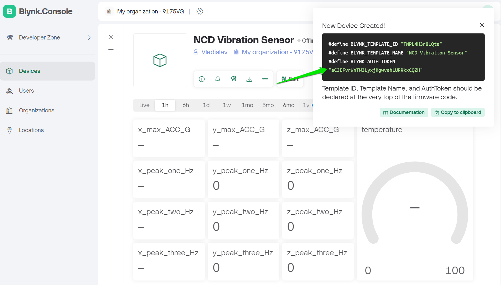<figcaption></figcaption></figure>

We are done with the configuration in the Blynk platform itself. The next step is to go back to Node-RED and create the MQTT integration to bridge the Gateway and the Blynk MQTT Broker. Once we do this, data will start flowing and we will immediately see it in Blynk.

### Connect the Gateway to the Blynk MQTT Broker

Two nodes need to be added to the flow – _function_ and _mqtt out_. Pull them into the flow and connect them as in the image below.

<figure>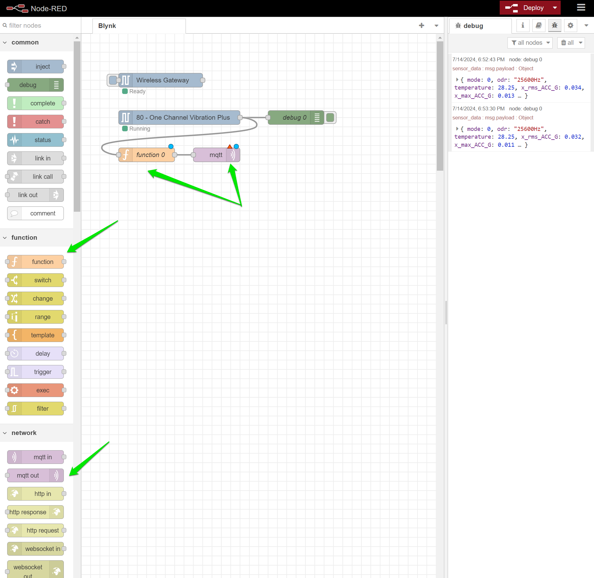<figcaption></figcaption></figure>

#### Parsing function

Open up the _function_ node and paste the following code.

```javascript
var returnMsg = null;
returnMsg = { topic: "ds/temperature", payload: msg.payload.temperature }
return returnMsg
```

<figure>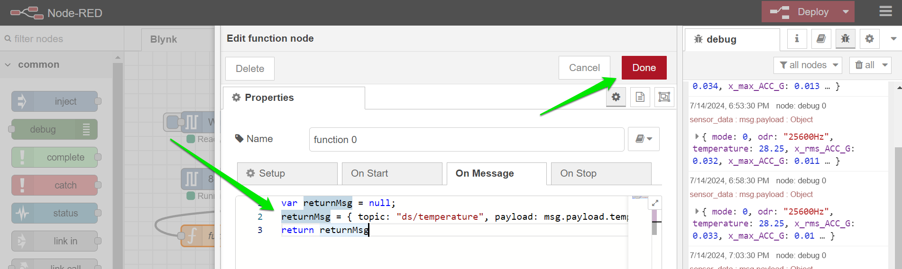<figcaption></figcaption></figure>

This will create a variable that has two fields:

`topic: "ds/temperature"` – the mqtt topic where the message will be published

_`ds/`_ - stands for Datastream and as you might have guessed this ties with the ones we created in the previous steps, thus _`ds/temperature`_ will associated with our temperature Datastream, _`ds/x_max_ACC_G`_ would be the one for the X axis acceleration, etc.

`payload: msg.payload.temperature` – this separates the _temperature_ value from the entire sensor payload and assignes it to a new _payload_ variable to be sent on the _temperature_ Datastream/mqtt topic. As an example if we wanted to send the value of the X axis acceleration the value would be _`msg.payload.x_max_ACC_G`_.

You need to have one of these function nodes for every parameter you want to separate and send to a Datastream on Blynk, adjusting the function values as we explained above.

A complete flow file will be provided for you to download to make things simple.

#### MQTT out

Now that the function node has parsed the data for us, we need to forward it to the Blynk MQTT Broker. Open up the mqtt out node and fill in the Topic field with the same topic used for the function node - _`ds/temperature`_

<figure>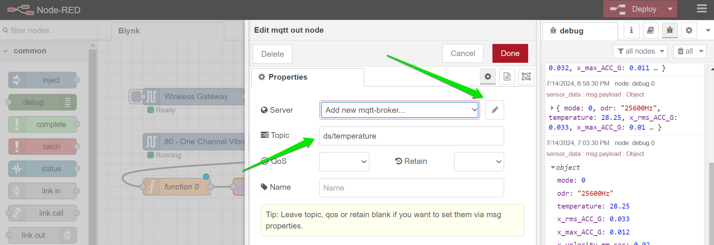<figcaption></figcaption></figure>

You will also need to create a new Server to connect to (press the pen icon).

Enter the settings as follows:

Name: Blynk

Server: fra1.blynk.cloud

Port: 8883

Connect automatically: Checked

Use TLS: Checked

Protocol: MQTT V5

Keep Alive: 45

<figure>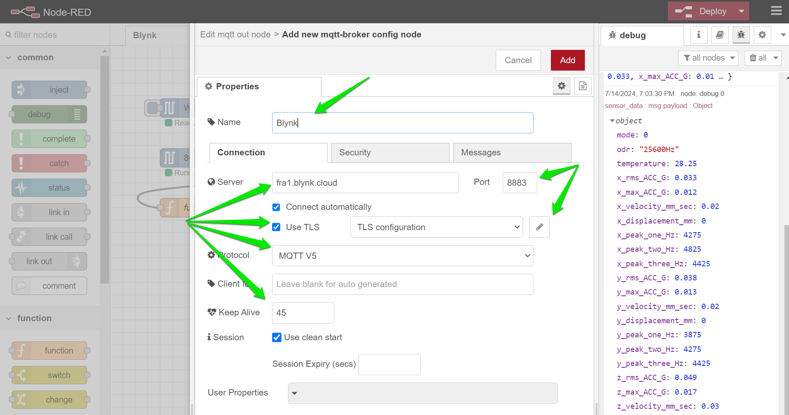<figcaption></figcaption></figure>


Note that the server address can be different for your location. For the full guide on servers refer to the [Blynk Server address](https://docs.blynk.io/en/blynk.cloud-mqtt-api/device-mqtt-api/authentication) list.


<figure><figcaption></figcaption></figure>

You also need to import the TLS CA Certificate, Blynk uses isrgrootx1.der, which you can download from [here](https://letsencrypt.org/certs/isrgrootx1.der).

Upload the file after you have downloaded it via the button, make sure to also fill in the Server address (same as above) and you are done with the TLS configuration.

<figure>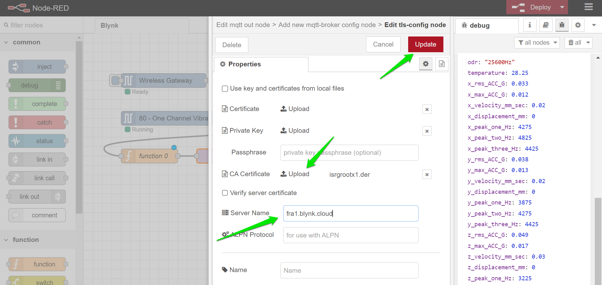<figcaption></figcaption></figure>

Once you update the node the MQTT client (mqtt out) node will connect to the Blynk MQTT Broker and data will start flowing. You should be able to see this reflected in the Dashboard where the Temperature Widget will update its value (refer to the image below).

<figure><figcaption></figcaption></figure>

The rest of the widgets will remain empty, as we have only connected one of the Datastreams. Once you have connected the rest, you will see all widgets update.

The procedure is the same for every widget, you simply need to create a set of _function_ and _mqtt_ nodes, connect them to the Sensor node and configure them utilizing the provided configuration, where you edit the naming to reflect the naming of the topic and payload. Your final flow should contain the full set of functions.

Alternatively, you could simply download the ready-to-use flow from the link below:

Example Flow

<figure>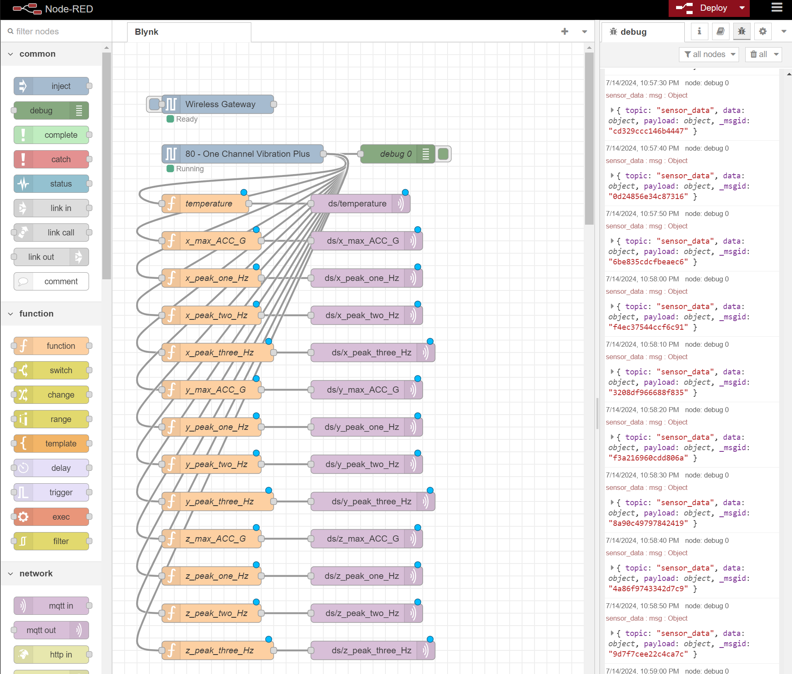<figcaption></figcaption></figure>

Which when deployed will populate the entirety of your Dashboard.

<figure>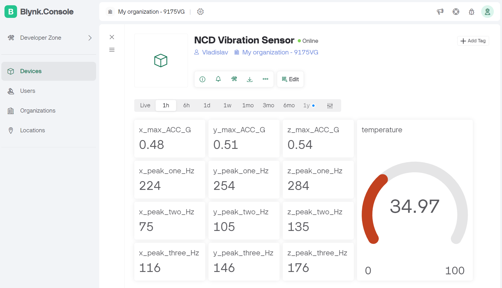<figcaption></figcaption></figure>

This concludes the tutorial, you now have your small network gathering Vibration data and sending it through the Gateway via Node-RED (utilizing MQTT) to Blynk for visualization.
