# Particle - control with Blynk

This guide can be used in combination with the first part, where we were connecting the Particle Boron device and pushing data to Blynk Cloud.&#x20;

This second part will help you change the state of a digital output on a Particle device built-in LED using either a pushbutton on the Blynk dashboard, or a Button’ widget in the Blynk.App.&#x20;

### Hardware

The Particle device is a [Boron 404x](https://store.particle.io/collections/boron-lte/products/boron-lte-cat-m1-noram-with-ethersim-4th-gen) cellular LTE Cat M1 device. The built-in LED on the device connected to digital I/O D7 will be utilized.&#x20;

### Firmware

A Particle [cloud function](https://docs.particle.io/reference/device-os/api/cloud-functions/particle-function/) causes code on a device to run when requested from the [Particle cloud API](https://docs.particle.io/reference/cloud-apis/api/#call-a-function). Up to 15 cloud functions may be registered, and each function call request and response uses one Particle Data Operation from your monthly or yearly quota. The function can also be triggered from the Particle [console](https://console.particle.io/), and the [CLI](https://docs.particle.io/getting-started/developer-tools/cli/). The function returns an integer defined by the function code.

Below is the firmware code for the Boron. Note that the cloud function is first registered in setup() by the call to Particle.function(funcKey, funcName), and then the custom function ‘funcName’ is added to the script. In this example, the funcKey is ‘blynk\_led’ and the funcName is ‘blynkLED’.&#x20;

```cpp
/*
 Project blynk_to_particle.io
 Author: Mark W Kiehl / Mechatronic Solutions LLC
 Date: April 2023
 
 Respond to a remote Blynk request to turn on or off the
 blue LED on D7. An HTTP POST to the Particle API calls
 a Particle function that responds to an argument with
 a value of 'on' or 'off' corresponding to what should
 happen to the LED. 
 Returns the value 1 if the LED has been turned on, 
 and 0 if turned off, -1 if an error.

 Hardware:
 Particle Boron 404x

 Software:
 Standard Particle firmware and this script.

*/

#include "Particle.h"

const char* firmware_version = "0.0.0";
uint8_t led_state = LOW;
uint8_t led_state_last = LOW;

// Register the Particle cloud function
int blynkLED(String on_or_off);

void setup() {

 pinMode(D7, OUTPUT);
 digitalWrite(D7, HIGH);

 Serial.begin(9600);
 waitFor(Serial.isConnected, 30000);
 delay(1000);
 Serial.printlnf("Device OS v%s", System.version().c_str());
 Serial.printlnf("Free RAM %lu bytes", System.freeMemory());
 Serial.printlnf("Firmware version v%s", firmware_version);

 // register the Particle cloud function (funcKey, funcName)
 Particle.function("blynk_led", blynkLED);

 randomSeed(millis());
 digitalWrite(D7, LOW);
 Serial.println("Setup complete");
} // setup()

void loop() {

 digitalWrite(D7, led_state);

} // loop()

int blynkLED(String on_off) {
 // Custom Particle cloud function that changes the state of the built-in LED
 // on D7 in response to an instruction from Blynk calling this
 // custom cloud function. 
 // Returns the value 1 if the LED has been turned on, and 0 if turned off, 
 // -1 if an unexpected on_off value is received.
 // Cloud functions must return int and take one String argument
 // curl https://api.particle.io/v1/devices/{your 25 char device id}/blynk_led
 // -d access_token={your 40 char access token}
 // -d "args=on/off"
 
 if (on_off == "on" || on_off == "1") {
 led_state_last = led_state;
 led_state = HIGH;
 return 1;
 } else if (on_off == "off" || on_off == "0") {
 led_state_last = led_state;
 led_state = LOW;
 return 0;
 } else {
 Serial.print("Unexpected on_off value of: '"); Serial.print(on_off); Serial.println("'");
 }
 return -1;
}
```

Upload the firmware code to the Boron and then continue to power it so it can connect to the Particle cloud. Go to your Particle [console](https://console.particle.io/), select the Boron device, and then under the section ‘FUNCTIONS’ on the right side of the screen you will see the function key of ‘blynk\_led’ listed. Enter ‘on’ in the ‘Argument’ input area and click the ‘CALL’ button. Observe the Boron to confirm that the built-in blue LED on D7 turns on. Repeat, this time with the ‘off’ argument to turn off the LED.&#x20;

<div align="left">

<figure>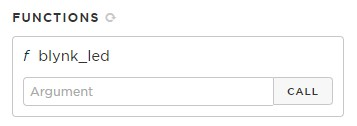<figcaption></figcaption></figure>

</div>

### Particle API

Now that we have confirmed that the Particle function works properly on the Boron, lets execute it using the Particle API. Create an access token by logging into your Particle account, and then visiting the Particle documentation section ‘[Create a token (browser-based)](https://docs.particle.io/reference/cloud-apis/access-tokens/#create-a-token-browser-based-)’. Use your Particle login email and password. If you have MFA (multi-factor authentication) enabled on your account, you will need your MFA code to generate the access token. Click the ‘Create token’ button to generate a token. Keep this token confidential.

<figure><figcaption></figcaption></figure>

The syntax for the API is:&#x20;

```
POST /v1/devices/{DEVICE_ID}/:{FUNCTION}
```

Where {DEVICE\_ID} is your Particle device ID and {FUNCTION} is the cloud function name.&#x20;

Example:

```
https://api.particle.io/v1/devices/{your 25 char device id}/blynk_led
```

Configure an HTTPs POST with OAuth 2.0 authorization, a webform with the key/values of “args” and “on” using a tool such as the free online tool [Postman](https://www.postman.com/), as shown in the images that follow. First select ‘POST’, enter the URL, select the ‘Authorization’ tab and set the ‘Type’ to ‘OAuth 2.0’. Select the ‘Request Headers’ option and then enter your 40 character Particle access token into the token field, and then the text “Bearer” for the ‘Header Prefix”.

<figure>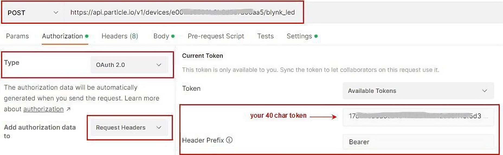<figcaption></figcaption></figure>

Configure the POST body message type as application/x-www-form-urlencoded with the following key/value pairs:

args on/off

<figure>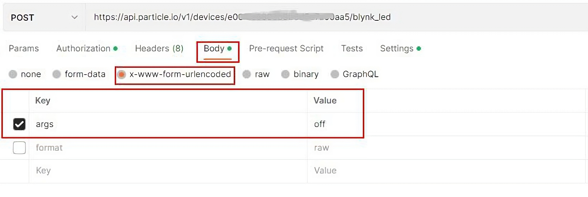<figcaption></figcaption></figure>

The ‘args’ value should be “on” or “off”, depending on if you want to turn the built-in LED on or off.&#x20;

For clarity, the full headers that will be sent with the HTTP POST by Postman are shown below. Note the key of ‘Authorization’ and the value of ‘Bearer {40 char Particle access token}’. A space is in between “Bearer” and the 40 character Particle access token. This is known as ‘Bearer Authorization’ or ‘token authentication’ and is an HTTP authentication scheme that involves security tokens called bearer tokens. In this case, the bearer token will be sent in an HTTP ‘Authorization’ header.

<figure>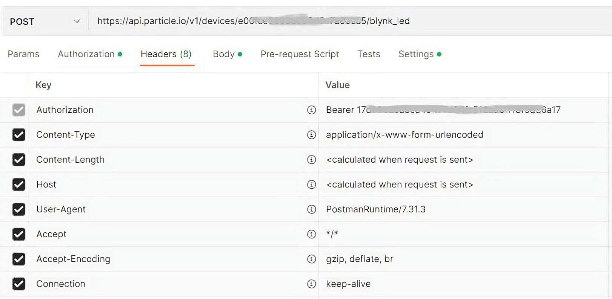<figcaption></figcaption></figure>

With your device powered and connected, manually send a POST using [Postman](https://www.postman.com/) or [CURL](https://curl.se/) with the ‘args’ value of either ‘on’ or ‘off’. If your response is unsuccessful, the response will be:

```
{
 "ok": false,
 "error": "Timed out."
}
```

The above response occurs if your Particle device isn’t online (Status: 400 Bad Request).

A successful execution will appear as follows:

```
{
 "id": "your 25 char device id",
 "name": "your device name",
 "connected": true,
 "return_value": 1
}
```

Note that if you add a body key of “format” and value of “raw” then the response will simply be the integer value you configured for your Particle function `blynkLED()` with a value of -1, 1 or 0.&#x20;

<figure><figcaption></figcaption></figure>

Now that you are certain that the Particle HTTP POST will be responded to by the Particle device, the next step is to configure a Blynk Webhook that will execute that POST. The Blynk webhook will pass a datastream value in the Particle HTTP POST, so begin by defining the Blynk datastream.

### Blynk Datastreams

Blynk Datastreams are bi-directional channels assigned a data type and link to data values stored on the Blynk Cloud. You reference them as virtual pins between the range of V0 and V255. Below are the datastreams defined for this project and their relationship to the hardware and the web dashboard / mobile app.

The Particle function argument is a data type of String. The custom function we created accepts values of ‘on’ or ‘1’ to turn the built-in LED on, and values of ‘off’ or ‘0’ to turn it off. Note below that the enumerable datastream converts 1/0 to “on”/”off”.

#### Blynk Datastream Definitions:

| Virtual Pin | Name     | Data Type  | Description                           |
| ----------- | -------- | ---------- | ------------------------------------- |
| V7          | LED int  | Integer    | 1 = LED on, 0 = LED off               |
| V8          | LED enum | Enumerable | 1 = “on” = LED on, 0 = ‘off = LED off |
| V9          | LED str  | String     | “on” = LED on, “off” = LED off        |

### Blynk Device Template

_If you already followed the steps from the prior article “_[_How to connect a Particle device to Blynk_](particle.md)_”, then edit the same device template and add the datastreams V7, V8, V9 as shown below._

Using the Blynk Datastream Definitions listed in the table, create or edit a device template named ‘BRN404X’ as shown below.

<div align="left">

<figure>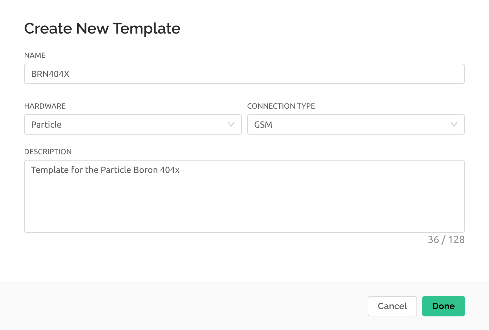<figcaption></figcaption></figure>

</div>

Three datastreams of data types integer, enumerable, and string will be created to illustrate how each can be used to control the LED on the Particle Boron. In a real application, you would only need to employ one of these.&#x20;

Click on the ‘Templates->Datastreams’ tab and configure the datastreams as defined in the Blynk Datastream Definitions table with the options as shown below. It is important to configure the Pin, Data Type, Is Raw, Min, Max, and Default Value as shown.

<figure>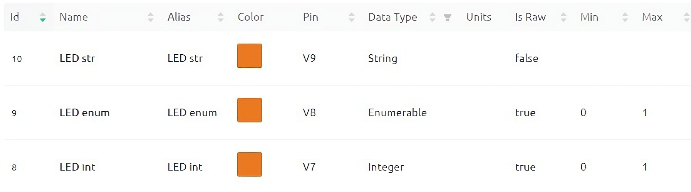<figcaption></figcaption></figure>

### Blynk Web Dashboard

_If you already followed the steps from the prior article “_[_How to connect a Particle device to Blynk_](particle.md)_”, then add a new dashboard tab by clicking the ‘+’ button before following the steps below._

Create a web dashboard by navigating to ‘Templates->\[template name = BRN404X]’ and then click on the ‘Web Dashboard’ tab. Create a dashboard as shown below, using a switch widget for virtual pins V7 and V8, and a text input widget for the string datastream V9. The label widgets to the right of each switch / text input widget are not required and are only to make it easy for you to see the latest datastream value.&#x20;

<figure>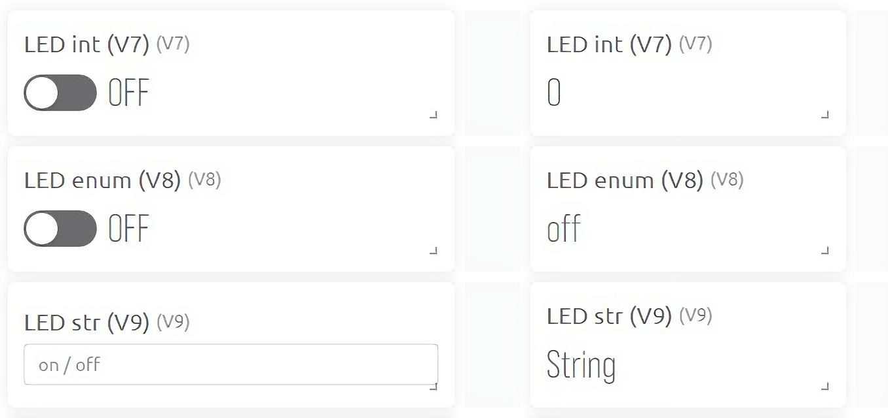<figcaption></figcaption></figure>

|   | 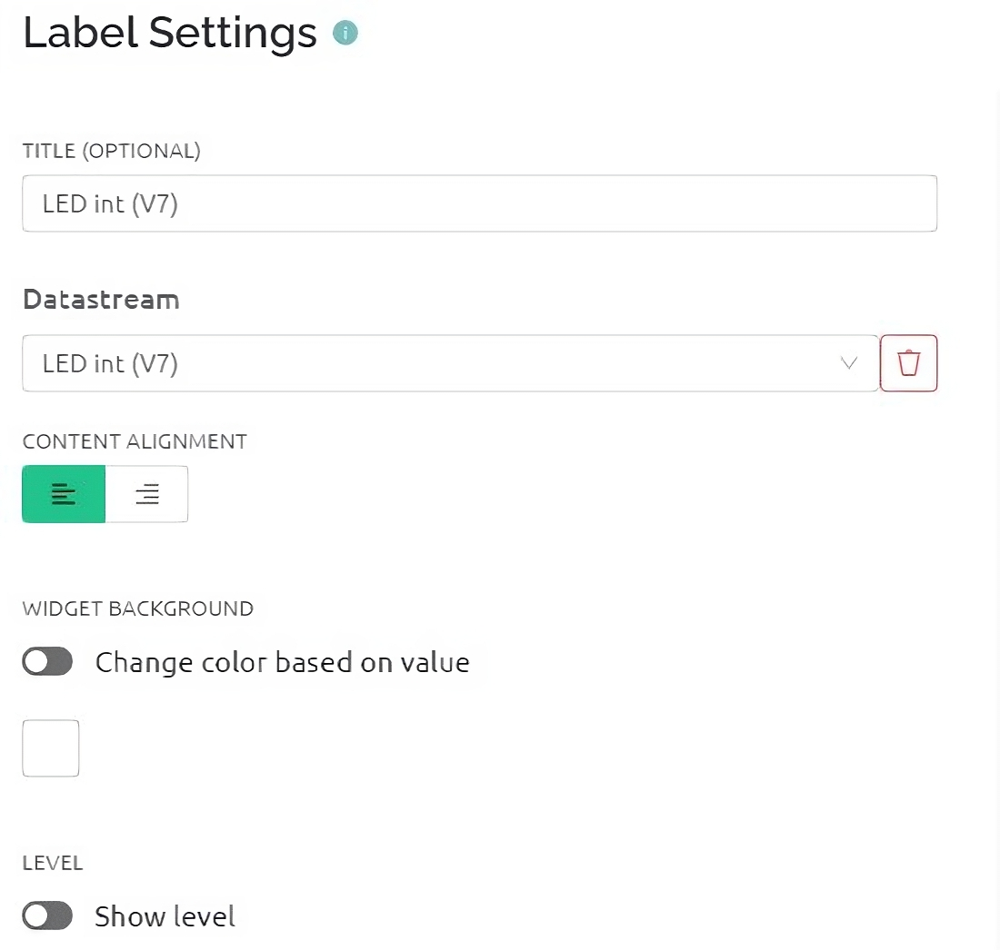 |
| ------------------------------- | ------------------------------- |
| 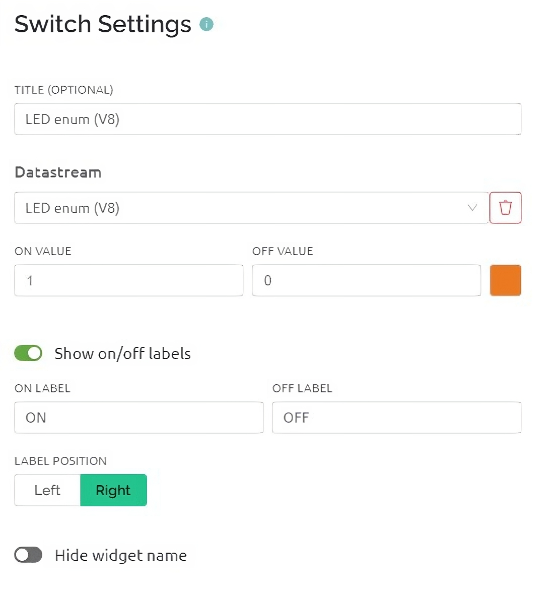 | 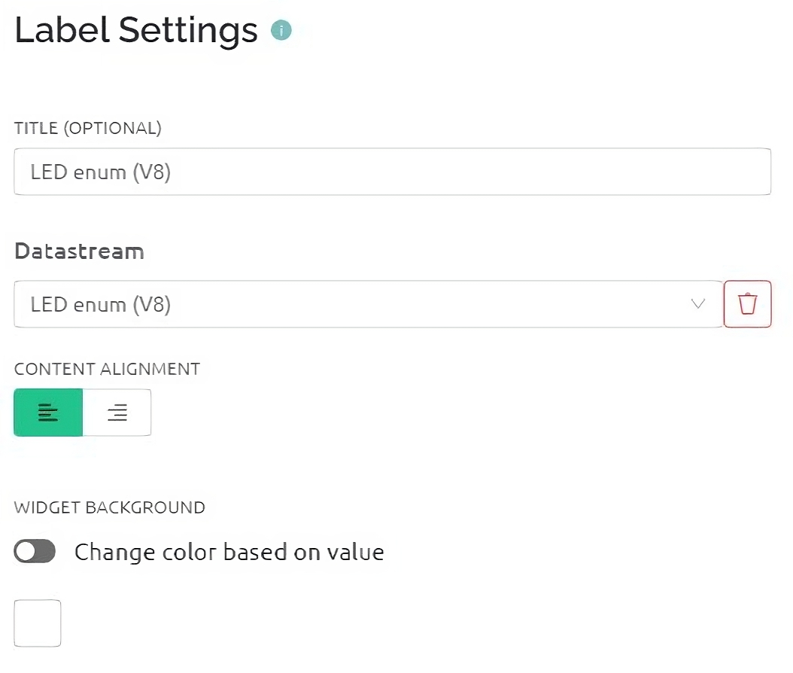 |
| 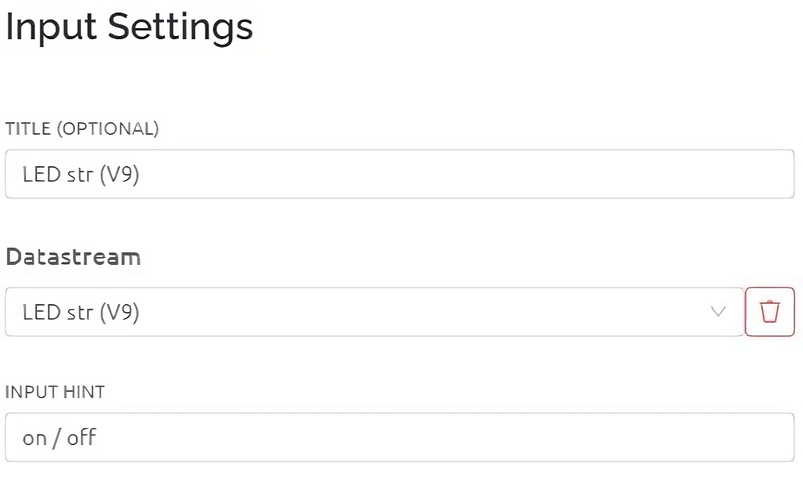 | 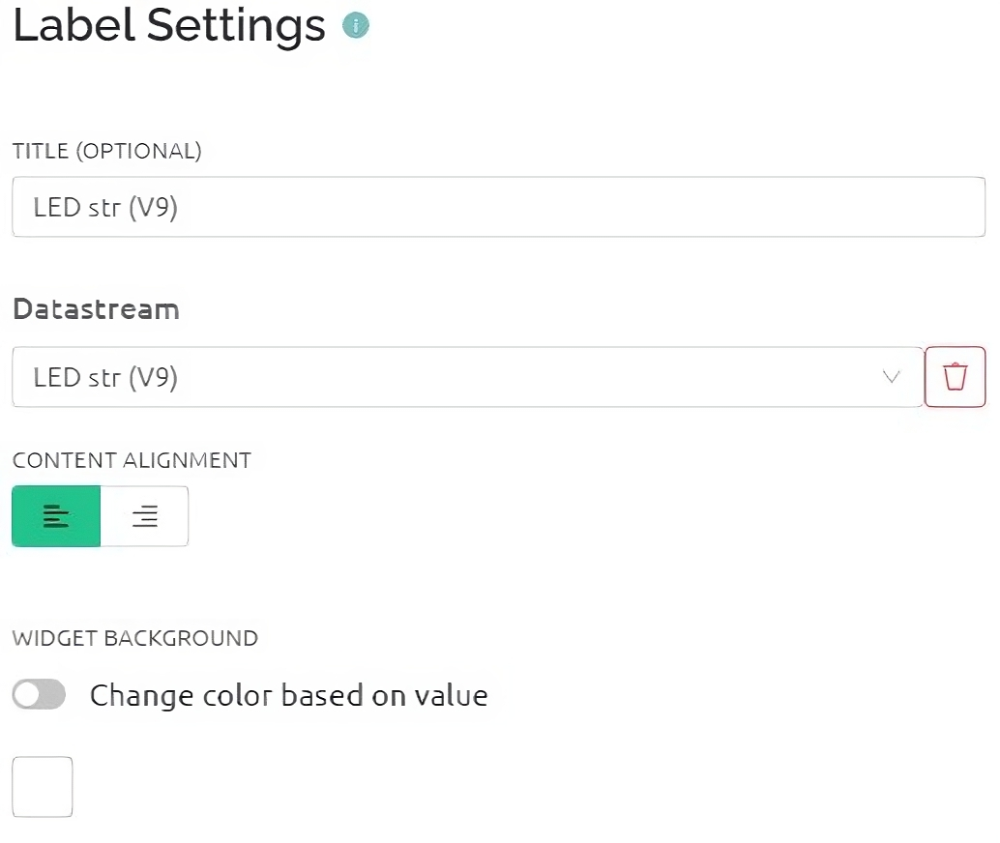 |

### Blynk Mobile App

_If you already followed the steps from the prior article “_[_How to connect a Particle device to Blynk”_](particle.md)_, then edit the same device template ‘boronc’ and add the three widgets for datastreams V7, V8, V9 as shown below._

Create a Blynk mobile device dashboard. The exact steps may vary between iOS and Android, but begin by tapping on a device, and tap on the wrench icon and then the ‘+’ icon to add a widget. Create the following widgets:

1. ‘Switch’ widget for datastream ‘LED int (V7)’.
2. ‘Segmented Switch’ widget for datastream ‘LED enum (V8)’.
3. ‘Text Input’ widget for datastream ‘LED str (V9)’.

#### Blynk Device Activation

Skip this step if you already followed the steps from the prior article “[How to connect a Particle device to Blynk](particle.md)”. If you didn’t, then go to that article and follow the steps under [‘Blynk Device Activation’](particle.md#blynk-device-activation).&#x20;

### Blynk Webhook

Navigate to ‘Settings -> Webhooks’ and create three new [webhooks](../blynk.console/settings/developers/webhooks.md), one each for the datastreams V7, V8, and V9, based on the information shown in the images below for V7, but substituting your Particle device ID and access token. The only difference between the three webhooks is the assignment of the V7, V8, and V9 datastream to the webhook, and the webhook name.&#x20;

<figure>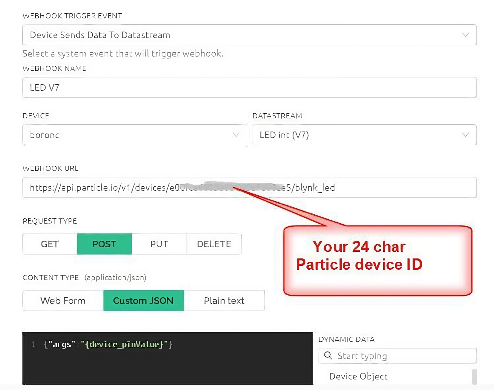<figcaption></figcaption></figure>

<figure>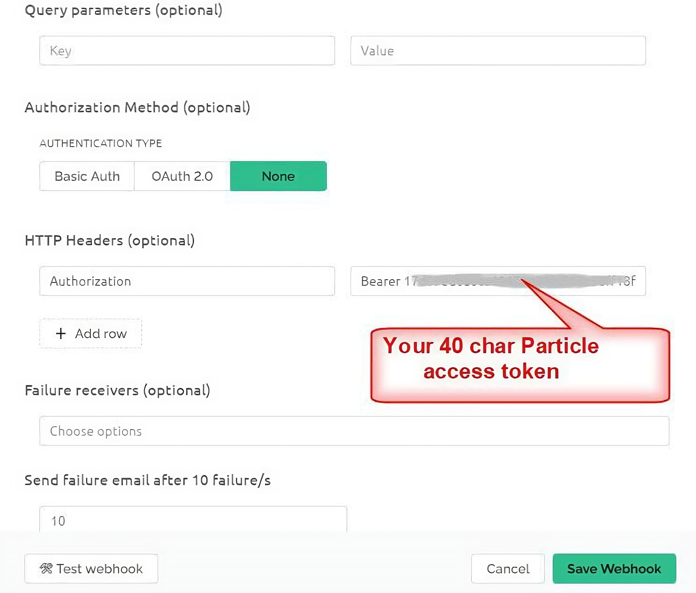<figcaption></figcaption></figure>

After you are finished configuring each webhook, click the ‘Test webhook’ to verify it doesn’t throw an error (it won’t send the datastream value here, so don’t expect to see the LED on your Particle device change). Click the ‘Create Webhook’ button to save it and close the dialog.

Note that request quota is ‘1 per minute’ so any datastream value changes faster than one minute will be ignored (webhook won’t execute).&#x20;

### Full System Test

Everything is now configured to push data from either the Blynk web dashboard widgets or mobile app widgets to the associated Blynk webhook. The webhook will execute a HTTP POST to Particle’s API, and call the Particle function running on the Particle device.

Make sure your Particle device is running and connected (cyan LED breathing). From the Blynk web dashboard, send a command from one of the widgets to turn on the Particle device LED. Wait 60 seconds, and then use the same widget to turn the LED off. The label widgets on the web dashboard will display the actual datastream values. Repeat the same tests from the Blynk mobile app.&#x20;

### Wrap Up

This article showed how to securely control a Particle device from either a Blynk web dashboard or mobile app. No code was needed to create the Blynk web dashboard, mobile app, or Blynk webhook. Three different types of Blynk datastreams were employed in this example, demonstrating how different web dashboard and mobile app widgets can be used to accomplish the same type of remote control. Although only a state change of either on or off was used, it is easy to see how a few changes could be made to cause a variable change at the device, such as changing the LED brightness or color.

By combining what was demonstrated in this article and the prior “[How to connect a Particle device to Blynk](particle.md)”, you can achieve bidirectional communication between a Particle device and both a Blynk web dashboard and mobile app. Additionally, Blynk provides a wide variety of widgets for visualizing data from a Particle device, and no-code Blynk automations can be configured to create a number of custom notifications.
