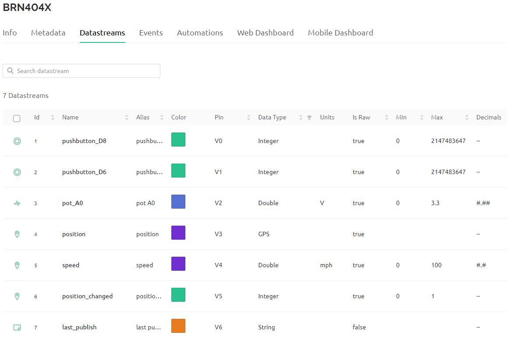
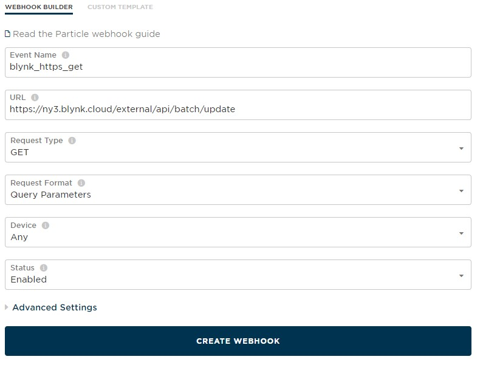
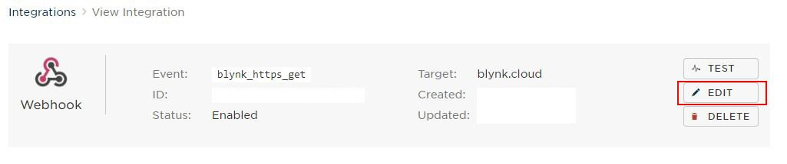

# Particle - monitor with Blynk

This guide will help you connect a Particle board and set up everything that is needed to:

* Monitor 2x digital inputs and notify the user whenever the state of any of them changes.
* Notify the user if the device has moved more than 122 m / 400 ft since it was powered on, and the speed in mph.
* Monitor 1x analog input and report the value when a digital input or position change event occurs..&#x20;
* Report the last time any data was published by the device.

Check part two of the article in order to learn [how to control your Particle device from Blynk app or web console](particle-part-ii.md) as this is not within the scope of this guide.

## Hardware

The Particle device is a [Boron 404x](https://store.particle.io/collections/boron-lte/products/boron-lte-cat-m1-noram-with-ethersim-4th-gen) cellular LTE Cat M1 device. A [GPS FeatherWing](https://www.adafruit.com/product/3133) with an [external active 28 dB GPS antenna](https://www.adafruit.com/product/960), and a [SMA to uFL/u.FL/IPX/IPEX RF adapter cable](https://www.adafruit.com/product/851) provides GPS functionality. The Boron and the GPS FeatherWing communicate over the Boron UART pins.

<figure><figcaption></figcaption></figure>

## Software

The IoT device (Particle Boron) can communicate with Blynk either using the Blynk library, or via the Blynk HTTPs API. In order to minimize cellular communication between Blynk and the device, the Blynk HTTPs API will be used.&#x20;

The Particle Boron cellular IoT device will publish a JSON string to the Particle Cloud, referencing a Particle webhook. The webhook reformats the data, and then sends it to the Blynk Cloud via a HTTP GET, updating the Blynk datastreams. Note that the device doesn't run Blynk code, and therefore it will never appear as "online" to Blynk in the Blynk.Console or Blynk.App.

### Blynk Datastreams

Blynk Datastreams are bi-directional channels assigned a data type and link to data values stored on the Blynk Cloud. You reference them as virtual pins between the range of V0 and V255. Below are the datastreams defined for this project and their relationship to the hardware and the web dashboard / mobile app.

#### Blynk Datastream Definitions

| Virtual Pin | Name              | Data Type | Description                                                                              |
| ----------- | ----------------- | --------- | ---------------------------------------------------------------------------------------- |
| V0          | pushbutton \_D8   | Integer   | Count of state changes for the Boron digital input on pin D8                             |
| V1          | pushbutton\_D6    | Integer   | Count of state changes for the Boron digital input on pin D6                             |
| V2          | pot\_A0           | Double    | Analog input value of Boron pin A0                                                       |
| V3          | position          | Location  | GPS latitude & longitude                                                                 |
| V4          | speed             | Double    | GPS speed \[mph]                                                                         |
| V5          | position\_changed | Integer   | 1 = device position has changed by more than 122 m / 400 ft. 0 = no change in position.  |
| V6          | last\_publish     | String    | Last date/time data was published                                                        |

### Blynk Device Template

Using the Blynk Datastream Definitions listed in the table, create a device template named ‘BRN404X’ as shown below.

<figure><figcaption></figcaption></figure>

Click on the ‘Templates->Datastreams’ tab and configure the datastreams as defined in the Blynk Datastream Definitions table with the options as shown below. It is important to configure the Pin, Data Type, Is Raw, Min, Max, and Default Value as shown.

<figure><figcaption></figcaption></figure>

### Blynk Dashboard

Create a web dashboard by navigating to ‘Templates->\[template name = BRN404X]’ and then click on the ‘Web Dashboard’ tab. Create a dashboard as shown below.&#x20;

<figure><figcaption></figcaption></figure>

A chart widget is used for the two datastreams associated with the two digital inputs because the value assigned to the datastream is the count of state changes. Details on the configuration of each widget is shown below.&#x20;

|  |                                                                                                                                                                                        |
| --------------------------------------------------------------------------------------------------------------------------------------------------------------------------------------------------- | ------------------------------------------------------------------------------------------------------------------------------------------------------------------------------------------------------------------------------ |
|      | <p><br></p><p></p> |
|      |                                |
|  | <p><br></p>                                                                                                                                                                                                                    |

### Blynk Mobile App

Create a Blynk mobile app. The exact steps may vary between iOS and Android, but begin by tapping on a device, and tap on the wrench icon and then the ‘+’ icon to add a widget. Create the following widgets:

1. ‘SuperChart’ widget configured to display both the datastreams of ‘pushbutton \_D8’ and ‘pushbutton\_D6’ as a bar chart.
2. ‘Slider’ widget for ‘pot\_A0 (V2)’
3. ‘Map’ widget for ‘position (V3)’
4. ‘Slider’ widget for ‘speed(V4)’
5. ‘Button’ widget for ‘position\_change(V5)’ with mode of ‘Push’
6. ‘Value Display’ for ‘last\_publish(V6)’

### Blynk Device Activation

Static tokens will be used for device authentication because the device is cellular. We will generate a static authentication token (BLYNK\_AUTH\_TOKEN) using the [manual method](../getting-started/activating-devices/manual-device-activation.md). Navigate to the search menu and create a new device from the ‘BRN404X’ template with a name that is similar to the name you assigned to your Particle device name (‘boron\_b’ in my case), just to keep it simple and consistent.

<figure><figcaption></figcaption></figure>

After you click the ‘Create’ button, a device page will open and the Template ID, Device Name, and AuthToken will be shown in the upper right of the screen.&#x20;

<figure><figcaption></figcaption></figure>

Write down the Device name you picked, and then the BLYNK\_TEMPLATE\_NAME and the BLYNK\_AUTH\_TOKEN shown in the panel because you will need them later.&#x20;

### Blynk HTTPs API

For this project, we want the [Particle webhook (integration)](https://docs.particle.io/getting-started/integrations/webhooks/) to pass data from the Particle device to Blynk. The [Blynk HTTPs API](broken-reference) will be used to set multiple datastream values in the Blynk Cloud. The following HTTP GET request will update the Blynk datastreams defined for this project after the {token} is replaced with the BLYNK\_AUTH\_TOKEN, and {[server\_address](../blynk.cloud/device-https-api/troubleshooting.md)} is replaced with the server shown at the bottom right of your Blynk.Console:

```
https://{server_address}/external/api/batch/update?token={token}&V0=0&V1=0&V2=1.5&V3=-73.8731,40.8414&V4=12.54&V5=0
```

Note that datastream V6 was omitted for now, and the location datastream V3 is first assigned the longitude, and then the latitude, both in decimal degrees, with a comma between them (e.g. V3=-73.8731,40.8414). The alternative Blynk HTTPs API format of ‘V3=-73.8731\&V3=40.8414’ cannot be used in the Particle webhook because the duplicate query parameter will not be permitted.

Paste the HTTP GET request into an internet browser to update the datastreams in the Blynk Cloud, and then observe the changes in the Blynk.Console by navigating to ‘Search -> My Devices -> Device -> Dashboard’. The browser will respond with nothing if the HTTP GET request is accepted, or a JSON string with an error if it is not.

<figure><figcaption></figcaption></figure>

Once you have confirmed that the HTTP GET request properly updates the widgets on your Blynk web dashboard, you are then ready to create the Particle webhook / integration.&#x20;

### Particle Webhook/Integration

We are going to create a Particle integration webhook running on the Particle cloud that will accept the data from the Particle.publish() function executing on the device, and transform it into a HTTPs GET that will post data to the Blynk cloud, updating the corresponding Blynk datastream values.

Login to your [Particle Console](https://docs.particle.io/getting-started/console/console/) and click on the [‘Integrations’ ](https://console.particle.io/integrations)sidebar option. Click on the ‘NEW INTEGRATION’ shown on the page, and then select the ‘Webhook’ option.

<figure><figcaption></figcaption></figure>

<figure><figcaption></figcaption></figure>

Fill out the Webhook form as shown below. The ‘Event Name’ is what will be called later by your device firmware with the Particle.publish() function. The server address of ‘ny3.blynk.cloud’ for the ‘URL’ field should be replaced with the server address from this list that matches what you defined for your Blynk HTTP GET request. Change the ‘Request Type’ to ‘GET’, and then click on the ‘CREATE WEBHOOK’ button at the bottom of the form.&#x20;

<figure><figcaption></figcaption></figure>

The webhook is not complete yet. The query parameters need to be defined. Click on the ‘EDIT’ button at the top right of the screen.&#x20;

<figure><figcaption></figcaption></figure>

Click on the ‘Advanced Settings’ link at the bottom of the page and then under the ‘QUERY PARAMETERS’ section, choose the ‘Custom’ option. Build the query parameters as shown below, using the ‘+ ADD ROW’ button at the bottom to add a row for each query parameter.&#x20;

<figure><figcaption></figcaption></figure>

The keys on the left (token, V0, V1 .. V6) refer to Blynk virtual pins (datastreams), and the values on the right for ‘v0, v1, pot, lon, lat, spd, moved’ reference variables from the firmware that will be passed from the Particle.publish() function. The value ‘PARTICLE\_PUBLISHED\_AT’ for virtual pin V6 is a [Particle pre-defined variable](https://docs.particle.io/reference/cloud-apis/webhooks/#pre-defined-variables) that provides a timestamp for when the webhook is executed.

At the bottom of the form, make sure the ‘ENFORCE SSL’ option is set to ‘Yes’, and then click the ‘SAVE’ button to save your changes.&#x20;

<figure><figcaption></figcaption></figure>

After you save your webhook, a summary of the configuration will be shown. Make sure it matches exactly what is shown below (except for the server address).

<figure><figcaption></figcaption></figure>

Note that we will be passing the unique BLYNK\_AUTH\_TOKEN defined in the firmware for each device to the Particle webhook as the variable ‘t’. This allows each device to call the same webhook, at the expense of increasing the cellular payload for each transmission by 32 bytes.

You can learn more about Particle webhooks by visiting this [documentation link](https://docs.particle.io/reference/cloud-apis/webhooks/).&#x20;

### Firmware

Below is the firmware code for the Boron. Note that the function `ProcessDigitalInputs()` is in `loop()` so that it frequently checks for a change in the state of the digital inputs. It uses struct digital\_inputs\_t to track the state changes, and if the state change is successfully published with the variable ‘alarm’.

The function `publishTimer()` limits publishing of the data to every five minutes, and only if a digital input has changed state, or the device’s position has moved more than 122 m or 400 ft. Within the function `publishTimer()` the call to `Particle.publish()` is what pushes data from the device to the Particle webhook named “blynk\_https\_get”.

This code implements a persistent method of ensuring that when a digital input state changes, the change will be published. The function publishTimer() will continue to attempt to publish the change until a successful result is returned by the Particle.publish() function. Additionally, the value sent for the digital inputs is the count of state changes. Tracking the count of state changes for the digital inputs makes it possible to see historically if somehow a digital input state change event was missed.&#x20;


```cpp
/*
  Project particle_to_blynk.io
  Author: Mark Kiehl / Mechatronic Solutions LLC
  Date: March 2023
  
  Publish to Blynk via the Particle webhook only if either of the two 
  digital inputs has changed state, or if the device position has changed 
  by more than 122 m or 400 ft. 

  Built-in blue LED on D7:
  Turns on constant during setup, then breathes when called in loop() unless:
   mode 4 (fast burst every 1 s) if GPS cannot get a fix. 
   mode 3 (slow burst every 1 second) when data publishing is pending.

  The GPS red LED blinks at about 1Hz while it's searching for satellites,
  and blinks once every 15 seconds when a fix is found.

 Hardware:
  Particle Boron 404x
  Adafruit GPS FeatherWing

 Software:
  Adafruit GPS FeatherWing library
  Custom code for sending data to Particle Webhook for Blynk.

*/

#include "Particle.h"

const char* firmware_version = "0.0.0";
uint8_t led_mode = 0;
boolean just_started = true;
#define BLYNK_AUTH_TOKEN "your_blynk_auth_token"

/////////////////////////////////////////////////////////////////////////
// blinkLEDnoDelay()
unsigned long LEDblinkPeriod = 8;
unsigned long LEDblinkLast = 0;
uint8_t LEDblinkPWM = 0;
bool LEDblinkState = false;
uint8_t LEDlastMode = 0;

void blinkLEDnoDelay(byte pin, byte mode) {
 // Blink the LED on 'pin' without using delay() according to
 // the 'mode' argument defined below. 
 // pin must support PWM. 
 // 
  // mode:
 // 0 = breathing
 // 1 = blink slow constantly
 // 2 = blink fast constantly
 // 3 = slow burst every 1 second
 // 4 = fast burst every 1 second
 //
 // 0=breathing; 1=slow blink; 2=fast blink; 3=slow burst; 4=fast burst
 // Required global variables: LEDblinkPeriod, LEDblinkLast, LEDblinkPWM, LEDblinkState, LEDlastMode
 if (mode == 0) {
  // breathing
  LEDblinkPeriod = 8;
  if (LEDlastMode != mode) {
   LEDblinkPWM = 0;
   LEDblinkState = true;
   digitalWrite(pin, LOW);
  }
  if (millis() - LEDblinkLast >= LEDblinkPeriod) {
    if (LEDblinkPWM > 254) LEDblinkState = false;
    if (LEDblinkPWM < 1) LEDblinkState = true;
    if (LEDblinkState) {
      LEDblinkPWM++;
    } else {
      LEDblinkPWM--;
    }
    analogWrite(pin, LEDblinkPWM);
    LEDlastMode = mode;
    LEDblinkLast = millis();
  }
 } else if (mode == 1) {
  // blink slow constantly
  LEDblinkPeriod = 1000;
  if (millis() - LEDblinkLast >= LEDblinkPeriod) {
    digitalWrite(pin, LEDblinkState);
    LEDblinkState = !LEDblinkState;
    LEDlastMode = mode;
    LEDblinkLast = millis();
  }
 } else if (mode == 2) {
  // blink fast constantly
  LEDblinkPeriod = 100;
  if (millis() - LEDblinkLast >= LEDblinkPeriod) {
    digitalWrite(pin, LEDblinkState);
    LEDblinkState = !LEDblinkState;
    LEDlastMode = mode;
    LEDblinkLast = millis();
  }
 } else if (mode == 3) {
  // slow burst every 1 second
  // Slow 4 blinks (lazy burst) followed by 1 sec pause
  if (LEDlastMode != mode) {
   LEDblinkPWM = 0;
   LEDblinkState = true;
   LEDblinkPeriod = 100;
  }
  if (millis() - LEDblinkLast >= LEDblinkPeriod) {
    if (LEDblinkPWM < 7) {
     if (LEDblinkPWM == 0) LEDblinkState = true;
     digitalWrite(pin, LEDblinkState);
     LEDblinkPeriod = 100;
     LEDblinkState = !LEDblinkState;
     LEDblinkPWM++;
    } else {
     digitalWrite(pin, LOW);
     LEDblinkPWM = 0;
     LEDblinkPeriod = 1000;
    }
    LEDlastMode = mode;
    LEDblinkLast = millis();
  }
 } else if (mode == 4) {
  // fast burst every 1 second
  // Fast 4 blinks (burst) followed by 1 sec pause
  if (LEDlastMode != mode) {
   LEDblinkPWM = 0;
   LEDblinkState = true;
   LEDblinkPeriod = 25;
  }
  if (millis() - LEDblinkLast >= LEDblinkPeriod) {
    if (LEDblinkPWM < 7) {
     if (LEDblinkPWM == 0) LEDblinkState = true;
     digitalWrite(pin, LEDblinkState);
     LEDblinkPeriod = 25;
     LEDblinkState = !LEDblinkState;
     LEDblinkPWM++;
    } else {
     digitalWrite(pin, LOW);
     LEDblinkPWM = 0;
     LEDblinkPeriod = 1000;
    }
    LEDlastMode = mode;
    LEDblinkLast = millis();
  }
 } // mode
}  // blinkLEDnoDelay()


void blinkERR(byte ledPIN){
 // S-O-S
 const uint8_t S = 150;
 const uint16_t O = 300;
 for(uint8_t i = 3; i>0; i--){
  digitalWrite(ledPIN, HIGH);
  delay(S);
  digitalWrite(ledPIN, LOW);
  delay(S);
 }  
 delay(200);
 for(uint8_t i = 3; i>0; i--){
  digitalWrite(ledPIN, HIGH);
  delay(O);
  digitalWrite(ledPIN, LOW);
  delay(O);
 }  
 delay(200);
 for(uint8_t i = 3; i>0; i--){
  digitalWrite(ledPIN, HIGH);
  delay(S);
  digitalWrite(ledPIN, LOW);
  delay(S);
 }  
 delay(200);
} // blinkERR()


/////////////////////////////////////////////////////////////////////////
// digital inputs

// Bundle all of the digital input data into a structure.
const uint8_t DI_COUNT = 2;
// initialize DI_DEFAULT_STATE LOW if pulldown resistor, HIGH if pullup resistor.
// Must use the same LOW / HIGH (pullup / pulldown) for all digital inputs monitored.
// timer_interval and timer_last are used for debounce. 
const uint8_t DI_DEFAULT_STATE = HIGH;
struct digital_inputs_t {
 uint8_t pin;
 uint8_t state;
 uint8_t last_state;
 uint32_t timer_interval;
 uint32_t timer_last;
 boolean alarm;
 uint32_t state_change_count;
};
digital_inputs_t arr_di[DI_COUNT];


void ProcessDigitalInputs() {
 // Publish the arr_di[i].state_change_count ONLY when the change in state is 
 // from DI_DEFAULT_STATE to !DI_DEFAULT_STATE.
 // Look for a change in state (HIGH/LOW) for the digital inputs referenced by arr_di.
 // If the change in state is from DI_DEFAULT_STATE to !DI_DEFAULT_STATE, and
 // arr_di[i].alarm == false, then increment arr_di[i].state_change_count and
 // publish the change (arr_di[i].alarm = true).
 for (uint8_t i=0; i<DI_COUNT; i++) {
  if (arr_di[i].timer_last > millis()) arr_di[i].timer_last = millis();
  arr_di[i].state = digitalRead(arr_di[i].pin);
  if (arr_di[i].state != arr_di[i].last_state && millis() - arr_di[i].timer_last > arr_di[i].timer_interval) {
   // Change in state for arr_di[i].pin detected. 
   if (arr_di[i].state != DI_DEFAULT_STATE && arr_di[i].alarm == false) {
    led_mode = 3; // 3 = slow burst every 1 second 
    arr_di[i].state_change_count++; // Only count the change from DI_DEFAULT_STATE to !DI_DEFAULT_STATE. (HIGH = bilge switch off) to LOW = bilge switch on).
    arr_di[i].alarm = true; // Causes the arr_di[i].state_change_count to be published by publishTimer()
   }   
   arr_di[i].last_state = arr_di[i].state;
   arr_di[i].timer_last = millis();
  } 
 } // for
} // ProcessDigitalInputs()


////////////////////////////////////////////////////////////////
// Adafruit GPS FeatherWing
// https://www.adafruit.com/product/3133
// https://learn.adafruit.com/adafruit-ultimate-gps-featherwing?view=all
// Install library "Adafruit_GPS" from the Particle cloud. 
#include <Adafruit_GPS.h>
// Serial1 is also UART1 on the Boron/Argon/Xenon pins D10/Rx and D9/Tx
#define GPSSerial Serial1
// Connect to the GPS on the hardware port
Adafruit_GPS GPS(&GPSSerial);
// Set GPSECHO to 'false' to turn off echoing the GPS data to the Serial console
// Set to 'true' if you want to debug and listen to the raw GPS sentences
#define GPSECHO false

/////////////////////////////////////////////////////////////////////////
// Particle publish to webhook / Blynk only when something happens.

const uint32_t TIMER_INTERVAL_MS = 60000;  // Used to limit the frequency of publishing. Use 5 min or 300000 ms
uint32_t last_publish_ms = 0;
float lat = 0.0;
float lon = 0.0;
float mph = 0.0;
float vdc_batt = 0.0;
bool publish_to_blynk = false;
uint8_t loc = 0;  // 1 when the GPS position of the device has changed by more than 122 m or 400 ft.

void publishTimer() {
 if (last_publish_ms > millis()) last_publish_ms = millis();
 if (millis() - last_publish_ms >= TIMER_INTERVAL_MS) {

  // Publish to Blynk if any arr_di[i].alarm == true, on first restart,
  // or if the device's position has changed by more than 122 m or 400 ft.
  publish_to_blynk = false;

  // Determine if any DI has alarm = true
  for (int i=0; i<DI_COUNT; i++) {
   if (arr_di[i].alarm == true) {
    publish_to_blynk = true;
   }
  } // for

  uint32_t v0 = arr_di[0].state_change_count;
  uint32_t v1 = arr_di[1].state_change_count;
  float pot = 0.0; // V2
  //uint32_t V2 = arr_di[2].state_change_count;
  //uint32_t V3 = arr_di[3].state_change_count;
  loc = 0; // location has not changed (default).
  
  if (GPS.fix) {
   Serial.printlnf("GPS UTC %4d-%02d-%02dT%02d:%02d:%02d%+05d, fix qual %d, sat %d, lat %0.5f, lon %0.5f, mph %0.1f, %0.1f deg, altitude %0.1f m, mag var %0.1f deg", GPS.year+2000, GPS.month, GPS.day, GPS.hour, GPS.minute, GPS.seconds, 0, GPS.fixquality, GPS.satellites, GPS.latitudeDegrees, GPS.longitudeDegrees, GPS.speed, GPS.altitude, GPS.angle, GPS.magvariation);
   if ((int)lat == 0 || (int)lon == 0) {
    lat = GPS.latitudeDegrees;
    lon = GPS.longitudeDegrees;
    mph = GPS.speed * 1.15078; // convert the speed in knots to mph
   }

   // Simulate location change
   //lat = lat + 0.0012; // more than 400 ft
   //Serial.printlnf("Latitude/Longitude: %f, %f", lat, lon);

   // FIX: 0 means no 'valid fix', 1 means 'normal precision', and 2 means the position data is further corrected by some differential system. Typically 1 with internal antenna, 2 with external antenna.
   // Sat: => 4 typical, but over time in home varies from 4 to 6 with internal antenna. With external antenna, typically 8 to 10. 
   // Note that knots will float at 0.1 to 1.2 when the GPS is at rest with the internal antenna. With external antenna, value is 0.0 to 0.01 knots.
   // Lat/Lon in decimal degrees to 3 decimal places is 111 m / 364 ft, to 4 places = 11.1 m or 36.4 ft.
   // A change in GPS latitude/latitude of 0.0011 is a distance of 122 m or 400 ft.
   //if (GPS.fixquality > 0 && (fabs(GPS.latitudeDegrees - lat) > 0.001 || fabs(GPS.longitudeDegrees - lat) > 0.001)) {
   if (GPS.fixquality > 0 && (fabs(fabs(GPS.latitudeDegrees) - fabs(lat)) > 0.0011 || fabs(fabs(GPS.longitudeDegrees) - fabs(lon)) > 0.0011)) {
    double delta_lat_m = fabs(fabs(GPS.latitudeDegrees) - fabs(lat))*10000.0/90.0*1000.0; // distance in m
    double delta_lon_m = fabs(fabs(GPS.longitudeDegrees) - fabs(lon))*10000.0/90.0*1000.0;
    double delta_lat_ft = fabs(fabs(GPS.latitudeDegrees) - fabs(lat))*10000.0/90.0*3280.4; // distance in ft
    double delta_lon_ft = fabs(fabs(GPS.longitudeDegrees) - fabs(lon))*10000.0/90.0*3280.4;
    double delta_m = max(delta_lat_m, delta_lon_m);
    double delta_ft = max(delta_lat_ft, delta_lon_ft);
    publish_to_blynk = true;
    loc = 1;
    Serial.printlnf("The device has moved a distance of %f m or %f ft since the last time the GPS position was reported", delta_m, delta_ft);
   }
   if (GPS.fixquality > 0 && just_started == true) {
    publish_to_blynk = true;
    just_started = false;
   } 
   lat = GPS.latitudeDegrees;
   lon = GPS.longitudeDegrees;
   mph = GPS.speed * 1.15078; // convert the speed in knots to mph
   if (led_mode != 3) led_mode = 0;
  } else {
    led_mode = 4; // 4 = fast burst every 1 second because no GPS fix.
    Serial.println("NO GPS fix!");
  } // GPS.Fix

  if (publish_to_blynk == true) {
   char data[150]; // See serial output for the actual size in bytes.
   
   // 12 bit ADC (values between 0 and 4095 or 2^12) or a resolution of 0.8 mV
   pot = double(analogRead(A0))*3.3/4096.0; // volts
   
   // Note the escaped double quotes around the value for BLYNK_AUTH_TOKEN. 
   snprintf(data, sizeof(data), "{\"t\":\"%s\",\"v0\":%lu,\"v1\":%lu,\"pot\":%.1f,\"lat\":%f,\"lon\":%f,\"spd\":%f,\"moved\":%u}", BLYNK_AUTH_TOKEN, v0, v1, pot, lat, lon, mph, loc);
   //snprintf(data, sizeof(data), "{\"t\":%s,\"v0\":%lu,\"v1\":%lu,\"pot\":%.1f,\"lat\":%f,\"lon\":%f,\"spd\":%f,\"moved\":%u}", BLYNK_AUTH_TOKEN, v0, v1, pot, lat, lon, mph, loc);
   Serial.printlnf("Sending to Blynk: '%s' with size of %u bytes", data, strlen(data));
   bool pub_result = Particle.publish("blynk_https_get", data, PRIVATE);
   if (pub_result) {
    for (int i=0; i<DI_COUNT; i++) {
     arr_di[i].alarm = false;
    }
    publish_to_blynk = false;
    if (led_mode != 4) led_mode = 0;
   } else {
    Serial.println("ERROR: Particle.publish()");
    blinkERR(D7);
   }
   last_publish_ms = millis(); // Limit publish frequency to limit cellular data usage.
  } else {
   last_publish_ms = millis() - 2000; // Don't check if publish required too frequently. 
  } // publish_to_blynk

 }
} // publishTimer()


void setup() {

 pinMode(D7, OUTPUT);
 digitalWrite(D7, HIGH);

 Serial.begin(9600);
 waitFor(Serial.isConnected, 30000);
 delay(1000);
 Serial.printlnf("Device OS v%s", System.version().c_str());
 Serial.printlnf("Free RAM %lu bytes", System.freeMemory());
 Serial.printlnf("Firmware version v%s", firmware_version);

 // Adafruit GPS FeatherWing
 // Note: If the GPS FeatherWing is not attached, the code continues.
 GPS.begin(9600);
 // Turn on RMC (recommended minimum) and GGA (fix data) including altitude
 GPS.sendCommand(PMTK_SET_NMEA_OUTPUT_RMCGGA);
 GPS.sendCommand(PMTK_SET_NMEA_UPDATE_1HZ); // Set 1 Hz update rate
 delay(1000);

 // Initialize arr_di
 arr_di[0].pin = D8;
 arr_di[1].pin = D6;
 for (uint8_t i=0; i<DI_COUNT; i++) {
  if (DI_DEFAULT_STATE == LOW) {
   pinMode(arr_di[i].pin, INPUT);
   arr_di[i].state = LOW;
   arr_di[i].last_state = LOW;
  } else {
   pinMode(arr_di[i].pin, INPUT);
   arr_di[i].state = HIGH;
   arr_di[i].last_state = HIGH;
  }
  arr_di[i].timer_interval = 50; // debounce timer 
  arr_di[i].timer_last = millis();
  arr_di[i].alarm = false;
  arr_di[i].state_change_count = 0;
 }

 pinMode(A0, INPUT);

 delay(5000); // Give the Boron and GPS time to connnect.

 randomSeed(millis());
 digitalWrite(D7, LOW);
 Serial.println("Setup complete");
} // setup()


void loop() {

 ProcessDigitalInputs();

 // Below absolutely required here.
 if (GPSSerial.available()) {
  GPS.read();
  if (GPS.parse(GPS.lastNMEA())) {
   if (GPS.newNMEAreceived()) {
     if (!GPS.parse(GPS.lastNMEA())) {
      // sets the newNMEAreceived() flag to false
     }
   }
  } // GPS
 }

 publishTimer();

 blinkLEDnoDelay(D7, led_mode);

} // loop()
```


### Blynk Dashboard Widget Alarm & Sound Widget

The datastream V5 named ‘position\_changed’ is assigned to the Blynk [Alarm & Sound widget](../blynk.console/widgets-console/alarm-and-sound-widget.md). When the Blynk datastream is changed to a value of one (1), the widget on the Blynk dashboard will signal with an alarm. The device updates that datastream when it detects it has moved more than 122 m / 400 ft since it was powered on. You can trigger this alarm manually by sending a Blynk HTTP GET with your browser as follows:

```
https://{server_address}/external/api/batch/update?token={token}&V5=1
```

Update {[server\_address](../blynk.cloud/device-https-api/troubleshooting.md)} with the server shown at the bottom right of your Blynk.Console, and {token} with the BLYNK\_AUTH\_TOKEN assigned to your device.&#x20;

### Blynk Automation

[Automations](../concepts/automations/) allow the end-user of your app to create scenarios where the device automatically performs one or more actions based on a condition. Following our functional specification, we want to alert the user when the state changes for either of the two digital inputs on the device, or when the device has moved more than 122 m / 400 ft since it was powered on.

The datastream V5 named ‘position\_changed’ is updated by the device from a value of 0 (false) to a value of 1 (true) when the device has moved more than 122 m / 400 ft since it was powered on. The GPS calculations are done on the device, making it very easy to use this datastream as a trigger for the automation.

The automation can be created from either the [Blynk.Console](broken-reference) (web dashboard), or the [Blynk.App](broken-reference) (mobile app). We will create the automation within the Blynk.Console.

Begin by making the three datastreams V0, V1, and V5 available to Automation actions and conditions. In the Blynk.Console, navigate to ‘Templates -> Automations’. Click on the ‘Edit’ button at the top right of the page and then enable both the ‘Condition’ and ‘Action’ switches for the V0, V1, and V5 datastreams. Click the ‘Save And Apply’ button at the top right of the page when you are finished.&#x20;

<figure><figcaption></figcaption></figure>

#### Configure an Automation for the Pushbutton Connected to D8

Create the automation by navigating to the ‘Automations’ page in the Blynk.Console, and then clicking on the ‘+ Create Automation’ at the top right of the page. When the dialog ‘Choose Condition’ appears, choose the ‘Device State’ option because we want to trigger the automation based on a change in the state of V0, V1, or V5.

<figure><figcaption></figcaption></figure>

Name the first automation ‘pushbutton\_D8’ by editing the field at the top of the page labeled ‘New Automation’. Under the ‘When’ section, choose the device ‘boronb’, the datastream ‘pushbutton\_D8’ (V0), and then assign the type of datastream value change of ‘Is On’ because the device will set the datastream value back to zero once the pushbutton connected to the device digital input is released.&#x20;

<figure><figcaption></figcaption></figure>

Under the section ‘Do this’, choose the ‘@ Send E-Mail’ option and fill out the form as shown below. The placeholder fields {DEVICE\_NAME} and {TRIGGER\_VALUE} may be typed in as shown, or drag and dropped from ‘Device name’ and ‘Trigger value’ shown at the bottom of the page.&#x20;

<figure><figcaption></figcaption></figure>

When you are finished configuring the action, click ‘Save’ at the top right of the page. The new automation will appear in the Automations page, and you can see that by default, the automation is enabled.

<figure><figcaption></figcaption></figure>

Go to the Blynk.App mobile app and navigate to ‘Automations’. You will see the automation you just created. From here you can enable/disable the automation, and edit the automation options.

Trigger the automation by pressing the pushbutton on your device connected to the Boron digital input D8. Then monitor the email account(s) assigned as the recipient(s) of the automation.

<figure><figcaption></figcaption></figure>

#### Configure an Automation for the Pushbutton Connected to D6

Repeat the prior steps of configuring an automation for ‘pushbutton\_D8’ for the datastream ‘pushbutton\_D6’ (V1), except this time choose the action option of ‘Send In-App Notifications’.&#x20;

<figure><figcaption></figcaption></figure>

Save the automation. Close the Blynk app on your mobile phone and then load it again so that the automation you just created is loaded. Verify that the automation ‘pushbutton\_D6’ is shown in the Blynk.App ‘Automations’ page. Then trigger the automation by pressing the pushbutton on your device connected to the Boron digital input D6. You should receive a notification on your mobile phone with the message defined for the automation.

#### Configure an Automation for Position Changed (V5)

The Alarm and Sound widget on the Blynk web dashboard is already configured to alert the user when the datastream position\_changed is set to the value of one (1) by the device. Additionally, an automation could be configured to activate a notification on the user’s phone. The process to define this automation is very similar to what was done for pushbutton\_D6.&#x20;

### Add Blynk User & Device

Devices that connect to the internet via Ethernet or cellular must have a unique authentication token (BLYNK\_AUTH\_TOKEN) embedded within the firmware. That token is used by the device to make the HTTPS GET request to push data to Blynk. The authentication tokens can be generated in bulk, and then later a user can claim the device scanning a QR Code for a QR Token from the Blynk.App or Blynk.Console.

For the first device (‘boronb’), we created an authentication token (BLYNK\_AUTH\_TOKEN) using the [manual method](../getting-started/activating-devices/manual-device-activation.md) based on the template ‘BRN404X’. The only user assigned to the account was by default assigned to the device ‘boronb’.&#x20;

We are going to add a new device named ‘boronc’ based on the template ‘BRN404X’ and then assign it to a new user. The new device is going to be added using the [static token method](../getting-started/activating-devices/blynk-edgent-static-authtoken.md).&#x20;

From the Blynk.Console, navigate to ‘Static Tokens’ and then click ‘+ Generate Static Tokens’, and select the ‘Generate Multiple’ option. Choose the template ‘BRN404X’ and leave the ‘NUMBER OF TOKENS TO CREATE’ set to the value of ‘1’. Click the ‘Create Tokens’ button.

<figure><figcaption></figcaption></figure>

<figure><figcaption></figcaption></figure>

The static token will be generated and then it will be shown within the list of all static tokens that exist. Under the list column ‘Device Token’, hover your mouse over the right of the partially visible token and select the pop up option ‘Copy to Clipboard’. Use that static token in the clipboard to update the firmware for the new device ‘boronc’. Note that you can also download one or many device static tokens and the associated QR Codes to a .ZIP file so they could be read from a script and programmatically used to update your firmware and generate custom QR Code enhanced instructions for the device end users.

Under the list column labeled ‘QR Token’, hover your mouse over the right of the partially visible QR Token and select the pop up option ‘Copy to clipboard’ to get the QR Code as text, or the option ‘Show QR code’ to view and download a QR Code image file.

Add a new user who doesn’t have an existing Blynk account (identified by email address) by sending them an invite by email. Follow the instructions [here](../blynk.console/users/#invite-new-user), and since we want them to claim the new device themselves, [assign them a role and edit the default permissions](../blynk.console/settings/access.md) to ensure they can view, provision, edit, and control the device. The new user who receives the email will click on a link in the email to join Blynk and set their Blynk account password. Once they are logged into Blink, they should install the Blynk.App, login to Blynk on the Blynk.App, and then from the devices panel, choose the menu option ‘+ Add New Device’. Choose the option ‘Scan QR -Code’ and scan in the QR Code for the QR Token. The device will be claimed by the user, and then the user may assign a custom name such as ‘boronc’ to the device.&#x20;

### Wrap Up

This article demonstrated in detail how to send data from a Particle cellular device to Blynk.  The techniques used the Blynk HTTPs API rather than the firmware library so cellular data usage is minimized. Claiming a device by Blynk was explained using both manual and enterprise suitable techniques. The use of Blynk web dashboard and mobile app widgets were also demonstrated to illustrate how they can be used to visualize data sent from the Particle device, and a widget and an automation was used to alert the user via the dashboard or mobile device running the app of changes in the value of data sent from the Particle device. Adding Blynk services to a Particle device deployment creates a full scope IoT platform solution that can later be white-labeled with [Blynk Business plan](https://blynk.io/iot-platform-for-business).

This article has been focused on pushing data from a Particle device to Blynk. Check our another article on [how to remotely control a Particle device from the Blynk web dashboard or mobile app](particle-part-ii.md).
