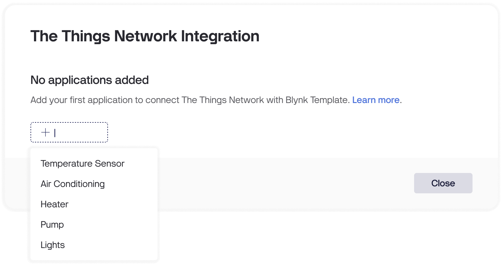

# Getting Started

The easiest way to prototype a device on Blynk and correctly configure the integration is to use a device that is already [connected to The Things Stack](https://www.thethingsindustries.com/docs/devices/adding-devices/). Once the device is connected and successfully goes online, [create a new template on Blynk](../../getting-started/template-quick-setup/) for this device. Once you have created a new template, navigate to the **Developer Zone -> Integrations -> The Things Stack**. Click the "**+ Add**" button and select the template you previously created.

<figure><figcaption><p>Create a new The Things Stack Application on Blynk</p></figcaption></figure>

In the application settings, fill in The Things Stack hostname, username, and password. To [obtain the credentials](https://www.thethingsindustries.com/docs/integrations/mqtt/#creating-an-api-key), navigate to the application page you wish to connect on The Things Stack. Click on the **Integrations** button in the left sidebar and select **MQTT**. Copy the Public TLS address under the MQTT server host section and paste it into Blynk (if you are going to use non-TLS MQTT address, change the switch to "**Insecure**"). Then, copy the username from the page and paste it into Blynk. After that, click on the "**Generate new API key**" button, copy the password, and paste it into Blynk.

<div data-full-width="false"><figure><figcaption><p>Capturing the credentials from The Things Stack</p></figcaption></figure></div>

Click the "**Connect**" button at the bottom of the application card on Blynk. You will see the integration status change to "**Connected**".


At this point, the metadata for _The Things Stack Device_ will be created in the template if it wasn't created before. Blynk uses this metadata to identify each device in The Things Stack application.


<figure><figcaption><p>The Things Stack Integration Page with a Connected Application</p></figcaption></figure>

Once this is done, Blynk will automatically create the device connected to The Things Stack as soon as it sends any data. This device will then be available on the [Devices page](../../blynk.console/devices/).

## Sending uplink and downlink messages

Once your first device is connected to Blynk, it's time to transfer some data! Start by configuring [the Payload formatter on The Things Stack](https://www.thethingsindustries.com/docs/integrations/payload-formatters/).


If you are using any provided The Things Stack Payload Formatter, such as a Payload Formatter imported from the The Things Stack Device Repository, additional steps might be required to convert the data format into the format required by Blynk.


### Uplink

For uplinks, Blynk requires the data to be in _key-value_ pair format, where the _key_ is either the datastream name or pin (such as `v1` or `a10`) and the _value_ is the datastream value. The value type must match the datastream value type! Also, prefer using only Virtual Pin, Enum and Location datastream types. Here is an example of the decoded uplink:

```json
{
  "temperature": 24.1,
  "humidity": 54,
  "idle": false,
  "state": "Working",
  "location": [-73.935242, 40.730610]
}
```

In this example, Blynk will set the datastream with the name "temperature" to the value 24.1 and the datastream with the name "humidity" to the value 54.


Since Blynk does not support a boolean datastream value type, you must use either the Integer or Double datastream value type. The value `true` will be represented as `1`, and `false` as `0`.


The datastreams configuration for this example may look like this:

<figure><figcaption><p>The datastreams configuration for the uplink and downlink examples</p></figcaption></figure>

Refer to the [Datastream documentation](../../blynk.console/templates/datastreams/) to create datastreams.


Each time Blynk receives an update from the device, it will trigger the Online lifecycle event. Therefore, it is recommended [to configure a meaningful wait time](../../blynk.console/templates/connection-lifecycle.md) to prevent your device from being stuck in the offline state.



Additionally, refer to the [System DataStreams](system-datastreams.md) section, which provides details on how to retrieve RSSI, SNR, and Firmware Version information.


### Downlink

For each datastream update via the web dashboard, mobile application, automation, etc., Blynk will send a separate downlink to the device. Here is an example of the downlink that Blynk will send to the device, indicating that the datastream with the name "speed" (pin `v2`) has been updated to the value `3`:

```json
{
  "name": "speed",
  "pin": "v2",
  "ts": 1721202415068,
  "value": 3
}
```

The `ts` field represents the timestamp in Unix milliseconds format when the value was actually updated.

## Application Statuses

Each application has its own status, representing its current state:

* **Not Connected**: This initial status indicates that the application has not been saved yet. Therefore, Blynk has not yet connected to the application, and the integration will not work. This status also applies when Blynk initially fails to connect to The Things Stack with the specified parameters.
* **Connected**: This status represents the normal state of the integration. Everything should operate normally in this status.
* **Broken**: This status indicates a problem related to the application. Possible issues include Blynk failing to establish a connection with The Things Stack work server (e.g., due to a server restart), invalid credentials, or an internal error on The Things Stack. In this status, Blynk will periodically try to reconnect to The Things Stack server to fix the integration. Once the integration operates normally, Blynk will automatically change the status to _Connected_.

## Next steps

With a configured Blynk template and a working device, you can now start creating a [Web Dashboard](../../blynk.console/templates/dashboard/) and [Mobile application](../../blynk.apps/constructor.md).

For scaling your device fleet, refer to the [Device Grouping](device-grouping.md) and [Automated Device Onboarding](automated-device-onboarding.md) sections. Be sure to explore the [System DataStreams](system-datastreams.md) section to extract more valuable data from your device.

Additionally, take advantage of other powerful Blynk features, such as [Automations](../../concepts/automations.md), [WebHooks](../../blynk.console/settings/developers/webhooks.md), and the [Device HTTPS API](../../blynk.cloud/device-https-api/), to build more advanced workflows.
