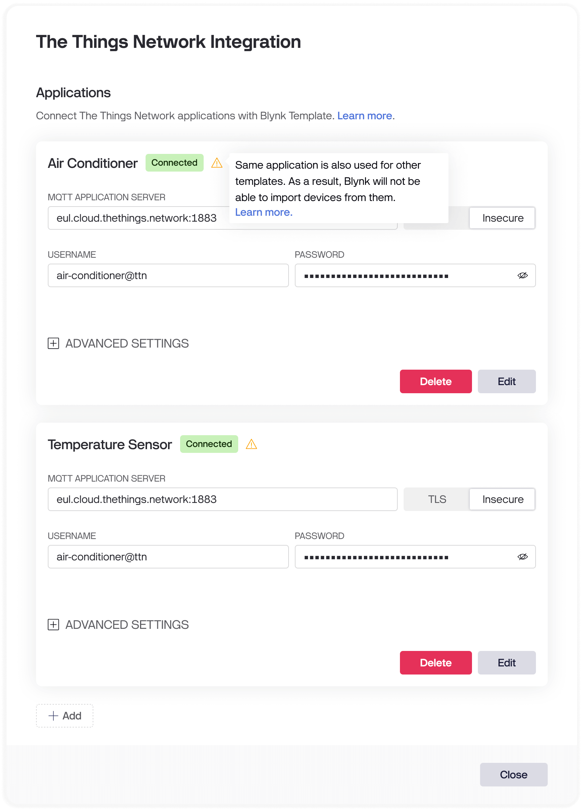

# Best Practices

## Group Individual Devices in a Single TheThingsNetwork Application

Grouping multiple devices under a single TheThingsNetwork application offers several benefits:

1. **Common Payload Formatter**: Configure a shared payload formatter at the application level, which helps prevent potential bugs and simplifies maintenance.
2. **Simplified Management**: Easier to manage multiple devices under one application.


When connecting multiple templates on Blynk to a single TheThingsNetwork application, **Device Provisioning from TheThingsNetwork will be disabled for both applications**.


<figure><figcaption>
Device Provisioning is disabled warning
</figcaption></figure>

## Prefer Device Provisioning through Blynk

For easier maintenance and to avoid potential errors, it is recommended to prefer device provisioning through Blynk rather than TheThingsNetwork. This approach also simplifies the device activation process, making it more user-friendly.
