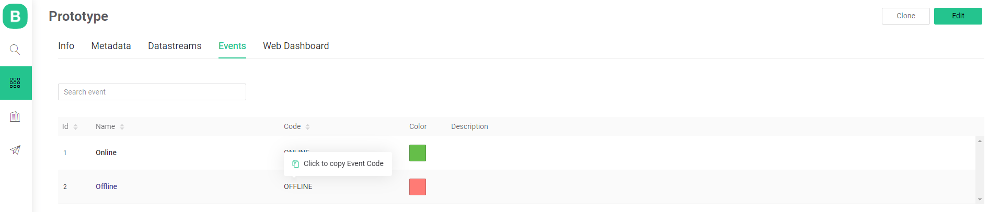

# Log Event

### Get an Event code

1. Open Device Template
2. Switch to Events tab
3. Hover Code column across from Event name
4. Once "Click to copy Event Code" hint appears, click it and Event Code will be coped to you buffer





Trigger the event by event code



This endpoint allows you to trigger the event.  
**Example:**  
`https://blynk.cloud/external/api/logEvent?token=GVki9IC70vb3IqvsV0YD3el4y0OpneL1&code=firmware_update&description=test`






Event description



Event code



Device auth token







Success


```text

```




Could not find a device token  
or  
Typo in code  
or  
Could not find event code


```text
{"error":{"message":"Invalid token."}}

or

{"error":{"message":"Event code is not provided."}}

or

{"error":{"message":"Can't find Event with this code in Product template"}}
```






