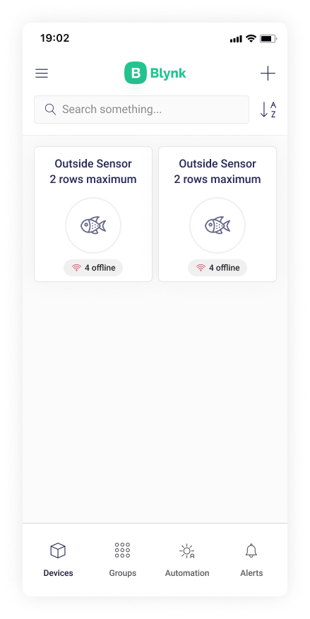
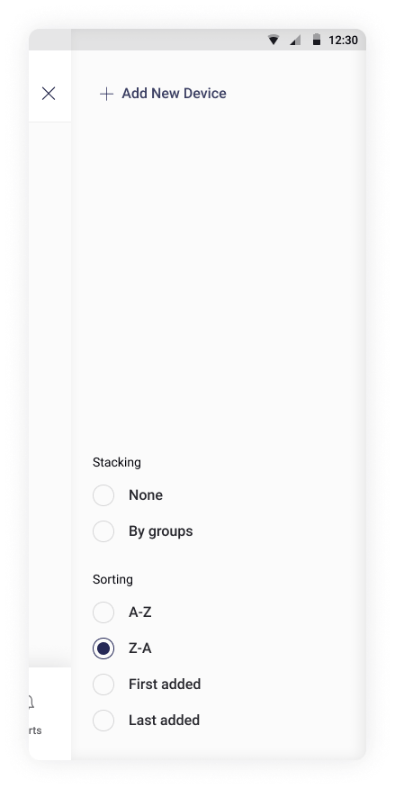
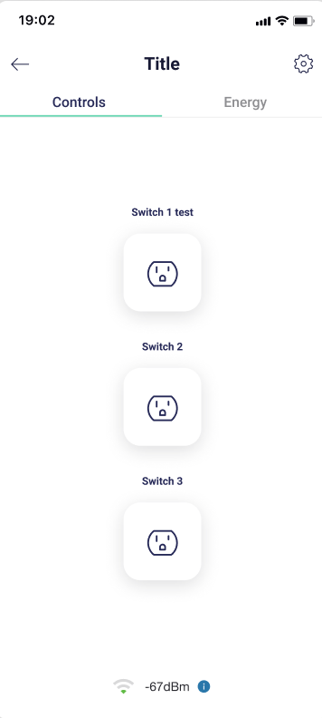
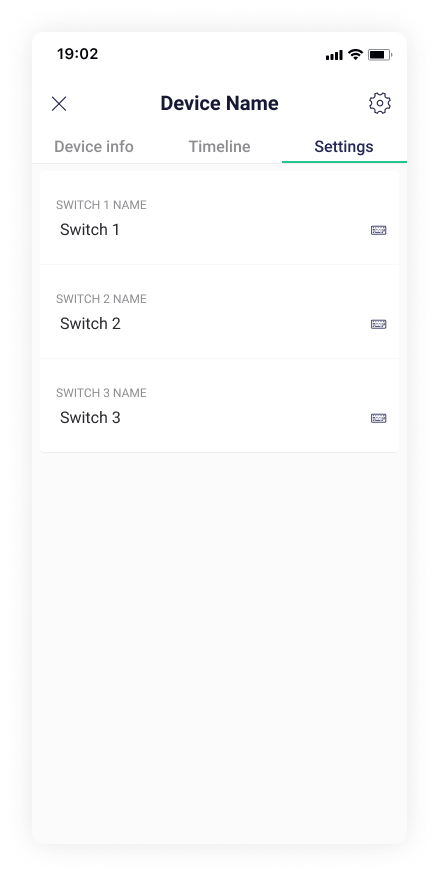
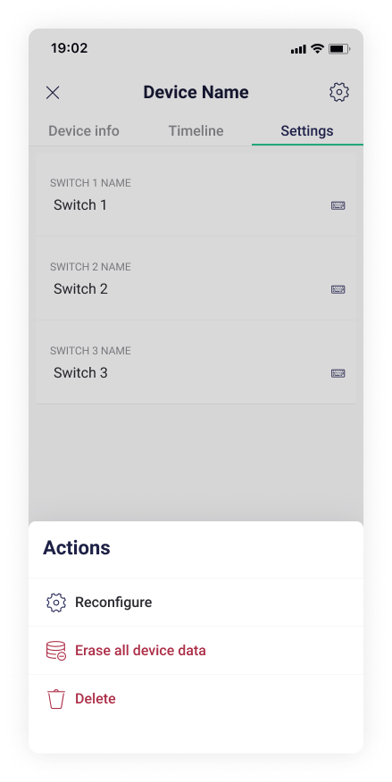

# Devices

Tap **Add New Device** in case your Devices tab is empty or you need to add new devices.

Follow the [provisioning steps](add-new-device.md).

You will see the tiled list of devices after they are added.

You can add new and **stack/sort** existing devices in the **right side menu**

Tap **Device tile** to open it's Dashboard. Here you can view and interract with device's stats and settings.

**Timeline** tab displays all events related to this device. Events are also displayed in the Alerts tab

On the tab **Settings**, you can edit the device’s settings

**Actions Menu** options:

* **Reconfigure** – use it to connect new or factory-reset Device so it has all data and settings of a previously set up and used Device. [Starts provision flow.](add-new-device.md)
* **Erase all device data** – _**critical action!**_  Erases all data generated by the device with no restore option. Confirmation window is present.
* **Delete** – _**critical action!**_  Deletes the device and all it's data. Confirmation window is present.

