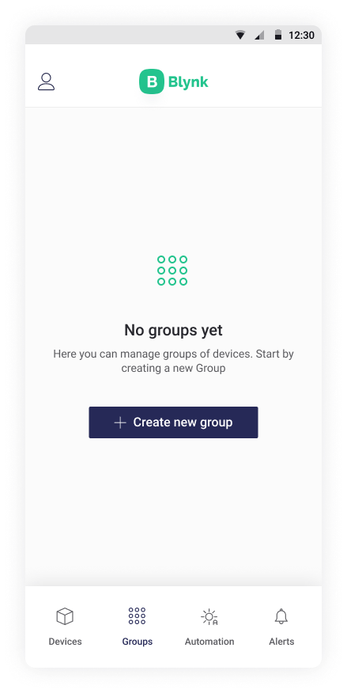
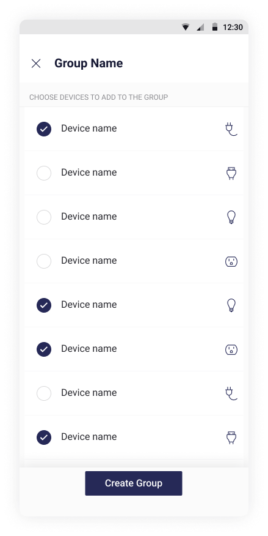
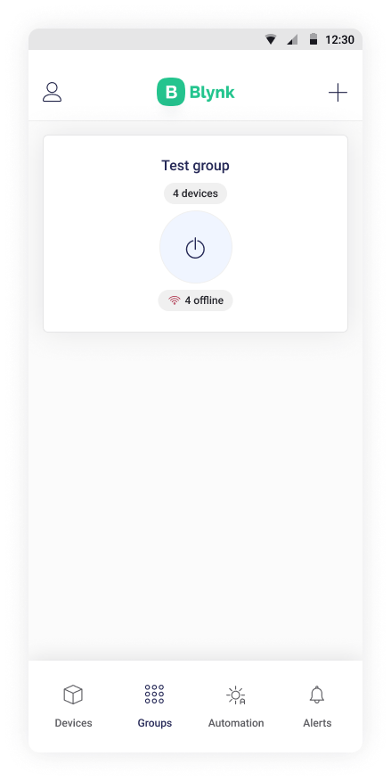

# Groups

Several devices can be grouped to be controlled simultaneously by a single command.

Press button Create new group to create a new one

Create the group name

Choose devices to add to the group and tap **Create Group**

You will see a group tile on your dashboard after creating it.

