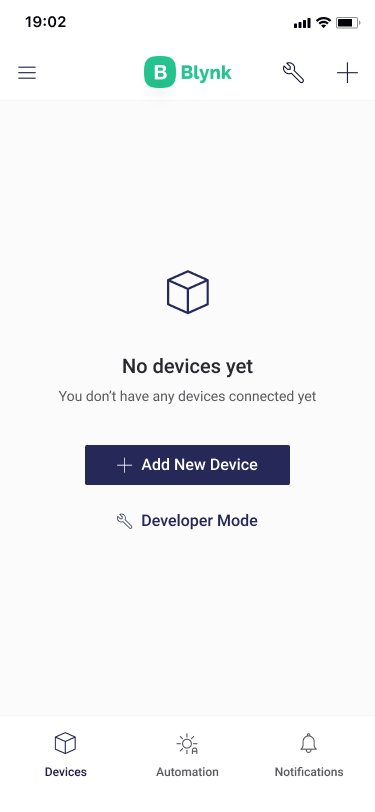
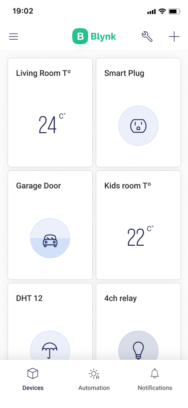
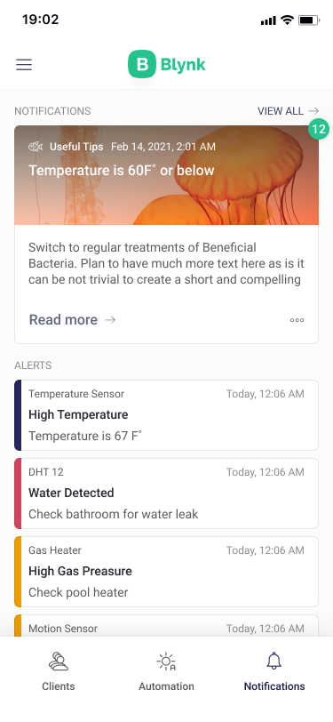
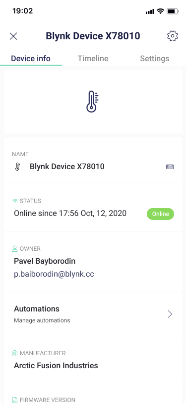
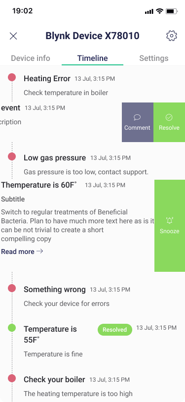
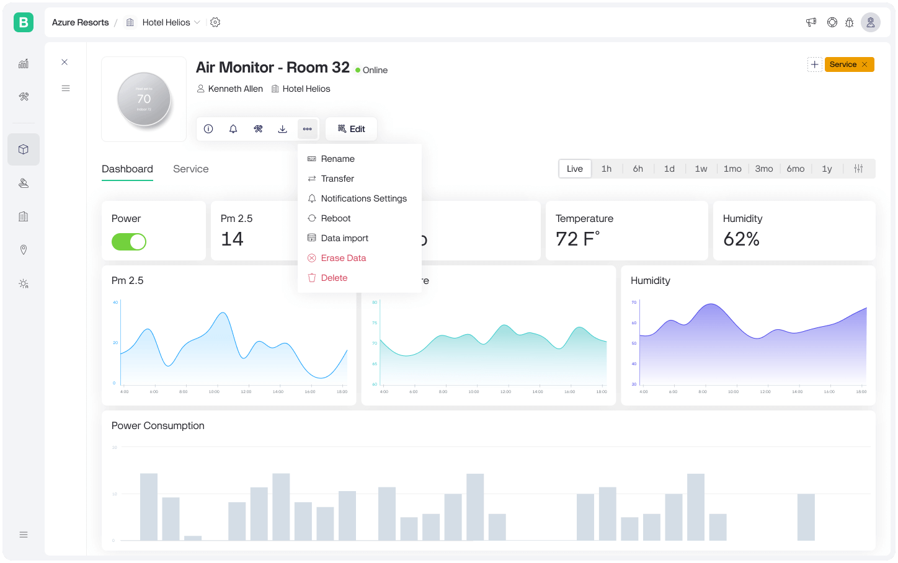
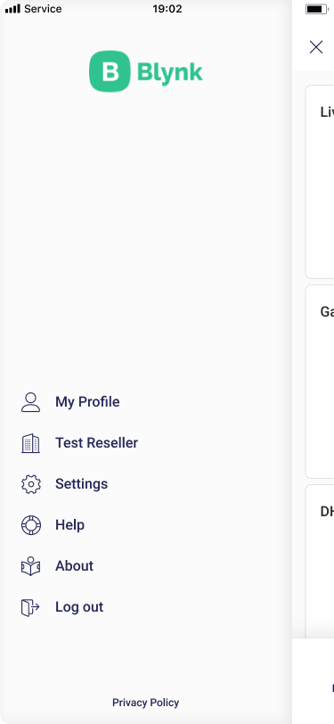

# Overview

Blynk offers native iOS and Android mobile apps which allow to remotely control connected devices and visualize data from them. 

App operates in two modes:

**Developer Mode**

**End-user mode**

## Home screen

Home screen consists of up to 3 tabs depending on the configuration: [Devices](overview.md#devices), [Automation](overview.md#automation) and [Notifications](overview.md#notifications)

### **Devices**

 

This section is open by default when you open the app. All created devices will be listed here and their tiles will look according to their [template ](../web-dashboard/products/)type. To add new device go to the [Right](overview.md#right-menu) menu by tapping the top right button in the navigation bar. There are also options to change how devices are sorted.

If there are no devices yet, there is a button "Add new device" in the middle wich takes you right to the device provisioning routine.

### **Automation**


This section is visible only when a template has at least one datastream enabled for automation.  
To enable the datastream for automation, please read the [Datastreams](../web-dashboard/products/datastreams/datastreams-common-settings/) article.


You can automate your connected devices with the following triggers:

* Time of the day
* Sunset and sunrise
* Device trigger
* Manual execution \(Scenes\)

### **Notifications**

The list of notificatios and important alerts from all devices will be here.


In order to be listed here, the template should have the [Event](../web-dashboard/products/events/) configured and the event should be [triggered](../web-dashboard/products/events/how-to-trigger-events.md) in the device.


## Device dashboard

When a user taps on the device tile, the device dashboard will be opened. It consists of widgets that allow controlling and monitoring the device. The layout of the widgets and their settings can be edited in the [Developer mode](../getting-started/developer-mode.md)

### **Device Info and Timeline**

At the top right corner of the dashboard, there's an ... icon that opens another view with the  
Device Information and Timeline.

On the **Device Info** tab, you can edit a device name, change other [metadata](../web-dashboard/devices-1/device-view/metadata/) values, view other things like firmware version, etc.

On the **Timeline** tab, you'll find the list of all events of the device \(for example online, offline and custom [Events](../web-dashboard/products/events/)\)

### **Device Actions menu**

At the top right corner of the Device Info and Timeline tabs, there's **Configure** \(gear\) _\*\*_icon that opens an actions menu with the following options:

* Reconfigure
* Erase all device data
* Delete device

## Main menu

At the top left corner, there's a **Profile** icon that will open the main menu when you tap on it. This menu consists of the following entries:

* **My profile** – here you can change your name, password, or delete your account.
* **Organization settings** – _\*\*_here you can change the organization name, description, and timezone.
* **Members** – here you can invite new users to an organization by sending them an Email
* **Switch organization** – if you have other [organizations](../web-dashboard/organizations.md) created, you can switch to and from them using this switch.

## **Right menu**

At the top right corner, there's a hamburger icon that will open the right sidebar menu when you tap on it.  
Depending on the active tab on the [Main screen](overview.md#main-screen) it offers to add new Device, create new Automation, new Group, etc.

This menu also offers the various sorting and stacking options for the devices and device groups list.

