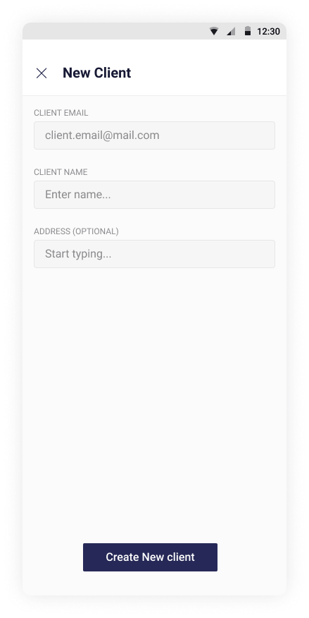
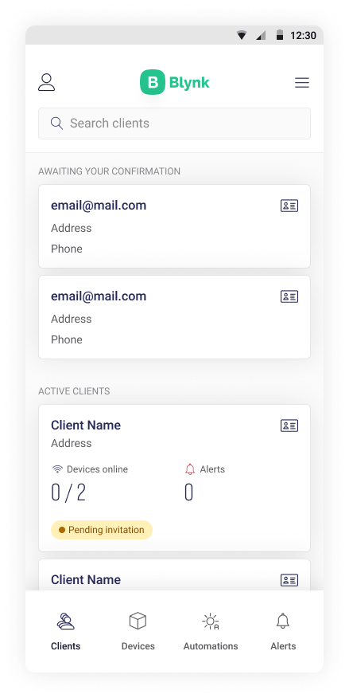

# Partner mode

When you're signed up as a Partner \(that means you're a Distributor, Reseller, Contractor or Installer\) you can access your Client's Devices to view, setup and control them in assistance means.   
You can request access or get invitations to from Clients.

Tap **New client** to create a new one

Fill the form and tap **Create new client**

After the client is created an invitation Email will be sent and his/her card will be shown in the **Active Clients** list.

Also this screen has **Awaiting Your Confirmation** section where you can see invitations to join Client's Organizations. Once confirmed you can view and/or manage Clients' Devices according to permissions Clients' have granted you .

