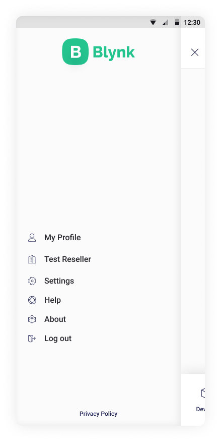
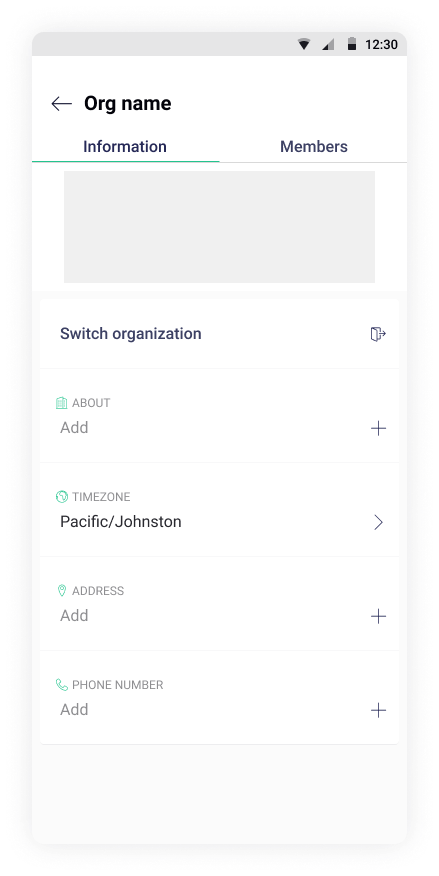
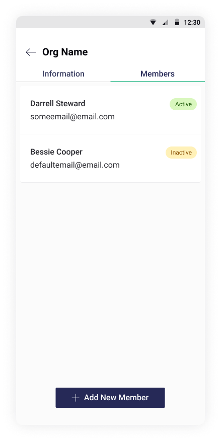
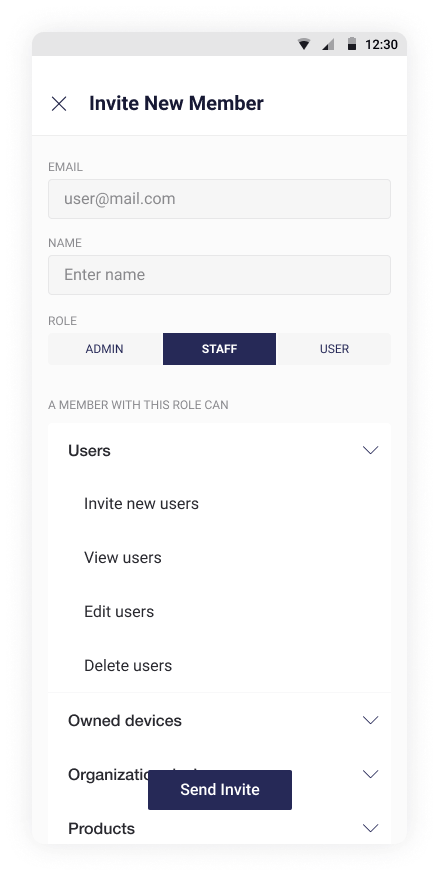

# My Organization

## Organization management

Open the left side menu and tap your **Organization Name** \(Test Reseller on screenshot\) to view it's settings

On this screen you can edit Organization Information, switch to another organization or navigate to Organization **Members** tab to edit users list.

## Members management

Members tab displays all members of the current organization and invite new one's. 


* **Status** – 3 registration statuses are possible:
  * **pending** – the user is invited, but the email is not confirmed \(user haven't logged in\) 
  * **active** – the user confirmed the email, logged at least one time 
  * **inactive** – the user hasn't logged for 1 month


To invite new member press **Invite New Member**

Fill new members Email and name. Choose a role to see what [permissions](../../web-dashboard/settings/access.md) new member will have, then tap **Invite** to confirm


Blynk has 3 types of users roles that can have different permissions sets: 

* **Admin** – supposed to have maximum permissions set
* **Staff** – we recommend to set up and use this role for user support processes such as handling user invitation, device check and debug, view and assist users' organizations
* **Users** – supposed to have least permissions set that is focued mostly on managing user's own devices.


