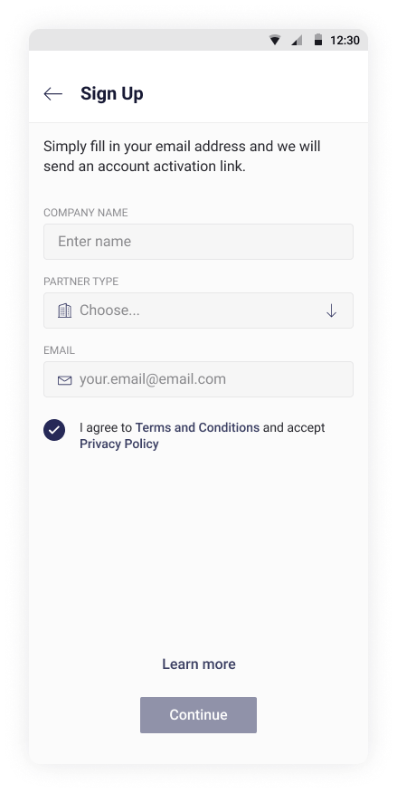
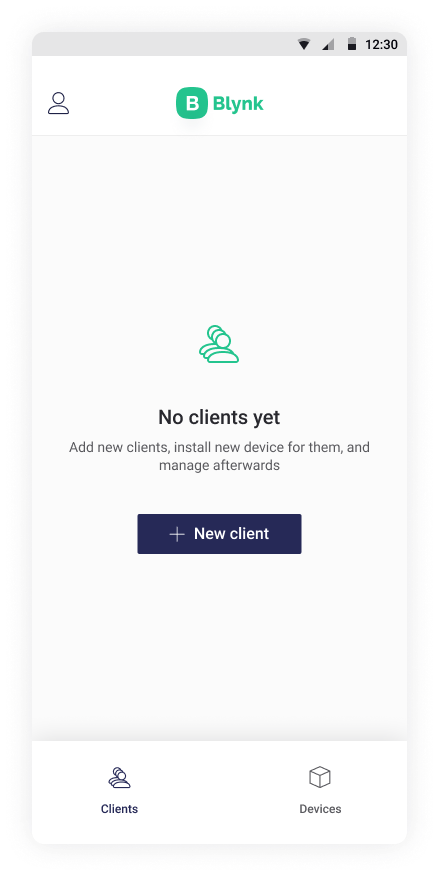

# Partner Sign Up

You'll get to Log In screen after application launch \(in case you're not logged in\):

Tap **Sign Up** button if you don’t have an account. Sign Up screen will open:

Tap **Sign up as a partner** link at the bottom of the page

Fill in the Company Name, Partner Type, E-mail address and tap **Continue.** Check your inbox for an email with instructions.


Tap Resend a Link if you can't find the invitation email \(also mind checking Spam folder\) after 1 minute interval\) to send it again.


Tap **Create Password** button. This action will return you to the application.

Create a password following the hint below the input field and tap **Continue**

Fill in your company profile required and optional information.


Contents of the Sign Up screen may vary accordingly to Sign Up settings applied by Administrator.


Now you can add and manage Devices, [Clients and their Organizations and/or Devices](../partner-mode.md) \(depending on access provided by Client Organization Administrator\).

