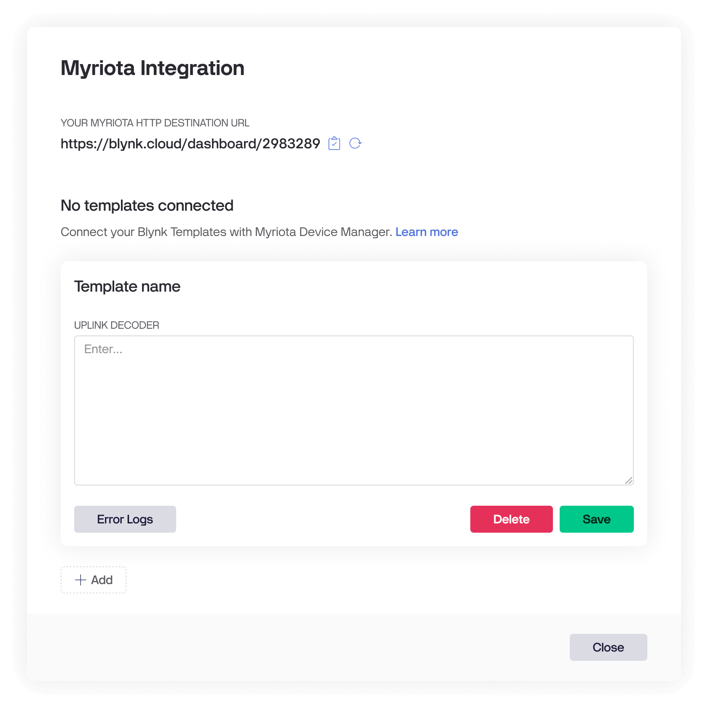
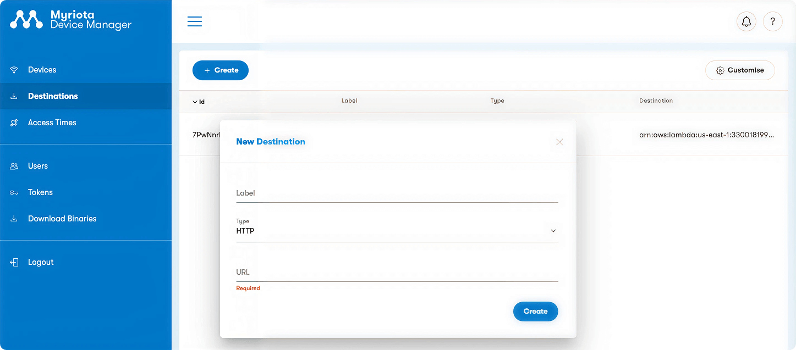
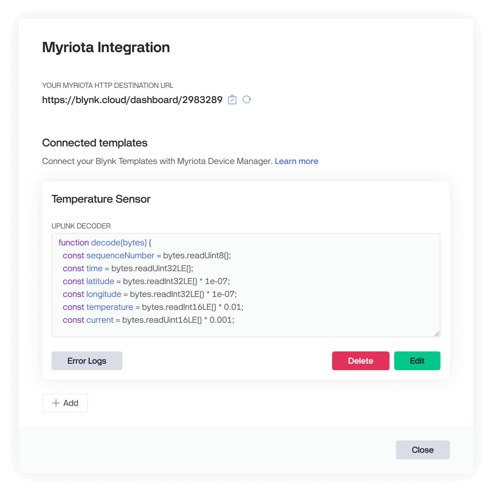
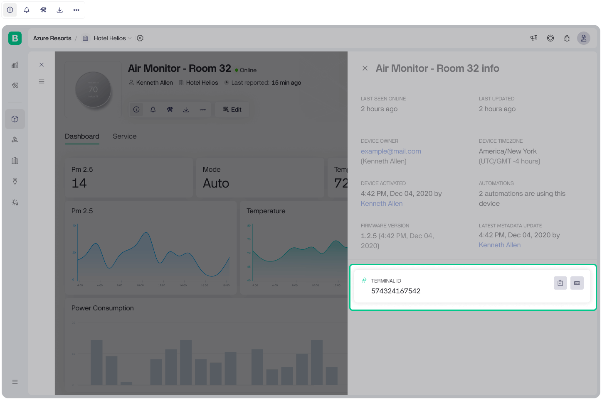
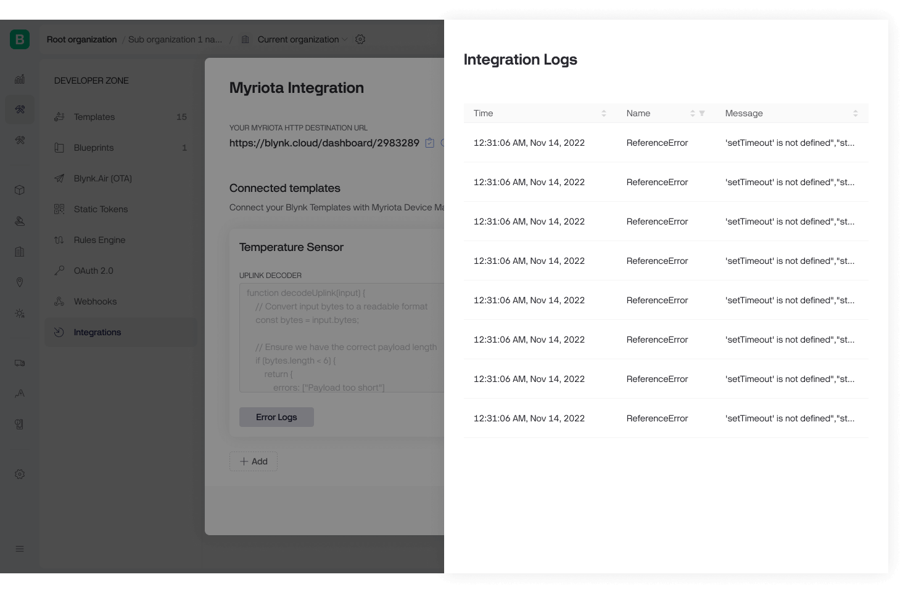

# Myriota

**Myriota** provides global IoT connectivity through its satellite network, making it ideal for remote and low-power deployments.

**Blynk** offers a seamless integration with Myriota to decode uplinks and visualize data from your satellite-connected devices — no custom backend required.

<figure><figcaption><p>Myriota Integration with Blynk</p></figcaption></figure>

***

### Setting Up the Integration

#### 1. Create a Destination in Myriota

To send uplink data from Myriota to Blynk, start by creating a destination:

1. Open **Blynk Console** and go to `Developer Zone > Integrations > Myriota`.
2. Copy the **HTTP Destination URL** provided.
3. Open your **Myriota Device Manager**, go to `Destinations`.
4. Click **Create New Destination** and paste the copied URL.
5. Click **Create** to save.

<figure><figcaption><p><strong>Myriota New Destination</strong></p></figcaption></figure>

> **Note:** If you update the HTTP Destination URL in Blynk, remember to update it in your Myriota destination settings.

***

#### 2. Write a JavaScript Decoder Function

You’ll need to provide a JavaScript **uplink decoder function** in Blynk to parse the raw binary payloads sent by your Myriota device.

The decoder should return an object with keys matching your Blynk datastream names.


Only **Uplinks** are supported at this time.


#### **Sample Uplink Decoder for Myriota Devices in Blynk:**

```js
function decode(bytes) {
  const sequenceNumber = bytes.readUint8();
  const time = bytes.readUint32LE();
  const latitude = bytes.readInt32LE() * 1e-07;
  const longitude = bytes.readInt32LE() * 1e-07;
  const temperature = bytes.readInt16LE() * 0.01;
  const current = bytes.readUint16LE() * 0.001;

  const date = new Date(time * 1000);
  const dateStr = date.toUTCString();

  return {
    'Sequence Number': sequenceNumber,
    'Time': dateStr,
    'Location': [longitude, latitude],
    'Temperature': temperature,
    'Current': current
  };
}
```

#### Byte Reader Methods

The `bytes` object supports the following built-in methods:

**Integer Readers**

* `readUint8()`, `readInt8()`
* `readUint16()`, `readInt16()`
* `readUint32()`, `readInt32()`
* `readUint64()`, `readInt64()`

**Floating Point Readers**

* `readFloat16()`, `readFloat32()`, `readFloat64()`

**Little Endian Variants**

* `readUint16LE()`, `readInt16LE()`
* `readUint32LE()`, `readInt32LE()`
* `readUint64LE()`, `readInt64LE()`
* `readFloat16LE()`, `readFloat32LE()`, `readFloat64LE()`

**Offset-Based Readers**

* `getUint8(offset)`, `getInt8(offset)`
* `getUint16(offset)`, `getInt16(offset)`
* `getUint32(offset)`, `getInt32(offset)`
* `getUint64(offset)`, `getInt64(offset)`
* `getFloat16(offset)`, `getFloat32(offset)`, `getFloat64(offset)`
* LE (little-endian) variants are available for all

**Other Utilities**

* `bytes[index]`: Access a byte by index
* `bytes.length`: Total number of bytes
* `bytes.offset`: Current read offset

**Tips**

* Match your decoder logic with your device’s encoding format
* Return an object with keys matching Blynk datastream names
* Decoder script must be under **5,000 characters**

***

#### 3. Connect a Template

To receive and display parsed data in Blynk:

1. In the **Myriota Integration** window in Blynk Console, click **Add Template**
2. Select a template for visualization
3. Paste your **uplink decoder function**
4. Click **Save**

<figure><figcaption><p>Myriota Integration Ready</p></figcaption></figure>

***

### Sending Data to Blynk

Once the integration and template are configured, you can create a device to start receiving and displaying satellite data:


1. In **Blynk Console**, go to the **Devices** section
2. Click **New Device**
3. Choose **From Template**
4. Select the **same template** used in your Myriota integration
5. Click **Create**
6. Click the **info icon** next to the new device
7. In the **Terminal ID** field, enter the **Myriota Device ID** from your device manager.

This links incoming payloads to the correct device instance in Blynk.

<figure><figcaption><p>Terminal ID metadata</p></figcaption></figure>

***

#### Troubleshooting

If data isn’t coming through:

1. Open the **Myriota Integration** page in Blynk Console
2. Click **Error Logs** on the integration card to view recent errors

<figure><figcaption><p><strong>Myriota Error Logs</strong></p></figcaption></figure>

