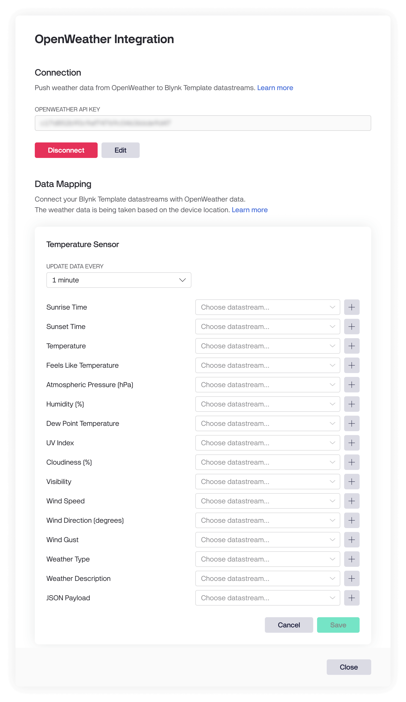

# OpenWeather

The OpenWeather integration allows you to fetch real-time weather data for your devices based on their approximate location. This data can be used to enhance your IoT applications with weather-based automation, monitoring, and analytics.


This feature is currently available only for Enterprise customers.


**Device location sources by priority:**

1. Location data from the device (Location datastream)
2. Location metadata
3. IP location


* Before the request execution, Blynk will merge the devices within 1 kilometre into a cluster and send a API request with a cluster average location, reducing the total amount of requests executed.
* Location data is updated once every 6 hours, so changes to the device’s location may not be reflected immediately.


### Setting Up the Integration

#### Getting the API Key from OpenWeather

1. Press on your username at the top-right of the OpenWeather dashboard.
2. Select **API keys**.
3. Copy the provided API key for use in the integration.


Make sure your OpenWeather subscription is active.


<figure><figcaption></figcaption></figure>

### Data Mapping

Connect your Blynk Template datastreams with OpenWeather data.

Map each field to individual datastreams. The following fields are supported:

* **Sunrise Time** — Unix, UTC. Example: `1645853361`
  * _For polar areas during midnight sun or polar night periods, this field may not be returned._
* **Sunset Time** — Unix, UTC. Example: `1645891727`
  * _For polar areas during midnight sun or polar night periods, this field may not be returned._
* **Temperature** — Units are defined by the datastream; defaults to °C if undefined.
* **Feels Like Temperature** — Units are defined by the datastream; defaults to °C if undefined.
* **Atmospheric Pressure (hPa)**.
* **Humidity (%)**.
* **Dew Point Temperature** — Units are defined by the datastream; defaults to °C if undefined.
* **UV Index**.
* **Cloudiness (%)**.
* **Visibility** — Units are defined by the datastream; defaults to meters if undefined.
* **Wind Speed** — Units are defined by the datastream; defaults to m/s if undefined.
* **Wind Direction (degrees)**.
* **Wind Gust** — Units are defined by the datastream; defaults to m/s if undefined.
* **Weather Type** — e.g “Drizzle”.
* **Weather Description** — e.g “Light intensity drizzle”.
* **JSON Payload** — Retrieve all fields as a single JSON string to one datastream. Example:

```json
{
  "dt": 1684929490,
  "sunrise": 1684926645,
  "sunset": 1684977332,
  "temp": 292.55,
  "feels_like": 292.87,
  "pressure": 1014,
  "humidity": 89,
  "dew_point": 290.69,
  "uvi": 0.16,
  "clouds": 53,
  "visibility": 10000,
  "wind_speed": 3.13,
  "wind_deg": 93,
  "wind_gust": 6.71,
  "weather": [
    {
      "id": 803,
      "main": "Clouds",
      "description": "broken clouds",
      "icon": "04d"
    }
  ]
}
```

<figure><figcaption></figcaption></figure>


You can create datastreams directly from the Integration window. The metric system is used by default.


### Data Frequency

Select the desired frequency for the data being pulled from OpenWeather to Blynk.

### Unit Conversion

Ensure you’ve selected the correct units. If the units are incorrect or left empty, data will be sent in the default metric system.
