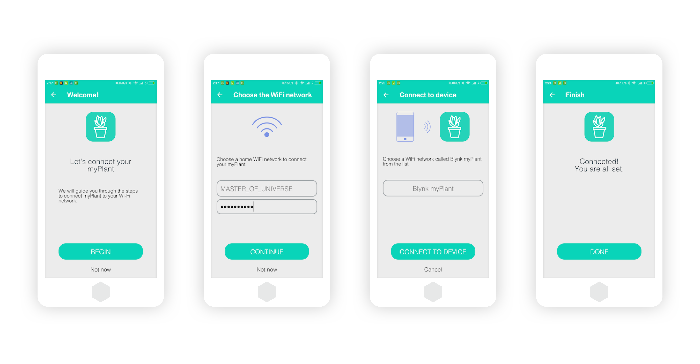

# Services

Blynk services \(or micro-services\) are software modules that work across products and perform a certain set of functionality.

## Blynk.Inject

A micro-service for:

1. Claiming device ownership by users and organizations
2. Provisioning devices with WiFi credentials so they can connect to the end-user WiFi networks.
3. Managing Authentication Tokens
4. UX flow to guide end-users through the process of claiming and provisioning with the help of Blynk.app

To get understanding of the Blynk Inject take a look at the below videos:

  

## Blynk.**R**

A micro-service for user management, covering

1. User registration with invitations
2. Roles and permissions management
3. Multi-tenancy

## Blynk.Air

A micro-service for Firmware Over-the-Air Updates responsible for:

1. Managing Firmware Over-the-Air Updates shipping campaigns
2. Installing new firmware on the edge devices

