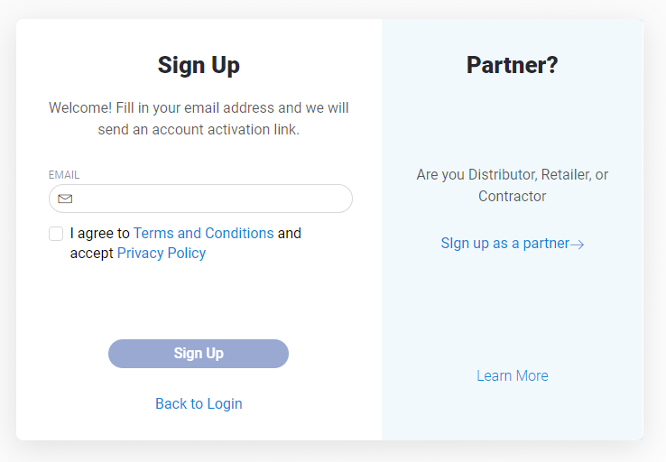

# Sign Up

Open [https://blynk.cloud/](https://blynk.cloud/) in you web browser or [Mobile application](../../mobile-applications/untitled/)

You'll see Log In screen:

Click **Create new account** and you'll get to Sign Up screen:


Contents of the Sign Up screen may vary accordingly to Sign Up settings applied by Administrator.


There are Sign Up 2 options:

**Sign Up \(**aka **Client Sign Up\)** – for personal or small company use, Developer's clients and tests

**Partner Sign Up** – sign up for Distributors, Retailers, or Contractors who need extended Organization management functionality 

## Client Sign Up

1. Enter your E-mail 
2. Read and agree to the Terms and Conditions 
3. Click **Continue** 
4. Check your inbox for an email with instructions.
5. Click **Create Password** in your invitation email
6. Provide your profile required and optional information.
7. Create a password following the hint provided on the screen and confirm the action.

## Partner Sign Up

1. Click **Sign Up as a Partner**
2. Fill in the Company Name, Partner Type, E-mail address and click **Continue**
3. Check your inbox for an email with instructions.
4. Click **Create Password** in your invitation email
5. Provide your Organization required and optional information.
6. Create a password following the hint provided on the screen and confirm the action.

## Log In

If you have an already registered account _enter_ your **Email and password**, click **Log In** and you'll be redirected to **Search** screen in Web Dashboard or Devices tabs screen in Mobile Application.

## [Personal account management ](../../web-dashboard/for-developers/user-profile.md)

## 

