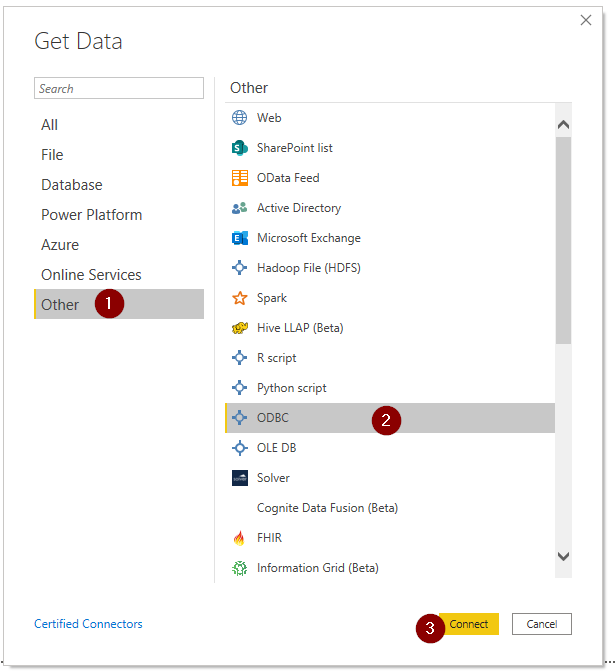
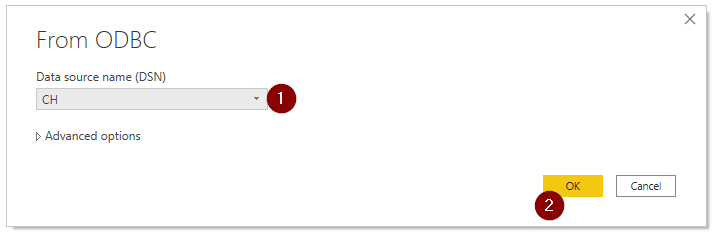
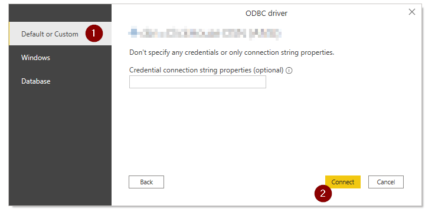

# ODBC DB copy

### Prerequisites:

1. Install [Clickhouse ODBC driver \(64bit\)](https://github.com/ClickHouse/clickhouse-odbc/releases/)
2. Install [Power BI desktop](https://www.microsoft.com/en-us/download/details.aspx?id=58494)

Press Win+R

Run`%systemdrive%\Windows\System32\Odbcad32.exe`

### Add User DSN Entry:

1. Click Add in User DSN tab
2. Name it \(CH in this tutorial\)
3. Insert the following URL: `http://company-readonly:password@ip:port/query?database=company_prod_reporting&buffer_size=3000000`
4. Click OK
5. Click Apply

### Desktop Power BI

1. Click the following sequence: Get Data -&gt; Other -&gt; ODBC -&gt; Connect

2. Select created DSN entry and press OK

3. Select the upper option on the following modal and press Connect

4. Finally, select `company_prod_reporting` and you are ready to go  

