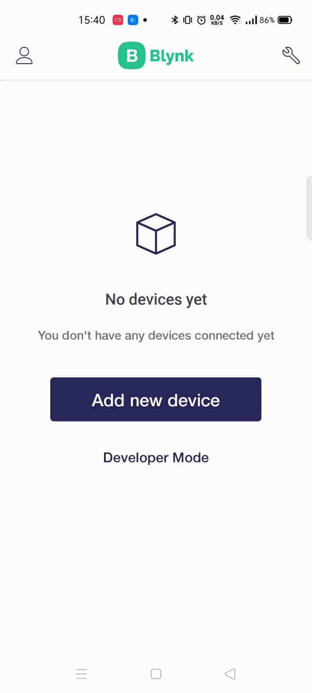

# Partner mode

## Partner access request

When you're signed up as a Partner \(that means you're a Distributor, Reseller, Contractor or Installer\) you can access your Client's Devices to view, setup and control them in assistance means.   
You can request access or get invitations to from Clients.

Tap **New client** to create a new one

Fill the form and tap **Create new client**

After the client is created an invitation Email will be sent and their card will be shown in the **Active Clients** list.

Also this screen has **Awaiting Your Confirmation** section where you can see invitations to join Client's Organizations. Once confirmed you can view and/or manage Clients' Devices accordingly to permissions Clients' have granted you .

## Providing Partner access from the Client's side

As an administrator of client organization you can request assistance from your partner company.

1. Tap **Profile** pictogram
2. Tap your **Organization name** to open Organization Setting screen
3. Switch to **Contractor tab**
4. Tap **Invite contractor**
5. Type your Partner's E-mail
6. Allow access to your organization by toggling the switch
7. Allow controlling devices \(optionally\) – toggle if needed
8. Set Access Period
9. And confirm with tap on **Invite** button

 

Your Partner will receive an Email about your request and your card will appear in his Blynk.Apps Clients tab with "Pending Invitation" status. 


You can recall the access anytime. 


