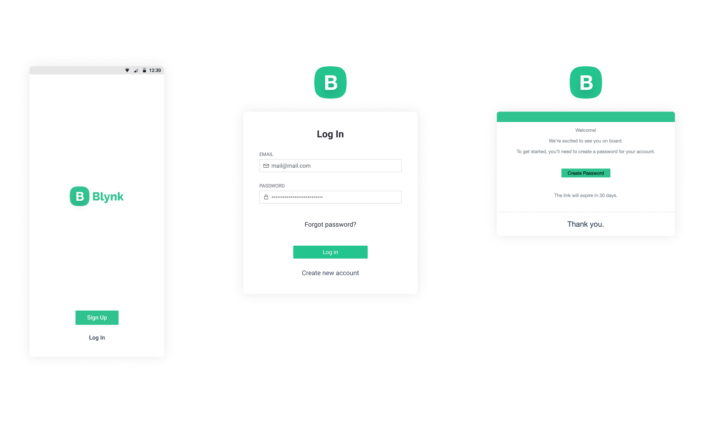

# Sign Up

To use Blynk, every user needs to create an account. This is essential for security reasons, to make data accessible from multiple devices and places. A valid email address is requried to create an account.

These are the main ways of how users can sign up:

1. By creating a new account at [https://blynk.cloud/](https://blynk.cloud/)
2. By downloading Blynk [Mobile application](../getting-started/signup.md) and following registration process in the app
3. By getting an invitation from existing user \(available in paid plans only\)

## Sign Up Step-By-Step

1. Enter a valid email address  
2. Agree to Terms and Conditions and Privacy Policy 
3. Click **Continue** 
4. Check your inbox for an email with instructions.
5. Click **Create Password** button ****in your invitation email. This link will be valid for 24 hours and after that you would need to repeat sign up process
6. Create a strong password and don't share it with anyone


If you haven't received email with activation link – check SPAM folder, add _dispatcher@blynk.cc_ to your address book and try to register again.


Now your account is created and you can start using the platform

## Log In

If you have an already registered account enter __your **Email and password**, click **Log In** and you'll be redirected to **Search** screen in Web Dashboard or Devices tabs screen in Mobile Application.

## [Personal account management ](../blynk.console/user-profile.md)

## 

