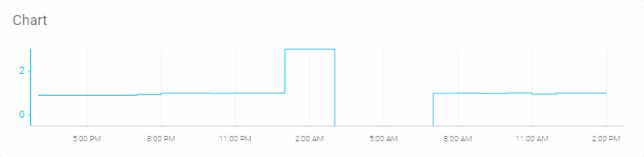
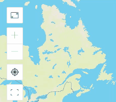

# Dashboard

Dashboard is used to visualize data \(e.g. from sensors\) and provide remote control for your devices.

Select or adjust Time Period using the switches on top of the tab.

Each widget may have indiviual elements

## **Slider**

Slider ****allows to view and send values in the predefined range. Usage examples: volume, brightness, RPM, flap position control, etc.. Move slider **handle** or fine control steps **+** and **–** buttons \(optional\) to set the value. 

Use plus/minus icons to set the value more precisely. 

## Switch

Turn parameters on/off

## **Label**

This widget displays value of Virtual Pin e.g. length/distance, mass, duration, volume, temperature and other data types including strings.Also it can show level/progress bar \(horizontal or vertical\) and/or have widget colors changes based on getting different predefined values.

## **Chart**

It's used to visualise live and historical data. You can use it for sensor data, for binary event logging and more. Chart display can be of 4 types: _Line, Area, Column, Stepline_

General chart properties:

* **Values axis** \(vertical\) – each Datastream added to Chart widget has it's scale on the right and left. It can be set manually or to be autoscaled during Template dashboard setup.
* **Timeline Axis** \(horizontal\) – helps to find values actual for the exact time the search is performed.
* **Hover the chart** – views value ant time for each selected point for each Datastream.

## **Map**

This widget displays device locations/route and data sets \(predefined by Template owner\) that are assigned to GPS data.

1. Specify the time period if it's needed \(top center of the widget\):

   1. select the day: click arrows to switch to previous/next day or click on the day to open date picker, search and click on the date you want;
   2. set day time period: click the field containing time data to open time picker, set hh:mm for both start and end of the period; 

2. Change track overlay by selecting available in top right dropdown menu. It's used for values/statuses differences visualization that can be checked in track overlays legend \(bottom right\) 
3. Navigate to the point you want to check:
   1. use scale management buttons at top left of the widget;
   2. move the map by moving the mouse with left mouse button hold;
   3. click the point or area \(nearest point data will be displayed\);

Now you can see all the data that was actual while the device was on the selected location.  
It always starts with Date and Time in the first line, Location Longtitude and Latitude in second line and all other data in further lines.

## **Modules**

This widget is used with devices with detachable modules.  
Each module has it's own tools, units, details that are represented by Datastreams sets configured under each module.

_Example:_   
Your Product is a road cleaning machine and it has summer setup with fan and dry broom modules and winter setup with snow brush and dryer modules. Fan and dryer use socket A for connection, broom and brush use socket B. Each module has Datastream set to represent the connectivity such as V0 for fan and V1 for dryer. So in Display Data for socket A you can switch between Fan and Dryer by enabling and disabling those Datastreams. Once connectivity DS is set to ON all the other Datastreams of Module will be displayed in Socket A tab. 

